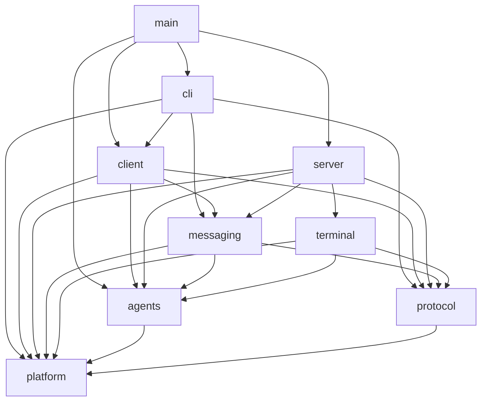
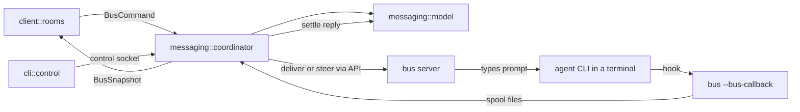
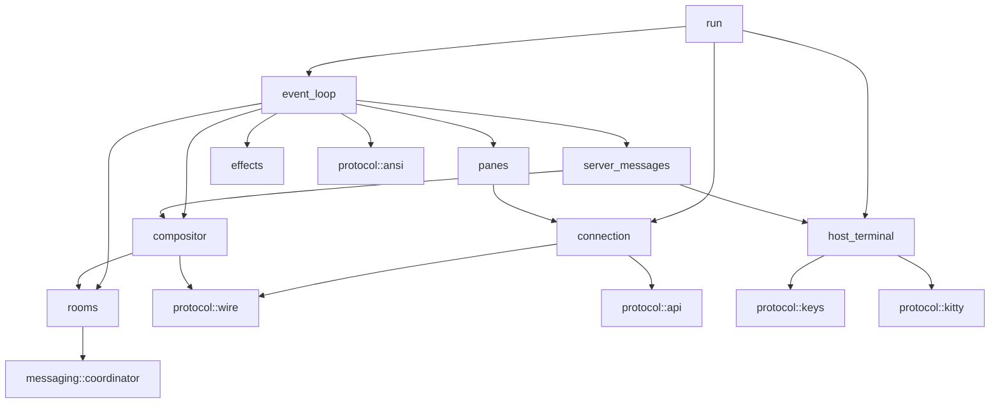
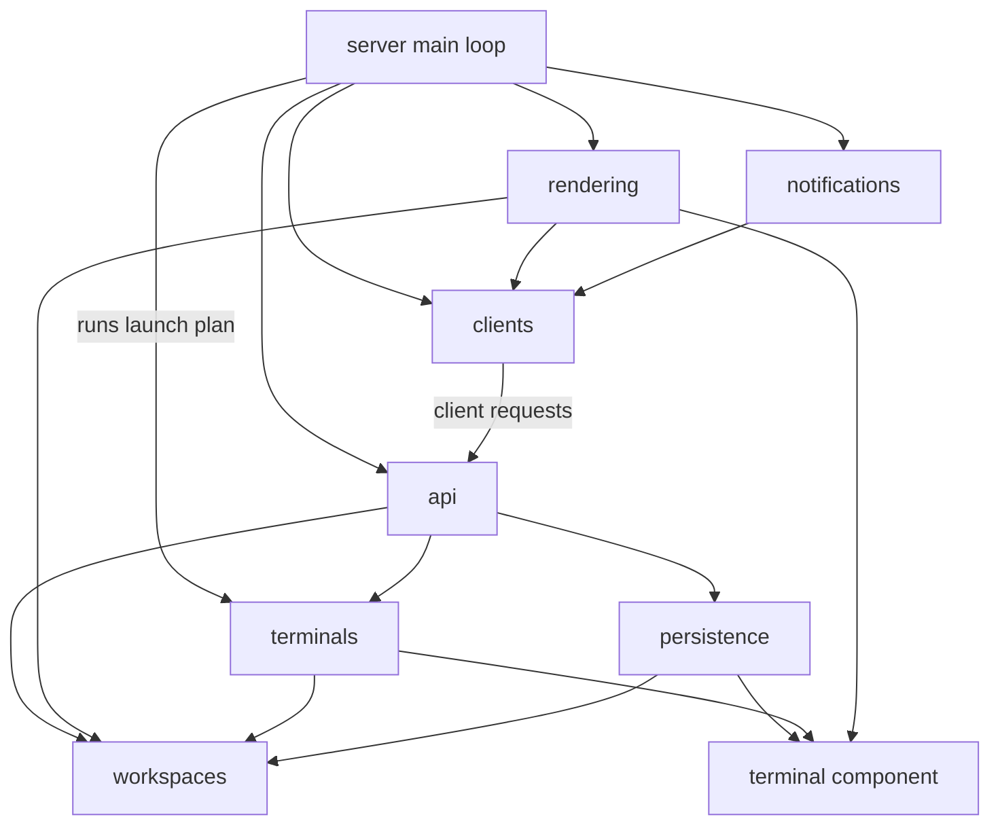

# Bus restructure

Status: proposal for discussion. It describes the target folder and module layout of the repository.

## 1. Repository root

- `src/`: the Bus terminal application (Rust), described in section 2
- `orchestration/`: Markdown only; how a MASTER orchestrator agent works
  - `README.md`: the contract between Bus and these files (placeholders, lookup order, control CLI)
  - `prompt.md`: the MASTER system prompt
  - `rules.md`, `guide.md`, `how-to-bus-cli.md`: binding rules, working guide, control CLI reference
- `workflows/`: Markdown only; the standard workflow library
  - `create.md`: how to draft and revise a workflow (the `workflow-create` skill points here)
  - `template.md`, `pr-review-loop.md`, `cross-repo-feature.md`
- `skills/`: agent workflow skills; `.agents/skills` and `.claude/skills` link here
  - `AGENTS.md` (with its `CLAUDE.md` link), `skill-architecture.md`: the shared skill contract
  - one folder per skill: `SKILL.md`, `guide.md`, `references/` and the skill's own `scripts/` (quality lanes, review lanes, PR signals,
    ledgers and plan checks stay with the skill that runs them)
- `cli_extensions/`: shared Python for the review skills (artifact parser and renderer, round and lane ownership)
- `docs/`: repo-development docs
  - `bus-architecture.md`: this document
  - `guides/`: architecture principles, code review, plan review, review format and response, consumer-fallout format
  - `templates/`: `plan-template.md`, `module-agents-template.md`
- `tests/`: black-box integration tests against the built `bus` binary
  - `support/`: `process.rs` (pid and dir hygiene), `spawn.rs` (one `spawn_server`/`spawn_client`), `wire.rs`, `json.rs`
  - `api/`: `main.rs`, `server.rs`, `workspaces_tabs.rs`, `panes.rs`, `agents.rs`, `events.rs`
  - `server/`: `main.rs`, `lifecycle.rs`, `reattach.rs`, `multi_client.rs`
  - `client/`: `main.rs`, `startup.rs`, `lifecycle.rs`, `window_title.rs`, `output.rs`, `persistence.rs`
  - `messaging/`: `main.rs`, `callbacks.rs` (hook entry spooling), `paths.rs` (data-dir isolation)
  - `fixtures/`: key corpora, endpoint golden JSON, session files
- `tools/`: repo-level tooling that belongs to no single skill, one Python package and one test root
  - `quality/`: UI hot-path check and the import-boundary check that enforces graph 3a
  - `acceptance/`: `harness.py`, `existing_instance.py`, `e2e.py`, `live_ui.py`, `screen.py`
  - `keyboard/`: raw-tty helper and the key capture tools
  - `vendor/`: re-vendor and hand-build libghostty-vt, vendored-tree checks
  - `git/conventional_commits.py`, `ci/windows_check.ps1`, `tests/`
- `packaging/`: release plumbing; every package installs the binary with `orchestration/` and `workflows/` beside it
  - `nix/package.nix`: `buildRustPackage`, installs the two folders into `share/bus/`
  - `windows/`: `conpty.json`, `licenses/`, `package_conpty.py`, `package_conpty.ps1`, `tests/`
- `vendor/`: `libghostty-vt/` (with `build.zig.zon.nix`), `portable-pty/`, `patches/`, the patch indexes and `libghostty-vt.vendor.json`
- `assets/`: `logo.svg`, `sounds/` (built-in dings)
- Root files: `Cargo.toml`, `Cargo.lock`, `build.rs`, `rust-toolchain.toml`, `clippy.toml`, `justfile`, `flake.nix`, `flake.lock`,
  `run` (repo launcher), `README.md`, `LICENSE`, `.cargo/config.toml` (Windows static CRT), `.gitattributes`, `.gitignore`

## 2. `src/` layout

Nine components, listed in reading order. The dependency rule is graph 3a, not this order; `main.rs` is the composition root above all
of them. Every handwritten file, tests included, stays under the 3,000-line gate, and files are split by ownership, not by helper.

- `main.rs`: argv dispatch to `cli`, the hidden `server` and `client` entries, and the `--bus-callback` hook entry
- `utils/`: shared basics; a leaf that imports no other component
  - `ids.rs` (`PaneId`, `TerminalId`), `version.rs`, `paths.rs` (the one path table under `BUS_DATA_DIR`)
  - `logging.rs` (takes its filter from `cli`), `log_events.rs`, `home_path.rs`, `url.rs` (safe web URL check)
  - `config/`: `mod.rs` (root, onboarding), `load.rs` (TOML, diagnostics, live reload), `session.rs`, `server.rs`, `terminal.rs`,
    `advanced.rs`, `experimental.rs`, `toast.rs`, `sound.rs`, `ui/{theme,window_title,keys,sidebar}.rs`
  - `theme/`: `color.rs` (`RgbColor`, `TerminalTheme`, `HostAppearance`), `palette.rs`, `builtin.rs`, `resolve.rs`
  - `text/`: `selection.rs` (`Selection`, `ScrollMetrics`), `hit_test.rs` (URL, word, quoted path), `copy_motion.rs`, `width.rs`
  - `render/`: `signal.rs` (redraw requests), `prof.rs`, `widgets.rs` (highlight, popups, scrollbar math)
- `platform/`: the operating system
  - `mod.rs`: shared types (`ForegroundJob`, `Signal`, `ChildExitReason`, `ClipboardImage`) and the facade; returns raw process and
    environment facts and leaves their meaning to `agents`
  - `process/{linux,macos}.rs`, `desktop/{linux,macos}.rs`: process introspection; clipboard, open URL, notifications
  - `unix.rs`, `daemon.rs`, `signals.rs`, `ipc.rs`: unix helpers, setsid and nofile, signals, local sockets
  - `fs.rs`: private dirs, locks and atomic replace primitives; each caller keeps its own write policy
  - `sound/`: `mod.rs` (`play`, `play_named`), `player.rs` (OS players), `catalog.rs` (system sounds)
  - `windows/`: Windows backend
    - `mod.rs` (small helpers, re-exports), `fs.rs` (atomic replace, ACL'd dirs, long paths), `shell.rs` (cmd and PowerShell)
    - `daemon.rs` (WMI launch, job checks), `console_command.rs` (no-console `Command`)
    - `desktop.rs` (clipboard text, URLs, tray notifications), `clipboard_image.rs` (PNG and DIB decode)
    - `process/snapshot.rs` (ToolHelp), `process/peb.rs` (cwd, cmdline, env readers), `process/foreground.rs` (job snapshot, caches)
    - `tests/{shell,daemon,process,foreground_cache,input}.rs`
- `protocol/`: every format Bus speaks to another process or to a terminal
  - `wire/`: binary client-server messages
    - `mod.rs`, `messages.rs` (`ClientMessage`, `ServerMessage`), `framing.rs` (length prefix, size limits), `version.rs`
    - `handshake.rs` (shell hello and welcome, codecs), `input.rs`, `input_adapters.rs` (key and mouse DTOs, conversions)
    - `frame.rs`, `frame_adapters.rs` (cells, cursor, frames, ratatui conversion), `shell.rs` (shell snapshot DTOs)
    - `surface.rs` (pane surfaces, patches, graphics scenes), `notifications.rs`, `host_theme.rs`
    - `tests/{codec,framing,input,frame,version}.rs`
  - `api/`: JSON-RPC
    - `schema/`: `mod.rs` (`Request`, `Method`), `methods.rs`, `common.rs`, `responses.rs`, `events.rs`, `workspaces.rs`, `tabs.rs`,
      `panes.rs`, `layout.rs`, `copy.rs`, `agents.rs`, `agent_view.rs`, `session.rs`, `server.rs`, `bus-api.schema.json`, `tests.rs`
    - `client.rs` (`ApiClient`), `status.rs` (ping)
  - `keys/`: `key.rs`, `protocol.rs` (`KeyboardProtocol`, modifyOtherKeys), `decode.rs`, `encode.rs` (including the ConPTY fallback),
    `mouse.rs`,
    `host/{event,framer,sequence,mouse,replies}.rs` (host byte stream to `RawInputEvent`), `tests/`
  - `ansi.rs`: frame diff to ANSI (`BlitEncoder`)
  - `kitty/`: `apc.rs`, `placement.rs` (kitty graphics encoding and placement math)
- `agents/`: knowledge of agent CLIs
  - `catalog.rs` (`AgentKind`, labels, executables), `identify.rs` (interprets platform process facts: chains, env hint, Windows
    foreground choice), `detect.rs` (`AgentState`, `AgentDetection`)
  - `hooks.rs` (one table of integration sources and hook policy), `dialog.rs` (choice and question panels), `title.rs` (spinners)
  - `manifest/`: `mod.rs`, `schema.rs`, `compile.rs`, `regions.rs`, `loader.rs`, `explain.rs`, `bundled/*.toml`, `tests/`
  - `resume/`: `catalog.rs` (resume argv per agent), `session_ref.rs`
  - `providers/`: agent harnesses Bus launches and observes, one folder each
    - `mod.rs` (`ProviderKind`, match dispatch into each harness), `launch.rs` (room-free `LaunchSpec` to `PreparedLaunch`),
      `spool.rs` (`--bus-callback` records, parsed into neutral provider events), `hook_json.rs` (shared hook-file merge and consent),
      `suggest.rs` (cwd suggestions), `tests/`
    - each harness passes a prompt file to its CLI and never reads room state; `resume.rs` rebuilds launch extras from verified facts
    - `claude_code/`: `launch.rs` (args, per-launch settings), `hooks.rs` (install, parse, prompt normalization), `system_prompt.rs`,
      `resume.rs`, `statusline.rs` (quota source), `tests/`
    - `codex/`: `launch.rs`, `hooks.rs` (`.codex/hooks.json`, parse), `system_prompt.rs`, `resume.rs`, `usage.rs` (rollout quota source),
      `tests/`
    - `cursor/`: `launch.rs`, `hooks.rs` (`.cursor/hooks.json`, parse), `system_prompt.rs` (first message), `resume.rs`,
      `final_reply.rs` (transcript tail), `tests/`
- `terminal/`: one live terminal, from PTY to server-owned state
  - `mod.rs`, `registry.rs`, `events.rs` (`TerminalEvent`, the one stream runtimes and hook handlers send to the server),
    `history.rs` (alt-screen scrollback merge)
  - `vt/`: safe wrapper over libghostty-vt
    - `mod.rs` (errors, re-exports), `ffi.rs` (generated bindings), `consts.rs`, `types.rs` (cells, colors, cursor, scrollbar)
    - `callbacks.rs` (C trampolines, clipboard, PNG decode), `terminal.rs` (lifecycle, write, modes, reads, scrolling)
    - `render.rs` (render state, row and cell iterators), `input.rs` (key, mouse, focus encoders), `kitty.rs` (images, placements)
    - `tests/{terminal,render,input,kitty}.rs`
  - `pty/`: `spawn.rs`, `fd.rs` (wake pipe, poll, resize), `actor/{mod,unix,windows}.rs` (per-terminal I/O thread)
  - `emulator/`: PTY bytes into the VT, frames and text out
    - `mod.rs` (core, locking, modes, scroll state), `write.rs` (PTY input, ordered replies, history seeding)
    - `color_replies.rs` (OSC color queries from the host theme), `encode.rs` (keys and mouse)
    - `render.rs` (ratatui render, dirty-row cell patches), `read.rs` (visible, recent and detection text and ANSI)
    - `text_motion.rs` (retained text, search, word and paragraph motion), `windows.rs`, `conpty_recent_cache.rs`
    - `controls/`: `osc/{default_colors,agent,cwd,scrollback_compat,debug,collector}.rs`, `xtgettcap.rs`, `kitty_keyboard.rs`,
      `cursor.rs`, `input.rs`
    - `tests/{render,color_replies,text_motion,read,write,encode,ansi}.rs` (`ansi.rs`: protocol ANSI tests that need a real VT)
  - `runtime/`: `TerminalRuntime`, the only handle to a live terminal
    - `mod.rs` (struct, I/O wiring, drop), `spawn.rs` (shell resolution, launch env, PTY spawn), `io.rs` (input, resize, scroll)
    - `read.rs` (snapshots, render, cwd), `detection_task.rs` (agent probe loop), `detection_policy.rs` (debounce, publish rules)
    - `compression.rs` (idle scrollback), `shutdown.rs` (close and release), `dialog.rs` (answer agent dialogs)
    - `test_support.rs`, `tests/{spawn,detection,compression,shutdown,io}.rs`
  - `state/`: `TerminalState`, the arbiter of effective agent state
    - `mod.rs` (struct, labels, title, queries, recompute), `detection.rs` (screen and process input), `hooks.rs` (hook authority)
    - `sessions.rs` (session refs, replacement), `managed_agent.rs` (phases of agents started through `agent.start`)
    - `tests/{detection,hooks,sessions,managed_agent,stale_sessions}.rs`
  - `metadata/`: `report.rs` (admission, sequence checks), `presentation.rs` (merge, TTL), `tokens.rs`, `tests.rs`
- `messaging/`: rooms and the message round trip
  - `mod.rs`, `identity.rs` (managed agent names, integration source ids), `attachments.rs`, `diagnostics.rs`
  - `model/`: the round-trip rules, no I/O
    - `mod.rs`, `types.rs` (ids, `Author`, `Room` and its MASTER kind, `RoomAgent`, `Prompt`, `Reply`), `state.rs` (`BusState`)
    - `rooms.rs`, `agents.rs` (participants, `orchestrates` link), `requests.rs` (queue, coalesce, steer, settle)
    - `callbacks.rs` (match neutral provider events to requests), `status.rs` (room rollup), `legacy.rs`, `tests.rs`
  - `coordinator/`: the single-writer worker that runs the round trip
    - `mod.rs` (`BusHandle`, `BusCommand`, `BusEvent`, `BusSnapshot`), `worker.rs`, `poll.rs` (agent status), `delivery.rs`
    - `commands.rs`, `agents.rs` (`AddAgent` to `LaunchSpec`, delete, guarded terminal close), `callbacks.rs` (consume the hook spool)
    - `resume.rs` (rebind after restart; validate a resumed agent's room, store and spool from terminal facts), `usage.rs` (newest
      quota per login, throttling, state output), `settings.rs`, `dialogs.rs`
    - `control/`: handlers for control commands, `rooms.rs`, `agents.rs`, `messages.rs`, `dialogs.rs`, `inspect.rs`
    - `tests/`: `delivery.rs`, `poll.rs`, `persistence.rs`, `steering.rs`, `resume.rs`, `focus.rs`, `settings.rs`, `dialogs.rs`, `control/`
  - `native.rs`: `NativeServerClient`, the coordinator's API client to the server
  - `storage/`: `state_store.rs` (`JsonStore`), `sessions.rs` (local session registry), `tests/`
  - `control/`: `server.rs` (control socket), `protocol.rs`
  - `prefs/`: `settings.rs` (`settings.json`), `colors.rs` (agent palette)
  - `orchestration.rs`: resolve `orchestration/` and `workflows/` (user layer in the data root, then the install root found relative to
    the executable, then the build checkout for `./run dev`) and fill MASTER prompt placeholders
- `server/`: the `bus server` daemon
  - `mod.rs` (`Server`, the main loop), `app.rs` (`App`, `AppState`, `AppSettings`), `startup.rs`, `shutdown.rs`, `config_reload.rs`
  - `workspaces/`: workspaces, tabs and the split layout
    - `mod.rs` (`Workspace`), `tab.rs`, `pane.rs` (`PaneState`), `layout/{tree,geometry,nav}.rs`, `layout_spec.rs` (API layout trees)
    - `ids.rs` (public `w`/`t`/`p` ids, target resolution), `navigation.rs` (focus, switch, move, zoom), `close.rs`, `attention.rs`,
      `git_label.rs`, `cwd.rs`, `tests/`
  - `terminals/`: live terminals and the agents in them
    - `events.rs` (apply `TerminalEvent`s, emit pane updates), `agents.rs` (start, rename, focus, info), `resume.rs` (extract terminal
      facts, ask `messaging` to validate, then the provider for launch extras), `respawn.rs` (shell after an agent exits), `expiry.rs` (metadata TTLs), `titles.rs`, `theme_sync.rs`
    - `scrollback_read.rs`: paged scrollback read of full-screen agent TUIs
    - `tests/`
  - `persistence/`: `schema.rs`, `capture.rs`, `store.rs`, `restore.rs` (snapshot to model plus a launch plan the main loop runs),
    `autosave.rs`, `tests/`
  - `api/`: handlers for every API method
    - `socket.rs` (API socket accept, one thread per connection), `streams/{event_hub,subscriptions,wait}.rs`
    - `mod.rs` (dispatch), `server_methods.rs` (stop, reload, window title, read deferral), `events.rs` (outbound API events)
    - `errors.rs`, `env.rs`, `input_encoding.rs`, `terminal_read.rs`, `session.rs`, `workspaces.rs`, `tabs.rs`, `layouts.rs`
    - `agents/`: `basic.rs`, `prompt.rs` (deferred prompts, admission), `dialog.rs`, `read.rs`, `view.rs`, `tests/`
    - `panes/`: `mod.rs` (list, get, focus, rename, close), `layout.rs` (split, resize, swap, zoom, events), `move_pane.rs`,
      `copy.rs` (scroll, selection, copy motion and search, links), `io.rs` (read, send, input routing), `report.rs` (agent reports)
    - `panes/tests/{layout,move_pane,copy,io,report,close}.rs`
  - `clients/`: connected TUI clients
    - `accept.rs`, `handshake.rs`, `read_loop.rs`, `writer.rs` (control and render lanes), `events.rs` (`ServerEvent` and its handling)
    - `connection.rs` (per-client record), `foreground.rs`, `input.rs`, `requests.rs` (client request allow-list and dispatch)
    - `focus.rs`, `geometry.rs`, `surface_lease.rs`, `clipboard_images.rs`, `tests/`
  - `rendering/`: what each client sees
    - `surface/{layout,draw,chrome,selection,scrollbar}.rs` (draw a tab of panes), `snapshot.rs` (shell snapshot for a client)
    - `full.rs`, `incremental.rs` (dirty-row patches), `stream.rs`, `images.rs` (kitty scene, delivery cache), `host_modes.rs`,
      `window_title.rs`, `tests/`
  - `notifications/`: `policy.rs` (state change to toast or sound), `delivery.rs` (pending, drain, send to clients), `show.rs`, `tests/`
  - `tests/`: `support.rs`, `lifecycle.rs`, `window_title.rs`, `client_shell.rs`, `incremental.rs`, `views.rs`, `input.rs`,
    `notifications.rs`, `surface_lease.rs`, `render_scale.rs` (ignored benchmark; the one test-only import of `client`)
- `client/`: the TUI client process
  - `mod.rs`, `run.rs`, `event_loop.rs`, `server_messages.rs`, `state.rs`, `events.rs`, `timer.rs`, `errors.rs`
  - `config_reload.rs`, `effects.rs` (clipboard, URLs, editor), `clipboard.rs` (native or OSC 52), `notifications.rs`
  - `host_terminal/`: the user's real terminal
    - `setup.rs`, `geometry.rs`, `frame_output.rs`, `effects.rs` (bells, title), `modes.rs`, `notify.rs`, `color_probe.rs`
    - `kitty.rs`: host image upload cache and emitter
    - `input/`: `mod.rs` (stdin reader thread), `windows/`
      - `reader.rs` (console handle, reader loop, motion coalescing), `records.rs`, `mapper.rs` (records to key, text, mouse)
      - `win32_input_mode.rs`, `keymap.rs` (VK and modifier tables), `pump.rs` (VT chunks through the host framer)
      - `tests/{support,mapper,pump,win32_input_mode,keymap,handoff}.rs`
  - `connection/`: `handshake.rs`, `writer.rs`, `bootstrap.rs` (first coherent surface), `requests.rs`, `state.rs`, `notices.rs`,
    `agent_seen.rs`, `tests/`
  - `compositor/`: `mod.rs`, `compose.rs`, `patch.rs`, `hits.rs`, `config.rs`, `snapshot.rs`, `tests/`
  - `panes/`: `router.rs`, `keys.rs`, `input_lease.rs`, `mouse/{hit,selection,scroll,splits,forward}.rs`, `tests/`
  - `rooms/`: the room UI
    - `mod.rs` (compositor hooks, coordinator start), `ui.rs`, `drafts.rs`, `toast.rs`, `ring.rs`, `help.rs`, `selection.rs`
    - `widgets/{editor,recipients}.rs`, `dialogs/{forms,deletion}.rs`
    - `input/`: `mod.rs`, `composer.rs`, `history.rs`, `forms.rs`, `settings.rs`
    - `history/`: `mod.rs`, `exchange.rs`, `markdown.rs`
    - `render/`: `view.rs`, `text.rs`, `sidebar.rs`, `layout.rs`, `room.rs`, `dialogs.rs`, `paint.rs`, `thumbnails.rs`
    - `tests/`: `mod.rs` (fixtures, input drivers, screen capture), `deletion.rs`, `sidebar.rs`, `toasts.rs`, `composer.rs`,
      `forms.rs`, `layout.rs`, `native_shell.rs`, `attachments.rs`, `selection.rs`, `history.rs`, `keys.rs`, `master.rs`,
      `sound.rs`, `focus.rs`
- `cli/`: the `bus` command
  - `mod.rs` (argv: `--dev`, `--paths`, `sessions`, `resume`, `stop`), `session_pick.rs`, `launch.rs` (start or validate the server, then run the client), `stop.rs`
  - `control.rs` (control commands used by orchestrators and humans), `help.rs`, `tests/`

## 3. Dependency graphs

Arrows point from the user to the dependency. `utils` is used by every component and is left out of the graphs. Graph 3a is the
dependency rule, and an import-boundary check in `tools/quality` fails the gate on any edge it does not show.

### 3a. Components

The graph is acyclic. `main` is the composition root: it dispatches to `cli`, the hidden `server` and `client` entries, and the
`--bus-callback` hook entry in `agents`.

- `messaging` never imports `terminal`, `server` or `client`: it reaches agents through the server's JSON API and the provider hook
  spool. `agents/providers` never imports `messaging`: it takes a room-free `LaunchSpec` and emits neutral provider events.
- `client` never imports `terminal` or `server`: it sees state only through protocol messages and API results.
- `server` uses `messaging` in one place: `server/terminals/resume.rs` passes terminal facts to `messaging` to validate a resumed Bus
  agent, so no `TerminalState` crosses into `messaging`.
- Inside `terminal`, only `state/` and the runtime's agent detection use `agents`; `vt`, `pty` and `emulator` do not.
- `platform` and `protocol` import no product component.

At run time there is one loop across processes, carried by sockets and files: the coordinator calls the server API, the server runs agent
CLIs in terminals, their hooks run `bus --bus-callback`, and the coordinator reads the spool those calls write.

### 3b. The message round trip

### 3c. Client

### 3d. Server

## 4. Component responsibilities

**utils**. Ids, version, the path table, logging, config loading, colors, text selection and small render helpers. It is a leaf: it
imports no other component, though it holds small shared state such as the redraw signal. `config` stores agent names as plain
strings; `agents` validates them. `logging` takes its filter from `cli`.

**platform**. Every OS call: processes, signals, clipboard, URLs, notifications, local sockets, file primitives, sound playback and the
Windows backend. It returns raw facts and must not know about agents or protocols; callers pass limits (such as the clipboard image
cap) and decide policy, including whether atomic writes follow symlinks.

**protocol**. Every format Bus speaks: the binary client-server wire, the JSON-RPC API schema and client, key and mouse codes, the ANSI
diff and the kitty image encoding. It encodes and decodes and holds no session state; the API socket server, event streams, waits and
the host image cache live with their owners in `server` and `client`. Changing a wire tag or field order is a protocol change.

**agents**. Knowledge of agent CLIs: which agent a process is, what its screen says, its dialogs, its hook sources, how to resume it, and
one provider folder per harness (Claude Code, Codex, Cursor), each owning its launch args, hook install and parsing, system prompt,
resume and quota sources. `ProviderKind` dispatches to them by match. Adding a harness means one folder and one enum variant. It owns
no terminals and no rooms, and its inputs carry no room ids.

**terminal**. One live terminal end to end: the libghostty-vt wrapper, the PTY actor, the emulator, `TerminalRuntime` (the single handle)
and the server-owned `TerminalState`, including agents started through `agent.start`. It must not know about workspaces, rooms or
clients.

**messaging**. Rooms and the round trip: a message in a room becomes one request per recipient, which is queued, delivered or steered into
a running turn, matched to the provider's callback and settled as a reply. It owns the room model (work rooms and the MASTER room), the
single-writer coordinator, room storage, the control socket and user preferences. It knows that MASTER agents orchestrate a work room and
resolves their prompt files, but holds none of the prompt content.

**server**. The `bus server` daemon, split by what it manages: `workspaces/` (tabs and split layout), `terminals/` (live terminals and
their agents), `persistence/` (session save and restore), `api/` (every API method handler), `clients/` (connected TUIs and their
focus and geometry), `rendering/` (what each client sees) and `notifications/`. It must not hold room logic.

**client**. The TUI: host terminal setup and input, the one server connection, the frame compositor, pane input and the room UI. It hosts
the coordinator in its process but only through `BusHandle`.

**cli**. The `bus` command: session pick, server start and compatibility check, client launch, `stop`, and the control commands.

**Errors and ids.** There is no crate-wide error type. Each owner keeps its own: framing errors in `protocol/wire`, `ApiClientError` in
`protocol/api`, VT errors in `terminal/vt`, `ModelError` in `messaging/model`, `StoreError` in `messaging/storage`, control errors in
`messaging/control`, method errors in `server/api` and `ClientError` in `client`; edges map them. Three id families stay distinct:
internal `PaneId`/`TerminalId` (`utils/ids`), public `w`/`t`/`p` ids (formatted only in `server/workspaces/ids.rs`), and room, agent,
prompt and request ids (`messaging/model`).

**orchestration/ and workflows/** (Markdown, outside `src/`). How MASTER agents work, and the workflows they run. Bus gives each agent the
context its job needs: MASTER agents know they are in Bus and command the agents in the room they are attached to, so they get the prompt,
rules, guide, control CLI reference and workflow library. Work-room agents do ordinary software work and get only the messages sent to them.
Both folders are installed beside the binary as defaults. A user layer in the Bus data root (default `~/.local/share/bus/`) overrides them
file by file (lookup: user layer, then the install root found relative to the executable, then the build checkout for `./run dev`), so anyone can design their own way of working on top of the defaults. `orchestration/README.md` documents the contract:
the placeholders Bus fills (`{{ROOM_NAME}}`, `{{ROOM_ID}}`, `{{AGENT_NAME}}`, `{{DOCS}}`), the lookup order, and the control CLI as the
only way to drive Bus.

## 5. Open questions

1. Saved-session compatibility: keep `messaging/model/legacy.rs`, the persist legacy migration and the settings first-launch path so old saves load, or drop them and lose old rooms and layouts.
2. Older client/server peers: keep handshake fallbacks, the health pong and retired `shell.surface.v1` fields, or assume both sides are always the same build and get a clean version reject instead.
3. Herdr-era config keys, the sound `On` value, and the unrendered sidebar rows and agent-state sounds: keep aliases so old `config.toml` files parse, or remove them and fail with a diagnostic.
4. Herdr's socket API methods nothing in the repo calls (`workspace.move_block`, `tab.move`, `layout.export/apply`, `pane.move/edges/neighbor/process_info`, `agent.view.*`, `agent.explain`): keep them for external scripts, or drop them and shrink `protocol/api` and `server/api`.
5. Windows: keep `platform/windows`, the Windows input decoder and the ConPTY packager without a Windows CI job, or drop Windows support and remove them all.
6. Vendored libghostty patch 0002 exposes only a mode-2 modifyOtherKeys boolean, while the emulator's PTY tracker keeps levels 0, 1 and 2 that tests rely on: drop the unused patch, or extend it to the exact level before replacing the tracker.
7. The herdr author path default in `tools/vendor` (`/home/can/Projects/ghostty`): make `--source-repo` required, or keep a default that only works on one machine.
8. Herdr names in external contracts (`HERDR_*` pane env vars, `herdr:<agent>` hook sources, `herdr.sock`): rename to `BUS_*`/`bus:` with read-only aliases, or rename outright and break old hooks.
9. MASTER attachment: `send --as` already must name an agent in the room or its orchestrator, but the other control commands carry no caller identity: add authenticated caller identity and enforce the attachment on every command, or keep the rest advisory.
10. Coordinator placement: keep it in the client process (simple, but quitting the UI stops it), or move it into the server (one less socket hop, bigger change).
11. Direct terminal attach and multi-endpoint switching: this layout assumes both are gone and the client has one server connection; confirm nobody needs them.
12. Two hook systems: keep both the provider spool hooks and `pane.report_agent` hook authority, or choose one way for Bus agents to report state.
