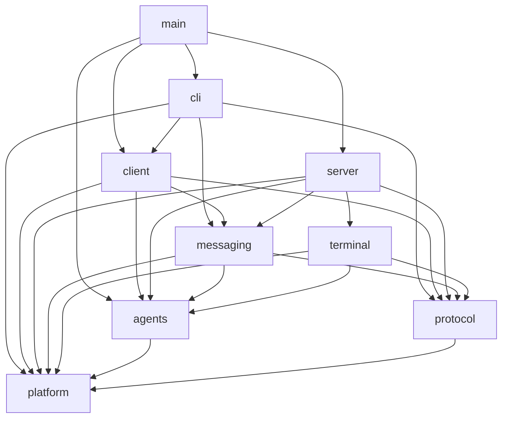
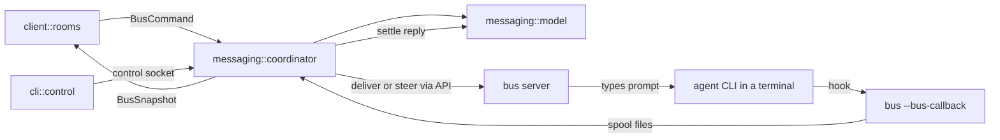
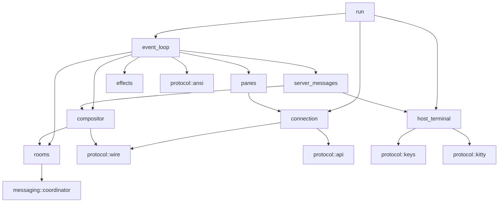
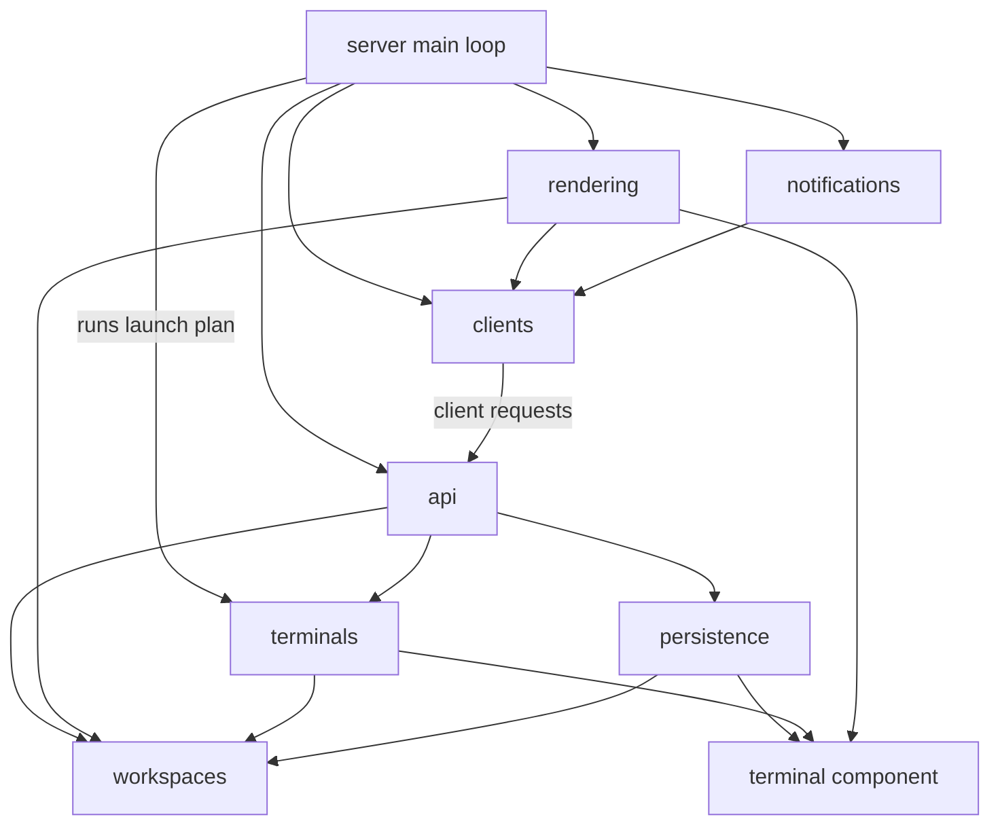

# Bus restructure

Status: decided. It describes the target folder and module layout of the repository. Bus is a prototype with no general backward compatibility and no CI. S13 retains a specific set of disk, injected environment and wire spellings so the existing local session can resume; this does not restore legacy Rust import paths.

S13 pre-cutover checkpoint: canonical imports and AgentKind/TerminalEvent/RoomAgent spellings are in place; compatibility wiring is removed and the final import graph is enforced. Shared filesystem mechanics, neutral provider harnesses, restore planning and package input closure are complete. The enforced limit is
800 handwritten production lines per file, with shared test scopes and the generated FFI exception. H14 production
Clippy rules are active at 100 function lines, cognitive complexity 25 and 11 arguments; tests are exempt from these
selected rules. Python retains Ruff E9,F and has no complexity lint policy.

## 1. Repository root

- `src/`: the Bus terminal application (Rust), described in section 2
- `orchestration/`: Markdown only; how a MASTER orchestrator agent works
  - `README.md`: the contract between Bus and these files (placeholders, compiled-in defaults, control CLI)
  - `prompt.md`: the MASTER system prompt
  - `rules.md`, `guide.md`, `how-to-bus-cli.md`: binding rules, working guide, control CLI reference
- `workflows/`: Markdown only; the standard workflow library
  - `create.md`: how to draft and revise a workflow (the `workflow-create` skill points here)
  - `template.md`, `pr-review-loop.md`, `cross-repo-feature.md`
- `skills/`: agent workflow skills; `.agents/skills` and `.claude/skills` link here
  - `skill-architecture.md`: the shared skill contract
  - one folder per skill: `SKILL.md`, `guide.md`, `references/` and the skill's own `scripts/` (quality lanes, review lanes, PR signals,
    ledgers and plan checks stay with the skill that runs them; their tests are `scripts/tests/*_test.py`)
- `cli_extensions/`: shared Python for the review skills (artifact parser and renderer, round and lane ownership)
- `scripts/`: skill-referenced shared tooling; `conventional_commits.py` and the skill-migration contract test stay here
- `docs/`: repo-development docs
  - `bus-architecture.md`: this document
  - `guides/`: architecture principles, code review, plan review, review format and response, consumer-fallout format
  - `templates/`: `plan-template.md`
- `tests/`: black-box integration tests against the built `bus` binary. Targets are declared with `[[test]]` in `Cargo.toml`;
  the cross-platform `room-screen` target uses `client/room_screen_test.rs`
  - `support/`: `process_test.rs` (pid and dir hygiene), `spawn_test.rs` (one `spawn_server`/`spawn_client`), `wire_test.rs`,
    `json_test.rs`; each target includes them with `#[path]`
  - `api/`: `api_test.rs`, `server_test.rs`, `workspaces_tabs_test.rs`, `panes_test.rs`, `agents_test.rs`, `events_test.rs`
  - `server/`: `server_test.rs`, `lifecycle_test.rs`, `reattach_test.rs`, `headless_size_test.rs`, `multi_client_test.rs`
  - `client/`: `client_test.rs`, `startup_test.rs`, `lifecycle_test.rs`, `window_title_test.rs`, `output_test.rs`,
    `persistence_test.rs`, `shared_view_test.rs`, `room_screen_test.rs`, `room_screen_support_test.rs`, `screen_support_test.rs`
  - `cli/`: `cli_test.rs`, `callbacks_test.rs` (`--bus-callback` spooling), `paths_test.rs` (`--paths` and data-dir isolation)
  - `fixtures/`: key corpora, endpoint golden JSON, session files (data files keep their names)
- `tools/`: repo-level tooling that belongs to no single skill, one Python package and one test root
  - `quality/`: UI hot-path check and the enforced import-boundary audit for graph 3a
  - `acceptance/`: `harness_test.py`, `existing_instance_test.py`, `e2e_test.py`, `live_ui_test.py`, `screen_test.py` (e2e and
    live-UI tests and their helpers, all test code)
  - `keyboard/`: raw-tty helper and the key capture tools
  - `vendor/`: re-vendor (`--source-repo` required) and hand-build libghostty-vt, vendored-tree checks
  - `windows/check.ps1` (local Windows build check), `tests/` (`*_test.py`)
- `packaging/`: release plumbing; orchestration and workflow defaults are compiled into the binary
  - `nix/package.nix`: `buildRustPackage`; its source fileset includes both embedded Markdown folders, registered test sources/fixtures, native sources/metadata and patched portable-pty
  - `windows/`: `conpty.json`, `licenses/`, `package_conpty.py`, `package_conpty.ps1`, `tests/` (`*_test.py`)
- `vendor/`: `libghostty-vt/` (with `build.zig.zon.nix`), `portable-pty/`, `patches/` (libghostty-vt carries patch 0001 only), the patch indexes and
  `libghostty-vt.vendor.json`
- `assets/`: `logo.svg`, `sounds/` (built-in dings)
- Root files: `Cargo.toml`, `Cargo.lock`, `build.rs`, `rust-toolchain.toml`, `clippy.toml`, `justfile`,
  `pytest.ini` (`python_files = *_test.py`), `flake.nix`, `flake.lock`, `run` (repo launcher), `README.md`, `LICENSE`, `.cargo/config.toml` (Windows static CRT), `.gitattributes`, `.gitignore`

## 2. `src/` layout

Nine components, listed in reading order. The dependency rule is graph 3a, not this order; `main.rs` is the composition root above all
of them. The final target is at most 800 handwritten production lines per file (generated bindings are not handwritten).
The gate retains the default Clippy rules and enforces production function length 100, cognitive complexity 25 and argument
threshold 11, plus no wildcard imports, stdout print macros, dbg/todo/unimplemented macros, get-unwrap or unwrap calls.
Production checking runs before test-target compilation, where only those selected rules are exempt.

Every test file in the repository, Rust or Python, is named `*_test.<ext>`: `*_test.rs` and `*_test.py`. Shared test helpers are
test code and follow the same rule (`support_test.rs`). Data fixtures such as `.json` keep their names inside a test folder. A
module's tests live in a sibling `tests/` folder with one `<area>_test.rs` per area, each included with
`#[cfg(test)] #[path = "tests/<area>_test.rs"] mod <area>_test;`, so no test folder needs a `mod.rs`.

A file is a test file, and so exempt from the 800-line cap and the complexity lints, if either its name matches `*_test.*`
(file level) or it sits inside a test directory: any folder named `tests`, at any depth, including the top-level `tests/`
(directory level). Inline `#[cfg(test)]` modules in production files are exempt by their test scope and stay where they are; they
are not moved out just for the cap. Both levels are patterns in the lint policy and the clippy and test-scope config, never a
per-file list. The same shared classifier drives length, coverage and architecture checks; no handwritten file-length
exemptions remain.

An enforced lint check fails the gate when test code (a `#[test]` fn, or a pytest test function or file) is in none of those three
places: a `*_test.*` file, a `tests` directory or an inline `#[cfg(test)]` module. Pytest (`python_files`) and the gate's Python
test discovery both look for `*_test.py` only.

Files are split by ownership, not by helper.

- `main.rs`: argv dispatch to `cli`, the hidden `server` and `client` entries, and the `--bus-callback` hook entry
- `utils/`: shared basics; a leaf that imports no other component
  - `ids.rs` (`PaneId`, `TerminalId`), `version.rs`, `paths.rs` (owns the path table for every on-disk
    file and socket under `BUS_DATA_DIR`, including `bus.sock`)
  - `logging.rs` (takes explicit filter/rotation/dev options from startup composition), `log_events.rs`, `env.rs` (shared inherited path/key facts), `time.rs`, `home_path.rs`, `url.rs` (safe web URL check)
  - `config/`: `mod.rs`, `load.rs` (TOML, live reload; an unknown key fails with a diagnostic), `session.rs`, `server.rs`,
    `terminal.rs`, `advanced.rs`, `experimental.rs`, `toast.rs`, `interface.rs` (UI settings), `sound.rs` (ding paths),
    `ui/{theme,window_title,keys}.rs`, section-owned `tests/`; `core.rs` retains the logical `model` namespace
  - `theme/`: `color.rs` (`RgbColor`, `TerminalTheme`, `HostAppearance`), `palette.rs`, `builtin.rs`, `resolve.rs`
  - `paths/`: `session_args.rs`, `socket.rs`; CLI help/stop policy lives in `cli`; detached attach guidance lives in client errors; shared paths contain calculation only
  - `text/`: `selection.rs` (`Selection`), `notification.rs` (message splitting), `hit_testing.rs` (URL, word, quoted path), `copy_motion.rs`, `width.rs`
  - `render/`: `signal.rs` (redraw requests), `prof.rs`, `widgets.rs` (`ScrollMetrics`, `CopyFeedback`, scrollbar/overlap math), `widgets/selection.rs` (highlight math), `feedback.rs`, `diagnostic.rs`
- `platform/`: the operating system
  - `mod.rs`: shared types (`ForegroundJob`, `Signal`, `ChildExitReason`, `ClipboardImage`) and the facade; returns raw process and
    environment facts and leaves their meaning to `agents`
  - `process/{linux,macos}.rs`, `desktop/{linux,macos}.rs`: process introspection; clipboard, open URL, notifications
  - `unix.rs`, `daemon.rs`, `signals.rs`, `ipc.rs`: unix helpers, setsid and nofile, signals, local sockets
  - `fs.rs`: private dirs, locks and atomic replace primitives; each caller keeps its own write policy
  - `tests/{process_linux_test,desktop_linux_test,process_macos_test,desktop_macos_test}.rs`
  - `sound/`: `mod.rs` (`play`, `play_named`), `player.rs` (OS players), `catalog.rs` (system sounds)
  - `windows/`: Windows backend
    - `mod.rs` (small helpers, re-exports), `fs.rs` (atomic replace, ACL'd dirs, long paths), `shell.rs` (cmd and PowerShell)
    - `daemon.rs` (WMI launch, job checks), `console_command.rs` (no-console `Command`)
    - `desktop.rs` (clipboard text, URLs, tray notifications), `clipboard_image.rs` (PNG and DIB decode)
    - `process/snapshot.rs` (ToolHelp), `process/peb.rs` (cwd, cmdline, env readers), `process/foreground.rs` (job snapshot, caches)
    - `tests/{shell_test,daemon_test,process_test,foreground_cache_test,input_test}.rs`
- `protocol/`: every format Bus speaks to another process or to a terminal
  - `wire/`: binary client-server messages
    - `mod.rs`, `messages.rs` (`ClientMessage`, `ServerMessage`), `framing.rs` (length prefix, size limits), `version.rs`
    - `handshake.rs` (shell hello and welcome; client and server must be the same build), `input.rs`, `input_adapters.rs` (key and mouse DTOs, conversions)
    - `frame.rs`, `frame_adapters.rs` (cells, cursor, frames, ratatui conversion), `shell.rs` (shell snapshot DTOs)
    - `surface.rs` (pane surfaces, patches, graphics scenes), `notifications.rs`, `host_theme.rs`
    - `tests/{codec_test,framing_test,input_test,frame_test,version_test}.rs`
  - `api/`: JSON-RPC
    - `schema/`: `mod.rs` (`Request`, `Method`), `methods.rs`, `common.rs`, `responses.rs`, `events.rs`, `workspaces.rs`, `tabs.rs`,
      `panes.rs`, `layout.rs`, `copy.rs`, `agents.rs`, `agent_view.rs`, `session.rs`, `server.rs`, `bus-api.schema.json`, `tests/{requests_test,responses_test,golden_test}.rs`
    - `client.rs` (`ApiClient`), `status.rs` (ping)
  - `keys/`: `key.rs`, `protocol.rs` (`KeyboardProtocol`, modifyOtherKeys), `decode.rs`, `encode.rs` (including ConPTY key encoding),
    `mouse.rs`,
    `host/{event,framer,sequence,mouse,replies}.rs` (host byte stream to `RawInputEvent`),
    `tests/{decode_test,encode_test,host_framer_test,host_events_test,host_mouse_test,host_replies_test}.rs`
  - `ansi/`: frame diff to ANSI: `mod.rs` (`BlitEncoder` state), `diff.rs` (full redraw and cell diff), `cursor.rs` (cursor, IME anchor,
    synchronized output), `tests/{diff_test,cursor_test,sync_test}.rs`
  - `kitty/`: `apc.rs`, `placement.rs` (kitty graphics encoding and placement math)
- `agents/`: knowledge of agent CLIs
  - `catalog.rs` (`AgentKind`, labels, executables), `identify.rs` (interprets platform process facts: chains, env hint, Windows
    foreground choice), `detect.rs` (`AgentState`, `AgentDetection`)
  - `dialog.rs` (choice and question panels), `title.rs` (spinners), `tests/{catalog_test,identify_test,dialog_test}.rs`
  - `manifest/`: `mod.rs`, `schema.rs`, `compile.rs`, `regions.rs`, `loader.rs`, `bundled/*.toml`,
    `tests/{engine_test,validation_test,regions_test,claude_test,codex_test,others_test}.rs`
  - `resume/`: `catalog.rs` (resume argv per agent), `session_ref.rs`, `tests/`
  - `providers/`: agent harnesses Bus launches and observes, one folder each
    - `mod.rs` (`ProviderKind`, match dispatch into each harness), `launch.rs` (room-free `LaunchSpec` to `PreparedLaunch`),
      `callback_entry.rs` (early hook process entry), `spool.rs` (`--bus-callback` records, parsed into neutral provider events), `hook_json.rs` (shared hook-file merge and consent),
      `suggest.rs` (cwd suggestions), `tests/`
    - each harness passes a prompt file to its CLI and never reads room state; `resume.rs` rebuilds launch extras from verified facts
    - `claude_code/`: `launch.rs` (args, per-launch settings), `hooks.rs` (install, parse, prompt normalization), `system_prompt.rs`,
      `resume.rs`, `statusline.rs` (quota source), `tests/`
    - `codex/`: `launch.rs`, `hooks.rs` (`.codex/hooks.json`, parse), `system_prompt.rs`, `resume.rs`, `usage.rs` (rollout quota source),
      `tests/`
    - `cursor/`: `launch.rs`, `hooks.rs` (`.cursor/hooks.json`, parse), `system_prompt.rs` (first message), `resume.rs`,
      `final_reply.rs` (transcript tail), `tests/`
- `terminal/`: one live terminal, from PTY to server-owned state
  - `mod.rs`, `registry.rs`, `events.rs` (`TerminalEvent`, the one stream runtimes and API handlers send to the server),
    `history.rs` (alt-screen scrollback merge)
  - `vt/`: safe libghostty-vt facade and cohesive handle/protocol owners
    - `mod.rs` (stable re-exports), `ffi.rs` (generated bindings), `consts.rs`, `types.rs` (cells, colors, cursor, scrollbar)
    - `terminal.rs` (handle, lifecycle, modes), `callbacks.rs` (C trampolines, clipboard, PNG decode), `input.rs` (focus/key/mouse encoders)
    - `render.rs` (render state), `read.rs` (terminal queries), `read/rows.rs` (borrowed row and cell iterators)
    - `kitty.rs` (image data/cache/storage), `kitty_placement.rs` (ordinary/virtual placement geometry)
    - `tests/{terminal_test,render_test,input_test,kitty_test}.rs`
  - `pty/`: `fd.rs` (wake pipe, poll, resize), `actor/{mod,unix,windows}.rs` (per-terminal I/O thread),
    `actor/submission.rs` (paced text, delay and Enter), `tests/{unix_actor_test,submission_test}.rs`
  - `emulator/`: PTY bytes into the VT, frames and text out
    - `mod.rs` retains core/locking and the mode/state facade; `write.rs` owns ordered writes/replies and response draining
    - `color_replies.rs` (theme ownership and queries), `encode.rs` (key/mouse encoders), `render.rs` (full painting),
      `dirty_patch.rs` (bounded dirty preparation, collection and clearing), `read.rs` (visible, recent and detection text and ANSI)
    - `text_motion.rs` (retained text, search, word and paragraph motion), `windows.rs`, `conpty_recent_cache.rs`
    - `controls/`: `osc/{default_colors,agent,cwd,scrollback_compat,debug,collector}.rs`, `osc/tests/`, `xtgettcap.rs`, `kitty_keyboard.rs`
      (kitty flags and the modifyOtherKeys 0/1/2 tracker),
      `cursor.rs`, `input.rs`
    - `tests/{render_test,color_replies_test,text_motion_test,search_test,read_test,recent_test,write_test,encode_test,ansi_test}.rs` (`ansi_test.rs`: protocol ANSI tests that need
      a real VT)
  - `runtime/`: `TerminalRuntime`, the only handle to a live terminal
    - `mod.rs` (struct, I/O wiring, drop), `spawn.rs` (shell resolution, launch env, PTY spawn), `io.rs` (input, resize, scroll)
    - `read.rs` (snapshots, render, cwd, PTY callback), `detection_task.rs` (agent probe loop),
      `detection_process.rs` (process observation), `detection_policy.rs` (debounce, publish rules)
    - `compression.rs` (idle scrollback), `shutdown.rs` (close and release), `dialog.rs` (answer agent dialogs)
    - `tests/{support_test,spawn_test,detection_test,compression_test,shutdown_test,io_test}.rs`
  - `state/`: `TerminalState`, the arbiter of effective agent state
    - `mod.rs` (struct, labels, title, queries, recompute), `detection.rs` (screen and process input)
    - `sessions.rs` (session refs, replacement), `managed_agent.rs` (phases of agents started through `agent.start`)
    - `tests/{detection_test,process_exit_test,sessions_test,session_replacement_test,managed_agent_test}.rs`
- `messaging/`: rooms and the message round trip
  - `mod.rs`, `identity.rs` (managed agent names, `bus:<agent>` source ids), `attachments.rs`, `diagnostics.rs`
  - `model/`: the round-trip rules, no I/O
    - `mod.rs`, `types.rs` (ids, `Author`, `Room` and its MASTER kind, `RoomAgent`, `Prompt`, `Reply`), `state.rs` (`BusState`)
    - `rooms.rs`, `agents.rs` (participants, `orchestrates` link), `requests.rs` (queue, coalesce, steer, settle)
    - `callbacks.rs` (match neutral provider events to requests), `status.rs` (room rollup),
      `tests/{rooms_test,agents_test,requests_test,callbacks_test}.rs`
  - `coordinator/`: the single-writer worker that runs the round trip
    - `mod.rs` (`BusHandle`, `BusCommand`, `BusEvent`, `BusSnapshot`), `worker.rs`, `poll.rs` (agent status), `delivery.rs`
    - `commands.rs`, `agents.rs` (`AddAgent` to `LaunchSpec`, delete, guarded terminal close), `callbacks.rs` (consume the hook spool)
    - `resume.rs` (rebind after restart; validate a resumed agent's room, store and spool from terminal facts), `usage.rs` (newest
      quota per login, throttling, state output), `settings.rs`, `dialogs.rs`
    - `control/`: handlers for control commands, `rooms.rs`, `agents.rs`, `messages.rs`, `dialogs.rs`, `inspect.rs`
    - `tests/`: `delivery_test.rs`, `queue_test.rs`, `poll_test.rs`, `binding_test.rs`, `persistence_test.rs`, `recovery_test.rs`,
      `steering_test.rs`, `resume_test.rs`, `focus_test.rs`, `settings_test.rs`, `dialogs_test.rs`,
      `control/{rooms_test,agents_test,messages_test,dialogs_test,inspect_test}.rs`
  - `native.rs`: `NativeServerClient`, the coordinator's API client to the server
  - `storage/`: `state_store.rs` (`JsonStore`), `sessions.rs` (local session registry), `tests/`
  - `control/`: `server.rs` (control socket, started only with `--dev`; `send --as` must name an agent in the room or its
    orchestrator, other commands trust the caller), `protocol.rs` (framing)
  - `prefs/`: `settings.rs` (`settings.json`), `colors.rs` (agent palette)
  - `orchestration.rs`: embed `orchestration/` and `workflows/`, write the docs into the Bus data root, and fill MASTER
    prompt placeholders; compiled-in copies are the only defaults in every build
- `server/`: the `bus server` daemon
  - `mod.rs` (wiring and stable server tests), `main_loop.rs` (`Server`), `app_loop.rs`, `app.rs` (`App`), `app_state.rs`,
    `app_settings.rs`, `app_queries.rs`, `startup.rs`, `shutdown.rs`, `config_reload.rs`
  - `workspaces/`: workspaces, tabs and the split layout
    - `mod.rs` (`Workspace`), `tab.rs`, `pane.rs` (`PaneState`), `layout/{tree,geometry,nav,layout_test}.rs`,
    `agent_view.rs` (ordered agent-panel entries; no filter DSL)
    - `ids.rs` (public `w`/`t`/`p` ids, target resolution), `navigation.rs` (focus, switch, move, zoom), `moves.rs` (move panes
      across tabs), `close.rs`, `attention.rs`, `git_label.rs`, `cwd.rs`, `tests/` (with `support_test.rs`)
  - `terminals/`: live terminals and the agents in them
    - `events.rs` (apply `TerminalEvent`s, emit pane updates), `agents.rs` (start, rename, focus, info), `resume.rs` (extract terminal
      facts, ask `messaging` to validate, then the provider for launch extras), `respawn.rs` (shell after an agent exits), `titles.rs`, `theme_sync.rs`
    - `scrollback_read.rs`: paged scrollback read of full-screen agent TUIs
    - `tests/{events_test,agents_test,resume_test,respawn_test,scrollback_read_test}.rs`
  - `persistence/`: `schema.rs`, `capture.rs`, `store.rs`, `restore.rs` (pure snapshot-to-model/TerminalState/launch descriptions; startup executes them through `terminals/restore_launch.rs`),
    `autosave.rs`, `tests/{schema_test,store_test,restore_test}.rs`
  - `api/`: handlers for every API method
    - `socket/{accept,connection}.rs` (API socket, one thread per connection), `streams/{event_hub,subscriptions,wait,prompt_wait}.rs`
    - only the methods the client, the coordinator and the control CLI call
    - `mod.rs` (dispatch), `server_methods.rs` (stop, reload, window title, read deferral), `events.rs` (outbound API events)
    - `errors.rs`, `env.rs`, `input_encoding.rs`, `terminal_read.rs`, `session.rs`, `workspaces.rs`, `tabs.rs`, `layouts.rs`
    - `tests/{dispatch_test,events_test,streams_test}.rs`
    - `agents/`: `basic.rs`, `prompt.rs` (deferred prompts, admission), `dialog.rs`, `read.rs`, `tests/{basic_test,prompt_test,dialog_test}.rs`
    - `panes/`: `mod.rs` (list, get, focus, rename, close), `layout.rs` (split, resize, swap, zoom, events),
      `copy.rs` (scroll, selection, copy motion and search, links), `io.rs` (read, input routing), `session.rs` (Bus agent session
      reports)
    - `panes/tests/{layout_test,navigation_test,copy_test,io_test,session_test,close_test}.rs`
  - `clients/`: connected TUI clients
    - `accept.rs`, `handshake.rs`, `read_loop.rs`, `writer.rs` (control and render lanes),
      `events/{mod,connection,shell}.rs` (`ServerEvent` and its handling)
    - `connection.rs` (per-client record), `foreground.rs`, `input.rs`, `requests.rs` (client request allow-list and dispatch)
    - `focus.rs`, `geometry.rs`, `surface_lease.rs`, `clipboard_images.rs`,
      `tests/{handshake_test,read_loop_test,writer_test}.rs`
  - `rendering/`: what each client sees
    - `surface/{layout,draw,chrome,selection,scrollbar}.rs` and `surface/tests/` (draw a tab of panes), `snapshot.rs` (shell snapshot for a client)
    - `full.rs`, `incremental.rs` (dirty-row patches), `stream.rs`, `images.rs` (kitty scene, delivery cache), `host_modes.rs`,
      `window_title.rs`, `tests/`
  - `notifications/`: `policy.rs` (state change to toast), `delivery.rs` (pending, drain, send to clients), `show.rs`, `tests/`
  - `tests/`: `support_test.rs`, `lifecycle_test.rs`, `startup_test.rs`, `config_reload_test.rs`, `theme_test.rs`, `window_title_test.rs`,
    `client_shell_test.rs`, `client_shell_input_test.rs`, `incremental_test.rs`, `views_test.rs`, `input_test.rs`, `notifications_test.rs`,
    `surface_lease_test.rs`, `render_scale_test.rs` (ignored benchmark; the one test-only import of `client`)
- `client/`: the TUI client process
  - `mod.rs`, `run.rs`, `event_loop.rs`, `server_messages.rs`, `state.rs`, `events.rs`, `timer.rs`, `errors.rs`
  - `config_reload.rs`, `effects.rs` (clipboard, URLs, editor), `clipboard.rs` (native or OSC 52), `notifications.rs`
  - `host_terminal/`: the user's real terminal
    - `setup.rs`, `geometry.rs`, `frame_output.rs`, `effects.rs` (bells, title), `modes.rs`, `notify.rs`, `color_probe.rs`
    - `kitty.rs`: host image upload cache and emitter
    - `input/`: `mod.rs` (stdin reader thread), `tests/`, `windows/`
      - `reader.rs` (console handle, reader loop, motion coalescing), `records.rs`, `mapper.rs` (records to key, text, mouse)
      - `win32_input_mode.rs`, `keymap.rs` (VK and modifier tables), `pump.rs` (VT chunks through the host framer)
      - `tests/{support_test,mapper_test,pump_test,win32_input_mode_test,keymap_test,handoff_test}.rs`
  - `connection/`: `handshake.rs`, `writer.rs`, `bootstrap.rs` (first coherent surface), `requests.rs`, `state.rs`, `notices.rs`,
    `agent_seen.rs`, `tests/`
  - `compositor/`: `mod.rs`, `compose.rs`, `patch.rs`, `hits.rs`, `config.rs`, `snapshot.rs`, `tests/`
  - `panes/`: `router.rs`, `keys.rs`, `input_lease.rs`, `mouse/{hit,selection,scroll,splits,forward}.rs`, `tests/`
  - `rooms/`: the room UI
    - `mod.rs` (compositor hooks, coordinator start), `ui.rs` (snapshot/events and settlement),
      `drafts.rs` (per-room editors and save/send intent), `toast.rs` (notices and expiry), `chat_search.rs`, `ring.rs`, `help.rs`, `selection.rs`
    - `widgets/{editor,recipients}.rs`, `dialogs/{forms,deletion}.rs`
    - `input/`: `mod.rs`, `composer.rs`, `history.rs`, `forms.rs`, `settings.rs`
    - `history/`: `mod.rs`, `exchange.rs`, `markdown.rs`
    - `render/`: `mod.rs` (view model and hits), `view.rs`, `text.rs`, `sidebar.rs`, `layout.rs`, `room.rs`, `dialogs.rs`, `paint.rs`, `thumbnails.rs`
    - `tests/`: `support_test.rs` (fixtures, input drivers, screen capture), `deletion_test.rs`, `sidebar_test.rs`, `toasts_test.rs`,
      `composer_test.rs`, `forms_test.rs`, `layout_test.rs`, `native_shell_test.rs`, `attachments_test.rs`, `selection_test.rs`,
      `history_markdown_test.rs`, `history_slots_test.rs`, `history_scroll_test.rs`, `keys_test.rs`, `master_test.rs`, `sound_test.rs`,
      `focus_test.rs`, `chat_search_test.rs`
- `cli/`: the `bus` command
  - `mod.rs` (argv: `--dev`, `--paths`, `sessions`, `resume`, `stop`), `session_pick.rs`, `launch.rs` (start or validate the server, then run the client), `stop.rs`
  - `control.rs` (control commands used by orchestrators and humans), `help.rs`, `tests/{parse_test,execute_test}.rs`

Local test moves use literal includes where needed to retain their full S9b names. In particular, CLI stop/guidance tests keep
`utils::paths::tests`, the runtime PTY setup case keeps `terminal::pty::spawn::unix::tests`, and graphics tests keep their Kitty
parent. Shared writer, lease and room support implementations are instantiated once. Python acceptance helpers and raw-tty
tools remain importable without launching live UI tests during collection.

## 3. Dependency graphs

Arrows point from the user to the dependency. `utils` is used by every component and is left out of the graphs. Graph 3a is the
dependency rule, and an import-boundary check in `tools/quality` fails the gate on any edge it does not show.

### 3a. Components

The graph is acyclic. `main` is the composition root: it dispatches to `cli`, the hidden `server` and `client` entries, and the
`--bus-callback` hook entry in `agents`.

- `messaging` never imports `terminal`, `server` or `client`: it reaches agents through the server's JSON API and the provider hook
  spool. `agents/providers` never imports `messaging`: it takes a room-free `LaunchSpec` and emits neutral provider events.
- `client` never imports `terminal` or `server`: it sees state only through protocol messages and API results.
- `server` uses `messaging` in one place: `server/terminals/resume.rs` passes terminal facts to `messaging` to validate a resumed Bus
  agent, so no `TerminalState` crosses into `messaging`.
- Inside `terminal`, only `state/` and the runtime's agent detection use `agents`; `vt`, `pty` and `emulator` do not.
- `platform` and `protocol` import no product component.

At run time there is one loop across processes, carried by sockets and files: the coordinator calls the server API, the server runs agent
CLIs in terminals, their hooks run `bus --bus-callback`, and the coordinator reads the spool those calls write.

### 3b. The message round trip

### 3c. Client

### 3d. Server

## 4. Component responsibilities

**utils**. Ids, version, the path table, logging, config loading, colors, text selection and small render helpers. It is a leaf: it
imports no other component, though it holds small shared state such as the redraw signal. `config` stores agent names as plain
strings; `agents` validates them. `logging` consumes explicit startup options.

**platform**. Every OS call: processes, signals, clipboard, URLs, notifications, local sockets, file primitives, sound playback and the
Windows backend. It returns raw facts and must not know about agents or protocols; callers pass limits (such as the clipboard image
cap) and decide policy, including whether atomic writes follow symlinks.

**protocol**. Every format Bus speaks: the binary client-server wire, the JSON-RPC API schema and client, key and mouse codes, the ANSI
diff and the kitty image encoding. It encodes and decodes and holds no session state; the API socket server, event streams, waits and
the host image cache live with their owners in `server` and `client`. Changing a wire tag or field order is a protocol change.

**agents**. Knowledge of agent CLIs: which agent a process is, what its screen says, its dialogs, how to resume it, and
one provider folder per harness (Claude Code, Codex, Cursor), each owning its launch args, hook install and parsing, system prompt,
resume and quota sources. `ProviderKind` dispatches to them by match. Adding a harness means one folder and one enum variant. It owns
no terminals and no rooms, and its inputs carry no room ids.

**terminal**. One live terminal end to end: the libghostty-vt wrapper, the PTY actor, the emulator, `TerminalRuntime` (the single handle)
and the server-owned `TerminalState`, including agents started through `agent.start`. It must not know about workspaces, rooms or
clients.

**messaging**. Rooms and the round trip: a message in a room becomes one request per recipient, which is queued, delivered or steered into
a running turn, matched to the provider's callback and settled as a reply. It owns the room model (work rooms and the MASTER room), the
single-writer coordinator, room storage, the control socket and user preferences. It knows that MASTER agents orchestrate a work room and
resolves their prompt files, but holds none of the prompt content.

**server**. The `bus server` daemon, split by what it manages: `workspaces/` (tabs and split layout), `terminals/` (live terminals and
their agents), `persistence/` (session save and restore), `api/` (every API method handler), `clients/` (connected TUIs and their
focus and geometry), `rendering/` (what each client sees) and `notifications/`. It must not hold room logic.

**client**. The TUI: host terminal setup and input, the one server connection, the frame compositor, pane input and the room UI. It hosts
the coordinator in its process but only through `BusHandle`.

**cli**. The `bus` command: session pick, server start and same-build check, client launch, `stop`, and the control commands.

**Errors and ids.** There is no crate-wide error type. Each owner keeps its own: framing errors in `protocol/wire`, `ApiClientError` in
`protocol/api`, VT errors in `terminal/vt`, `ModelError` in `messaging/model`, `StoreError` in `messaging/storage`, control errors in
`messaging/control`, method errors in `server/api` and `ClientError` in `client`; edges map them. Three id families stay distinct:
internal `PaneId`/`TerminalId` (`utils/ids`), public `w`/`t`/`p` ids (formatted only in `server/workspaces/ids.rs`), and room, agent,
prompt and request ids (`messaging/model`).

**orchestration/ and workflows/** (Markdown, outside `src/`). How MASTER agents work, and the workflows they run. Bus gives each agent the
context its job needs: MASTER agents know they are in Bus and command the agents in the room they are attached to, so they get the prompt,
rules, guide, control CLI reference and workflow library. Work-room agents do ordinary software work and get only the messages sent to them.
Both folders are compiled into the binary with `include_str!`; debug, release and Nix builds use the same defaults. Bus writes the
embedded docs under `<BUS_DATA_DIR>/docs/` for agents to read, and the filled prompt into each launch's callback folder. There is no
installed `share/bus` default directory, runtime source-file lookup or user-file override layer. Explicit per-launch custom prompts
remain supported. `orchestration/README.md` documents the source-to-emitted filename map, the placeholders Bus fills
(`{{ROOM_NAME}}`, `{{ROOM_ID}}`, `{{AGENT_NAME}}`, `{{DOCS}}`), and the control CLI as the only way to drive Bus.

S11 packaging closure: Cargo includes all Rust sources, registered integration suites and fixtures, authored Markdown, native Ghostty sources/metadata and the build script. Zig caches, dependency caches and built outputs are excluded. Nix retains the patched portable-pty dependency as a path source; Cargo registry normalization removes the local patch table, so registry publication is a distinct dependency contract, not the Nix/repository build. No runtime resolver or installed default directory is added. The final import graph is enforced, including grouped/aliased/relative paths and physical owners reached through re-exports. Unknown paths fail; generated or procedural macro expansion still requires compiler verification. S13 uses Bus operational branding while retaining the explicitly documented live session directory/socket/log names, injected runtime keys, native session source identifiers and serialized enum tags. The callback command and executable path stay unchanged through the human-controlled cutover.

## S13 live-session compatibility

Bus branding and build/debug knobs use Bus names. No startup migration is introduced. The human cutover must reuse the same HOME, local session ID and callback executable path. These retained literals preserve the existing session and injected agents:

| Contract | Retained spelling |
| --- | --- |
| Session-local native config/state | `herdr-config`, `herdr-config/sessions/bus`, `herdr-state` |
| Native IPC endpoints | `herdr.sock`, `herdr-client.sock` |
| Logs and numbered rotations | `herdr-server.log`, `herdr-client.log` |
| Injected environment | `HERDR_ENV`, `HERDR_SESSION`, `HERDR_SOCKET_PATH`, `HERDR_CLIENT_SOCKET_PATH`, `HERDR_CONFIG_PATH`, `HERDR_STARTUP_CWD`, `HERDR_AGENT`, `HERDR_BIN_PATH`, `HERDR_WORKSPACE_ID`, `HERDR_TAB_ID`, `HERDR_PANE_ID`, `HERDR_PANE_RUNTIME_ID` |
| Environment isolation and shell prompt marker | `HERDR_` scrub prefixes; `__HerdrOriginalPrompt` |
| Persisted native provider sources | `herdr:<provider>` prefixes, aliases and replacement rules |
| Serialized delivery and right-click tags | `herdr` |
| Already-injected callback command | `/Users/dylanliu/work/bus/target/debug/bus --bus-callback` and the existing provider hook subcommands |

`BUS_DATA_DIR`, `BUS_SESSION_ID`, `BUS_CALLBACK_DIR` and `BUS_LAUNCH_ID` keep their existing meanings. Native `HERDR_SESSION=bus` is distinct from the local Bus session ID. Persisted rooms, agents, callback manifests, queues and consumed callback/turn IDs are not rekeyed. Upstream attribution and provenance, frozen test identities and explicit negative legacy-title fixtures also retain their original spelling. Windows packaging and the maintained ConPTY loader now agree on `conpty/bus-conpty.json` and `BUS_WINDOWS_CONPTY`; no old marker fallback is added.
