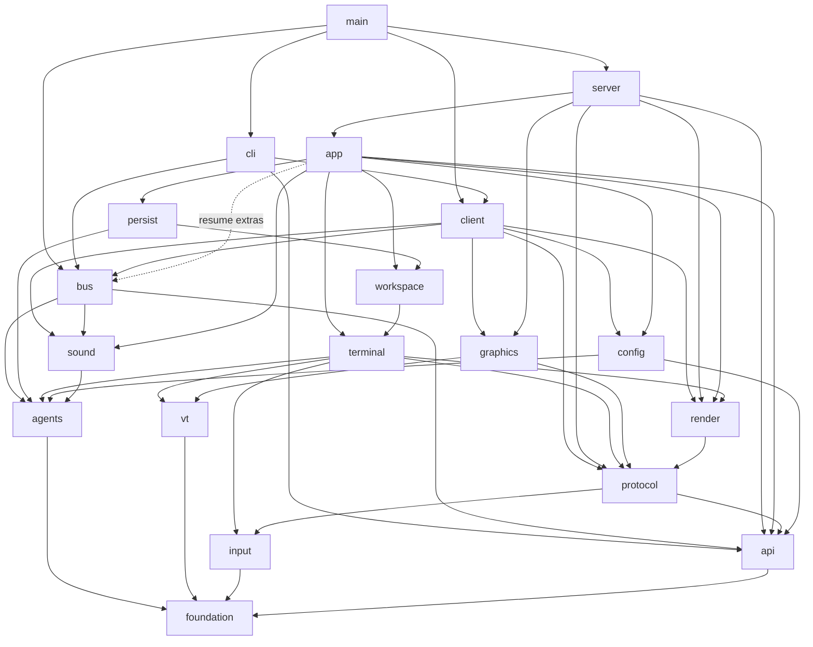
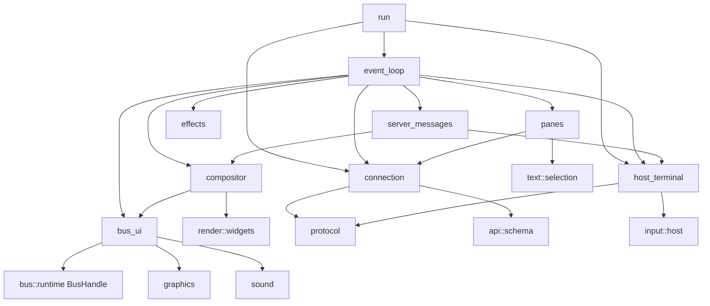
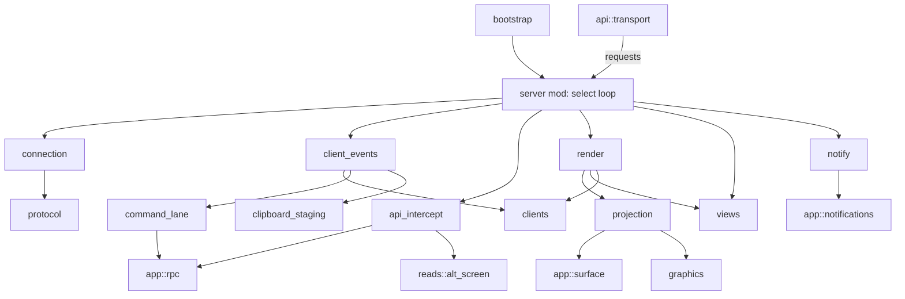
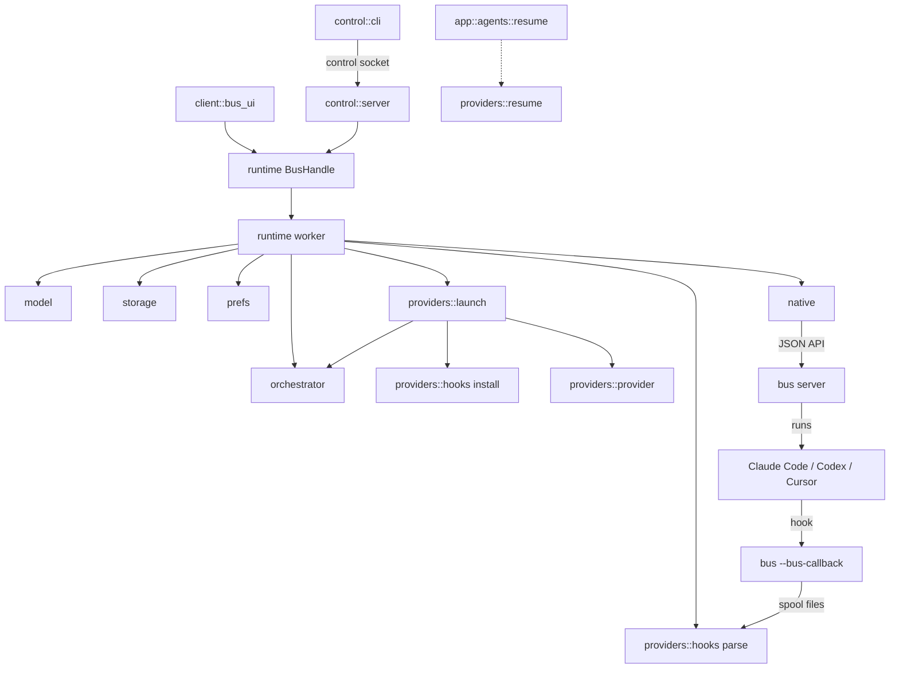

# Bus architecture

Status: proposal for discussion. It describes the target folder and module layout of the repository.

## 1. Overview

Bus is a terminal workspace for running coding agents side by side and coordinating them in chat-style rooms. One `bus` binary runs as three
kinds of process. The **CLI** (`bus`, `bus resume`, `bus sessions`, `bus stop` and the orchestrator control commands) picks a local session,
starts the server if needed and then becomes the **TUI client**. The client draws the Bus room UI and the agent terminals in the user's real
terminal, and it hosts the **Bus room coordinator**: a single-writer worker that owns rooms, agents, messages and request queues. The
**server** (`bus server`, a background daemon) owns every live terminal: the PTY, the **terminal emulation** (vendored libghostty-vt), agent
detection, the workspace and tab layout and a JSON-RPC socket API. **Provider integrations** for Claude Code, Codex and Cursor launch those
CLIs in server terminals, install observation hooks that call back into `bus --bus-callback`, and resume their native sessions after a
restart. **Persistence** has two owners: the server saves the terminal session snapshot and the coordinator saves Bus room state. Around the
binary sit the agent **skills** (`skills/`) and the Python **scripts and tooling** (`tools/`) that run quality gates, reviews and live
acceptance tests.

## 2. Directory layout

- `Cargo.toml`, `Cargo.lock`, `rust-toolchain.toml`, `clippy.toml`: crate manifest, lockfile, toolchain pin, lint config
- `build.rs`: builds and links the vendored libghostty-vt with Zig
- `flake.nix`, `flake.lock`: Nix flake (must stay at the root)
- `justfile`: lint, test, coverage, build and e2e recipes
- `run`: repo launcher, `./run dev` (build and start) and `./run dev-control` (control commands, no rebuild)
- `README.md`, `LICENSE`, `assets/` (`logo.svg`, `sounds/` with the built-in dings)
- `docs/`: user and agent documentation
  - `bus-architecture.md`: this document
  - `how-to-bus-cli.md`, `orchestrator-guide.md`, `orchestrator-rules.md`: CLI and orchestrator docs, also embedded in the binary
  - `guides/`, `templates/`, `workflows/`: review, plan and workflow guides used by the skills
- `packaging/`: release plumbing
  - `nix/package.nix`: `buildRustPackage` with offline Zig dependencies
  - `windows/`: `conpty.json`, `licenses/`, `package_conpty.py`, `package_conpty.ps1`, `tests/`
- `skills/`: agent workflow skills, each a `SKILL.md` plus local `scripts/`; `.agents/skills` and `.claude/skills` link here
- `tools/`: repo tooling, one Python package and one test root
  - `quality/`: lint, unit, integration and coverage lanes, file-length and UI hot-path checks, `config/` policies
  - `review/`: review artifact parser and renderer, round and lane ownership, locked PR goal context
  - `github/`: PR check signals, GitHub review lanes, review metrics
  - `acceptance/`: `harness.py` (PTY spawn, data-dir isolation), `existing_instance.py`, `e2e.py`, `live_ui.py`, `screen.py`
  - `keyboard/`: raw-tty helper and the key capture tools
  - `vendor/`: re-vendor and hand-build libghostty-vt, vendored-tree checks
  - `git/conventional_commits.py`, `ci/windows_check.ps1`, `tests/`
- `vendor/`: `libghostty-vt/`, `portable-pty/`, `patches/` and the patch indexes
- `tests/`: black-box integration tests against the built `bus` binary
  - `support/`: `process.rs` (pid and dir hygiene), `spawn.rs` (one `spawn_server`/`spawn_client`), `wire.rs` (client protocol), `json.rs`
  - `api/`: `main.rs`, `server.rs`, `workspaces_tabs.rs`, `panes.rs`, `agents.rs`, `events.rs`
  - `server/`: `main.rs`, `lifecycle.rs`, `reattach.rs`, `multi_client.rs`
  - `client/`: `main.rs`, `startup.rs`, `lifecycle.rs`, `window_title.rs`, `output.rs`, `persistence.rs`
  - `bus/`: `main.rs`, `callbacks.rs` (hook entry spooling), `paths.rs` (data-dir isolation)
  - `fixtures/`: key corpora, endpoint golden JSON, session files
- `src/`: the `bus` crate
  - `main.rs`: argv dispatch to `cli`, hidden `server` and `client` entries, and the `--bus-callback` hook entry
  - `version.rs`: version string and build channel
  - `ids.rs`: `PaneId`, `TerminalId`
  - `util/`: `home_path.rs`, `private_fs.rs` (owner-only dirs, locks, the one atomic writer), `url.rs` (safe web URL check)
  - `theme/`: `color.rs` (`RgbColor`, `TerminalTheme`, `HostAppearance`), `palette.rs`, `builtin.rs`, `resolve.rs` (auto dark and light)
  - `text/`: `selection.rs` (`Selection`, `ScrollMetrics`), `hit_test.rs` (URL, word, quoted path), `copy_motion.rs`, `width.rs`
  - `platform/`: the OS boundary
    - `mod.rs`: shared types (`ForegroundJob`, `Signal`, `ChildExitReason`, `ClipboardImage`) and the facade
    - `process/{linux,macos}.rs`, `desktop/{linux,macos}.rs`: process introspection; clipboard, open URL, desktop notifications
    - `unix.rs`, `daemon.rs`, `signals.rs`, `fs.rs`: unix helpers, setsid and nofile, SIGWINCH/SIGINT/SIGPIPE, private files
    - `windows/`: Windows backend
      - `mod.rs` (small helpers, re-exports), `fs.rs` (atomic replace, ACL'd dirs, long paths), `shell.rs` (cmd and PowerShell)
      - `daemon.rs` (WMI launch, job checks), `console_command.rs` (no-console `Command`), `conpty_input.rs` (key fallback)
      - `desktop.rs` (clipboard text, URLs, tray notifications), `clipboard_image.rs` (PNG and DIB decode)
      - `process/snapshot.rs` (ToolHelp), `process/peb.rs` (cwd, cmdline, env readers), `process/foreground.rs` (job choice, caches)
      - `tests/{shell,daemon,process,foreground_cache,input}.rs`
  - `daemon/`: `ipc.rs` (local sockets and pipes), `paths.rs` (the one Bus path table), `logging.rs`, `log_events.rs`
  - `vt/`: safe wrapper over libghostty-vt
    - `mod.rs` (errors, re-exports), `ffi.rs` (generated bindings), `consts.rs`, `types.rs` (cells, colors, cursor, scrollbar)
    - `callbacks.rs` (C trampolines, clipboard, PNG decode), `terminal.rs` (lifecycle, write, modes, reads, scrolling)
    - `render.rs` (render state, row and cell iterators), `input.rs` (key, mouse, focus encoders), `kitty.rs` (images, placements)
    - `tests/{terminal,render,input,kitty}.rs`
  - `input/`: key and mouse codecs
    - `key.rs`, `protocol.rs` (`KeyboardProtocol`, modifyOtherKeys, IME flags), `decode.rs`, `encode.rs`, `mouse.rs`
    - `host/`: `event.rs` (`RawInputEvent`), `framer.rs`, `sequence.rs`, `mouse.rs`, `replies.rs`, `tests/`
  - `render/`: `signal.rs` (redraw requests), `prof.rs`, `ansi_blit.rs` (frame diff to ANSI), `widgets.rs` (highlight, popups, scrollbar)
  - `graphics/kitty/`: `mod.rs`, `apc.rs`, `placement.rs`, `host_cache.rs`, `client.rs` (emit placements to the host terminal)
  - `protocol/`: binary client-server contract
    - `mod.rs`, `messages.rs` (`ClientMessage`, `ServerMessage`), `framing.rs` (length prefix, size limits), `version.rs`
    - `handshake.rs` (shell hello and welcome, codecs), `input.rs`, `input_adapters.rs` (key and mouse DTOs, conversions)
    - `frame.rs`, `frame_adapters.rs` (cells, cursor, frames, ratatui conversion), `shell.rs` (shell snapshot DTOs)
    - `surface.rs` (pane surfaces, patches, graphics scenes), `notifications.rs`, `host_theme.rs`
    - `tests/{codec,framing,input,frame,version}.rs`
  - `api/`: JSON-RPC over the local API socket
    - `schema/`: `mod.rs` (`Request`, `Method`), `methods.rs` (names, UI-changing set), `common.rs`, `responses.rs`, `events.rs`,
      `workspaces.rs`, `tabs.rs`, `panes.rs`, `layout.rs`, `copy.rs`, `agents.rs`, `agent_view.rs`, `session.rs`, `server.rs`,
      `bus-api.schema.json`, `tests.rs`
    - `transport/`: `server.rs` (accept, one thread per connection), `client.rs` (`ApiClient`), `status.rs` (ping)
    - `streams/`: `event_hub.rs`, `subscriptions.rs`, `wait.rs`
  - `config/`: `mod.rs`, `load.rs` (TOML, diagnostics, live reload), `terminal.rs`, `toast.rs`, `advanced.rs`, `ui/{theme,window_title,keys,sidebar}.rs`
  - `agents/`: what agent runs in a terminal and how to resume it
    - `catalog.rs` (`Agent`, labels, executables), `identify.rs` (process chains, env hint), `detect.rs` (`AgentState`, `AgentDetection`)
    - `hooks.rs` (one table of integration sources and hook policy), `dialog.rs` (choice and question panels), `title.rs` (spinners)
    - `manifest/`: `mod.rs`, `schema.rs`, `compile.rs`, `regions.rs`, `loader.rs`, `explain.rs`, `bundled/*.toml`, `tests/`
    - `resume/`: `catalog.rs` (resume argv per agent), `session_ref.rs`; `tests/`
  - `terminal/`: one live terminal, from PTY to server-owned state
    - `mod.rs`, `registry.rs`, `events.rs` (`TerminalEvent` sent to the app), `history.rs` (alt-screen scrollback merge)
    - `pty/`: `spawn.rs`, `fd.rs` (wake pipe, poll, resize), `actor/{mod,unix,windows}.rs` (per-terminal I/O thread)
    - `emulator/`: PTY bytes into libghostty-vt, frames and text out
      - `mod.rs` (core, locking, modes, scroll state), `write.rs` (PTY input, ordered replies, history seeding)
      - `color_replies.rs` (OSC color queries from the host theme), `encode.rs` (keys and mouse)
      - `render.rs` (ratatui render, dirty-row cell patches), `read.rs` (visible, recent and detection text and ANSI)
      - `text_motion.rs` (retained text, search, word and paragraph motion), `windows.rs`, `conpty_recent_cache.rs`
      - `controls/`: `osc/{default_colors,agent,cwd,scrollback_compat,debug,collector}.rs`, `xtgettcap.rs`, `kitty_keyboard.rs`,
        `cursor.rs`, `input.rs`
      - `tests/{render,color_replies,text_motion,read,write,encode}.rs`
    - `runtime/`: `TerminalRuntime`, the only handle to a live terminal
      - `mod.rs` (struct, I/O wiring, drop), `spawn.rs` (shell resolution, launch env, PTY spawn), `io.rs` (input, resize, scroll)
      - `read.rs` (snapshots, render, cwd), `detection_task.rs` (agent probe loop), `detection_policy.rs` (debounce, publish rules)
      - `compression.rs` (idle scrollback), `shutdown.rs` (close and release), `dialog.rs` (answer agent dialogs)
      - `test_support.rs`, `tests/{spawn,detection,compression,shutdown,io}.rs`
    - `state/`: `TerminalState`, the arbiter of effective agent state
      - `mod.rs` (struct, labels, title, queries, recompute), `detection.rs` (screen and process input), `hooks.rs` (hook authority)
      - `sessions.rs` (session refs, replacement), `managed_agent.rs` (Bus-launched agent phases)
      - `tests/{detection,hooks,sessions,managed_agent,stale_sessions}.rs`
    - `metadata/`: `report.rs` (admission, sequence checks), `presentation.rs` (merge, TTL), `tokens.rs`, `tests.rs`
  - `workspace/`: pure model of workspaces, tabs and split layout
    - `mod.rs` (`Workspace`), `tab.rs`, `pane.rs` (`PaneState`), `ids.rs` (public `w`/`t`/`p` ids), `attention.rs`, `git_label.rs`,
      `layout_spec.rs` (API layout trees)
    - `layout/`: `tree.rs`, `geometry.rs`, `nav.rs`, `tests.rs`
  - `persist/`: `schema.rs`, `capture.rs`, `store.rs`, `restore.rs` (snapshot to model plus terminals to launch), `tests/`
  - `sound/`: `mod.rs` (`play`, `play_named`), `player.rs` (OS players), `catalog.rs` (system sounds), `config.rs` (`[ui.sound]`)
  - `app/`: server-side domain, owns `App` and `AppState`
    - `mod.rs` (`App`), `model.rs` (`AppState`, `AppSettings`), `bootstrap.rs`, `main_loop.rs`, `config_reload.rs`, `session_save.rs`
    - `events.rs` (reduce `TerminalEvent`s into state and `PaneStateUpdate`s), `api_events.rs` (outbound events, focus sync)
    - `navigation.rs` (focus, switch, move, zoom), `teardown.rs` (close), `expiry.rs` (TTLs), `respawn.rs`, `cwd.rs`, `theme_sync.rs`
    - `notifications/`: `types.rs`, `policy.rs` (transition to toast or sound), `delivery.rs` (pending, drain), `show.rs`
    - `addressing/`: `ids.rs` (public id lookup), `targets.rs` (terminal and agent target resolution)
    - `agents/`: `ops.rs` (start, rename, focus, info), `view_filter.rs`, `resume.rs` (deferred native resume)
    - `titles/`: `pane.rs`, `window.rs`
    - `surface/`: tab-surface view, `layout.rs`, `draw.rs`, `chrome.rs`, `selection.rs`, `scrollbar.rs`, `tests/`
    - `rpc/`: method dispatch and handlers
      - `mod.rs` (dispatch), `errors.rs`, `env.rs`, `input_encoding.rs`, `terminal_read.rs`, `session.rs`, `workspaces.rs`, `tabs.rs`,
        `layouts.rs`
      - `agents/`: `basic.rs`, `prompt.rs` (deferred prompts, admission), `dialog.rs`, `read.rs`, `view.rs`, `tests/`
      - `panes/`: `mod.rs` (list, get, focus, rename, close), `layout.rs` (split, resize, swap, zoom, events), `move_pane.rs`,
        `copy.rs` (scroll, selection, copy motion and search, links), `io.rs` (read, send, input routing), `report.rs` (agent reports)
      - `panes/tests/{layout,move_pane,copy,io,report,close}.rs`
    - `tests/{events,notifications,navigation,teardown,config_reload,bootstrap}.rs`
  - `server/`: the `bus server` process
    - `mod.rs` (`Server`, select loop), `bootstrap.rs`, `lifecycle.rs`, `client_events.rs`, `send.rs`, `window_title.rs`
    - `api_intercept.rs` (server-context methods, shutdown, alt-screen read deferral), `notify.rs`, `clipboard_staging.rs`
    - `connection/`: `accept.rs`, `handshake.rs`, `read_loop.rs`, `writer.rs` (control and render lanes), `events.rs`, `tests/`
    - `clients/`: `connection.rs`, `foreground.rs`, `input.rs`, `location.rs`
    - `command_lane/`: `mod.rs` (method allow-list), `dispatch.rs`
    - `views/`: `locations.rs`, `focus.rs`, `geometry.rs`, `surface_lease.rs`
    - `render/`: `stream.rs`, `full.rs`, `retained.rs`, `host_modes.rs`
    - `projection/`: `snapshot.rs`, `surface.rs`, `graphics.rs` (kitty scene, delivery cache)
    - `reads/alt_screen.rs`: paged scrollback read of full-screen agent TUIs
    - `tests/`: `support.rs`, `lifecycle.rs`, `window_title.rs`, `client_shell.rs`, `retained.rs`, `views.rs`, `input.rs`,
      `notifications.rs`, `surface_lease.rs`, `render_scale.rs`
  - `client/`: the TUI client process
    - `mod.rs`, `run.rs`, `event_loop.rs`, `server_messages.rs`, `state.rs`, `events.rs`, `timer.rs`, `errors.rs`
    - `config_reload.rs`, `effects.rs` (clipboard, URLs, editor), `clipboard.rs` (native or OSC 52), `notifications.rs`
    - `host_terminal/`: the user's real terminal
      - `setup.rs`, `geometry.rs`, `frame_output.rs`, `effects.rs` (bells, title), `modes.rs`, `notify.rs`, `color_probe.rs`
      - `input/`: `mod.rs` (stdin reader thread), `windows/`
        - `reader.rs` (console handle, reader loop, motion coalescing), `records.rs`, `mapper.rs` (records to key, text, mouse)
        - `win32_input_mode.rs`, `keymap.rs` (VK and modifier tables), `pump.rs` (VT chunks through the host framer)
        - `tests/{support,mapper,pump,win32_input_mode,keymap,handoff}.rs`
    - `connection/`: `handshake.rs`, `writer.rs`, `bootstrap.rs` (first coherent surface), `requests.rs`, `state.rs`, `notices.rs`,
      `agent_seen.rs`, `tests/`
    - `compositor/`: `mod.rs`, `compose.rs`, `patch.rs`, `hits.rs`, `config.rs`, `snapshot.rs`, `tests/`
    - `panes/`: `router.rs`, `keys.rs`, `input_lease.rs`, `mouse/{hit,selection,scroll,splits,forward}.rs`, `tests/`
    - `bus_ui/`: the Bus room UI
      - `mod.rs` (compositor hooks, coordinator start), `ui.rs`, `drafts.rs`, `toast.rs`, `ring.rs`, `help.rs`, `selection.rs`
      - `widgets/{editor,recipients}.rs`, `dialogs/{forms,deletion}.rs`
      - `input/`: `mod.rs`, `composer.rs`, `history.rs`, `forms.rs`, `settings.rs`
      - `history/`: `mod.rs`, `exchange.rs`, `markdown.rs`
      - `render/`: `view.rs`, `text.rs`, `sidebar.rs`, `layout.rs`, `room.rs`, `dialogs.rs`, `paint.rs`, `thumbnails.rs`
      - `tests/`: `mod.rs` (fixtures, input drivers, screen capture), `deletion.rs`, `sidebar.rs`, `toasts.rs`, `composer.rs`,
        `forms.rs`, `layout.rs`, `native_shell.rs`, `attachments.rs`, `selection.rs`, `history.rs`, `keys.rs`, `master.rs`,
        `sound.rs`, `focus.rs`
  - `bus/`: the Bus room coordinator and provider integrations
    - `mod.rs`, `identity.rs` (managed agent names, integration source ids), `attachments.rs`, `diagnostics.rs`
    - `native.rs`: `NativeServerClient`, the coordinator's API client to the server
    - `model/`: `mod.rs`, `types.rs` (ids, `Author`, `Room`, `Agent`, `Prompt`), `state.rs` (`BusState`), `rooms.rs`, `agents.rs`,
      `requests.rs` (queue, steer, coalesce, settle), `callbacks.rs` (match hooks to requests), `status.rs`, `legacy.rs`, `tests.rs`
    - `storage/`: `state_store.rs` (`JsonStore`), `sessions.rs` (local session registry), `tests/`
    - `prefs/`: `settings.rs` (`settings.json`), `colors.rs` (agent palette)
    - `runtime/`: the single-writer worker
      - `mod.rs` (`BusHandle`, `BusCommand`, `BusEvent`, `BusSnapshot`), `worker.rs`, `poll.rs`, `delivery.rs`, `commands.rs`,
        `agents.rs`, `callbacks.rs`, `resume.rs`, `settings.rs`, `dialogs.rs`
      - `control/`: `mod.rs`, `rooms.rs`, `agents.rs`, `messages.rs`, `dialogs.rs`, `inspect.rs`
      - `tests/`: `delivery.rs`, `poll.rs`, `persistence.rs`, `steering.rs`, `resume.rs`, `focus.rs`, `settings.rs`, `dialogs.rs`, `control/`
    - `control/`: `server.rs` (control socket), `protocol.rs`, `cli.rs` (orchestrator commands), `help.rs`, `tests/`
    - `providers/`: Claude Code, Codex and Cursor
      - `provider.rs` (kinds, executables, allowed args, adopted sessions), `launch.rs` (`AddAgent` to `PreparedLaunch`)
      - `hooks/`: `mod.rs` (`--bus-callback` spool), `parse.rs`, `install.rs` (hook JSON merge, consent), `cursor_reply.rs`
      - `resume.rs` (validate and extend native resume), `usage.rs`, `claude_statusline.rs`, `suggest.rs`, `tests/`
    - `orchestrator/`: `prompt.rs`, `docs.rs`, `prompts/orchestrator.md`, `tests.rs`
  - `cli/`: the `bus` command line
    - `mod.rs` (argv), `session_pick.rs`, `launch.rs` (start or validate the server, then run the client), `stop.rs`

## 3. Dependency graphs

### 3a. Top level

Foundation modules (`version`, `ids`, `util`, `theme`, `text`, `platform`, `daemon`) may be used by any module and use no module above them.
Arrows point from the user to the dependency.

There is no compile-time cycle. Two things stay on purpose:

- `app -> bus::providers::resume` (dashed) is the one upward edge. The server asks the coordinator's provider code to check and extend the
  native resume of a Bus-launched agent. It stays until Bus restores its own agents by spawning a `PreparedLaunch`.
- At run time there is a loop across processes: the coordinator calls the server API, the server runs provider CLIs in terminals, and their
  hooks run `bus --bus-callback`, which writes a spool the coordinator reads. Files and sockets carry it, not imports.

### 3b. Client

### 3c. Server

### 3d. Bus coordinator and provider integrations

## 4. Module responsibilities

**Foundations** (`version`, `ids`, `util`, `theme`, `text`). Small leaf types and helpers that several layers share.
They must not hold state or call into any other module.
- `ids::{PaneId, TerminalId}`, `util::private_fs` (the only atomic file writer), `util::url::safe_web_url`
- `theme::{RgbColor, TerminalTheme, HostAppearance, Palette}`, `text::{Selection, ScrollMetrics, hit_test}`

**platform**. Every OS call: processes, signals, clipboard, URLs, desktop notifications, daemon detach and private files. It must not know
about agents, sockets or the wire protocol; callers pass limits and decide policy.
- `foreground_job`, `process_cwd`, `session_processes`, `signal_processes`
- `write_clipboard`, `read_clipboard_image`, `open_url`, `show_desktop_notification`, `replace_file`

**daemon**. Local socket plumbing, the single Bus path table under `BUS_DATA_DIR`, and file logging. It must not contain product
policy or talk to a running server.
- `ipc::{LocalStream, LocalListener, bind_private_local_listener}`, `paths::{data_dir, api_socket, client_socket, control_socket}`
- `logging::init`, structured `log_events`

**vt**. The safe FFI wrapper over libghostty-vt. It must not contain Bus logic.
- `Terminal`, `RenderState`, row and cell iterators, `KeyEncoder`, `MouseEncoder`, kitty placement types

**input**. Key and mouse values, their VT encodings and decodings, and the host byte-stream framer. It must not route input or hold UI
state.
- `TerminalKey`, `KeyboardProtocol`, `decode`, `encode`, `host::{RawInputEvent, RawInputFramer}`

**render** and **graphics**. Render plumbing shared by server and client (redraw signal, profiler, ANSI diff, small widgets) and the kitty
image protocol. Neither may read `App` state.
- `RenderSignal`, `BlitEncoder`, `widgets::*`; `graphics::kitty::{apc, HostGraphicsCache, client::ClientState}`

**protocol**. The binary client-server contract: framing, version, handshake, input, frames, surfaces, notifications. It must not decide
behaviour. Changing a tag or field order is a protocol change.
- `ClientMessage`, `ServerMessage`, `read_message`, `write_message`, `PROTOCOL_VERSION`, `handshake::*`

**api**. The JSON-RPC contract and its socket transport, event log, subscriptions and waits. `schema` depends on nothing in the crate;
handlers live in `app`, so `api` must not touch `App`.
- `schema::{Request, Method, ResponseResult}`, `transport::{server::start, client::ApiClient, status}`, `streams::EventHub`

**config**. The `config.toml` schema, loading, diagnostics and live reload. It takes its path as input and must not reach into Bus or
server code.
- `Config::load(path)`, `load_live_config`, `config_diagnostic_summary`

**agents**. Knowledge about agent CLIs: which agent a process is, what its screen says, its dialogs, its hook sources and how to resume it.
It must not own terminals or state.
- `identify_agent_in_job`, `detect_agent_with_osc`, `dialog::parse`, `hooks::*`, `resume::{plan, AgentSessionRef}`

**terminal**. One live terminal end to end: PTY actor, emulator, runtime and the server-owned `TerminalState`. `TerminalRuntime` is the
single handle. It must not know about workspaces, tabs, rooms or clients.
- `TerminalRuntime::{spawn, try_send_*, encode_*, resize, render, collect_dirty_patch, *_snapshot}`
- `TerminalState` mutations returning `TerminalStateMutation`, `TerminalEvent`, `TerminalRuntimeRegistry`

**workspace**. Workspaces, tabs, the split-layout tree and public ids, as pure data. It must not spawn processes or hold channels.
- `Workspace`, `Tab`, `TileLayout`, `PaneState`, public id encode and decode, `attention`

**persist**. The terminal session snapshot: schema, capture, atomic store, and restore into model values plus a list of terminals to
launch. It must not spawn terminals.
- `capture`, `save`, `load`, `restore -> RestoredSession`

**sound**. Plays the built-in dings and named system sounds and lists system sounds. It must not decide when to ring.
- `play`, `play_named`, `system_sounds`, `SoundConfig`

**app**. The server-side domain: `App`, `AppState`, the event reducer, notification policy, navigation, agent operations, deferred resume,
titles, the tab-surface view and every RPC handler. It must not do socket or client I/O.
- `App::new`, `handle_api_request`, `handle_terminal_event`, `drain_due_notifications`
- `surface::{compute_view, render_tab_surface}`, `rpc::*` handlers

**server**. The `bus server` process: sockets, client connections, per-client views and geometry, render streaming, the client command
lane, server-context API methods and shutdown. It must not own domain rules; it calls `app`.
- `run_server`, `ServerEvent`, `ClientWriter`

**client**. The TUI client process: host terminal setup and input, the one server connection, the frame compositor, pane input and the
Bus room UI. It must not depend on `app` or `server`; it learns state only through protocol snapshots and API results.
- `run_client`, `ClientShellState`, `bus_ui::BusUi`

**bus**. The room coordinator and provider integrations: the room model and its storage, user preferences, the single-writer runtime, the
control socket and orchestrator CLI, provider launch, hooks, resume and the orchestrator prompt. It reaches terminals only through the
server API and must not import `app`, `server` or `terminal`.
- `runtime::{BusHandle, BusCommand, BusEvent, BusSnapshot}`, `control::cli::run`, `providers::hooks::dispatch`
- `providers::resume::for_native_resume` (plain identity values in, launch extras out)

**cli**. The `bus` command line: session pick, server start and compatibility check, client launch and stop. It must not contain UI or
domain logic.
- `run(args)`, `--paths`, `sessions`, `resume`, `stop`

## 5. Open questions

1. Saved-session compatibility: keep `bus/model/legacy.rs`, the persist legacy migration and the settings first-launch path so old saves load, or drop them and lose old rooms and layouts.
2. Older client/server peers: keep handshake fallbacks, the health pong and retired `shell.surface.v1` fields, or assume both sides are always the same build and get a clean version reject instead.
3. Herdr-era config keys and the sound `On` value: keep aliases so old `config.toml` files parse, or remove them and make such configs fail with a diagnostic.
4. Herdr's socket API methods nothing in the repo calls (`workspace.move_block`, `tab.move`, `layout.export/apply`, `pane.move/edges/neighbor/process_info`, `agent.view.*`, `agent.explain`): keep them for external scripts, or drop them and shrink `app/rpc` and `api/schema`.
5. Windows: keep `platform/windows`, the Windows input decoder and the ConPTY packager without a Windows CI job, or drop Windows support and remove them all.
6. Vendored libghostty patch 0002 exposes modifyOtherKeys through terminal data, but the emulator tracks it from PTY bytes: read it through `vt` and delete the tracker, or drop the patch.
7. The herdr author path default in `tools/vendor` (`/home/can/Projects/ghostty`): make `--source-repo` required, or keep a default that only works on one machine.
8. External herdr names (`HERDR_*` pane env vars, `herdr:<agent>` hook sources, `herdr.sock`): rename to `BUS_*`/`bus:` with read-only aliases, or rename outright and break old hooks.
9. Coordinator placement: keep the coordinator in the client process (simple, but quitting the UI stops it), or move it into the server and call `app` directly (one less socket hop, bigger change).
10. Direct terminal attach and multi-endpoint switching: this layout assumes both are gone and the client has one server connection; confirm nobody needs `terminal attach` or remote machines.
11. Two hook systems: keep both the provider spool hooks and `pane.report_agent` hook authority, or choose one way for Bus agents to report state.
12. Configurable sidebar rows and agent-state sounds: no client renders or plays them; keep the config surface, or delete it with question 3.
