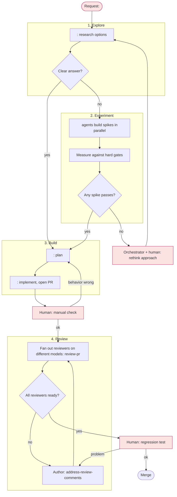

# Workflow: <room name>

<!--
A workflow is a living plan for one room (one unit of work). The orchestrator
drafts it with the human before kickoff, follows it, and rewrites it whenever
the plan stops matching reality: a step fails, a gate cannot be met, or the
human changes the requirements. Nothing executes this file. It is a shared
picture of the work, not a script.

Keep it short. Replace every <placeholder>. Delete sections that do not apply.
-->

## Goal

<What done looks like, in one or two sentences, and how the human will check it.>

## Non-goals

- <Work that is explicitly out of scope for this room.>

## Graph

<!--
Nodes are agent tasks, diamonds are decisions, red nodes wait for the human.
Group parallel work in a subgraph. Label edges with the condition that takes
them. Mark the node the room is currently on with :::current.
-->

## Participants

| Agent | Provider | Role | Worktree / branch |
|---|---|---|---|
| <name> | <claude/codex/cursor> | <coder, reviewer, tester> | <path or shared> |

Use different providers for reviewers. Keep a provider for review only once its
weekly allowance falls below about 25%.

## Gates

- <Hard gate that must hold before moving on, such as a benchmark threshold or green CI.>

## Coordination

- <Which agents share a branch, which need a worktree, and which files need
  "ask before you write" handoffs between agents.>

## Decision rules

- <What the orchestrator may decide alone, and what must go to the human.>
- If reviewers or best-of-N candidates disagree sharply, stop and ask the human.

## Log

<!-- Newest first. One line per change to this workflow, with the reason. -->

- <date>: Drafted with the human.
