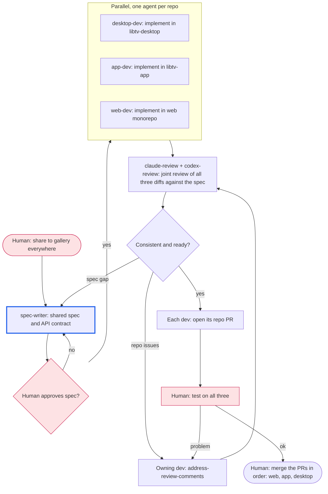

# Workflow: share-to-gallery across apps

<!-- Example. The same feature lands in several repositories at once: one
agent per repository works in parallel from a shared spec, a joint review
checks they agree, then each repository gets its own PR. -->

## Goal

"Share to gallery" works the same in libtv-desktop, libtv-app and the web
monorepo, each in its own merged PR, verified by the human on all three.

## Non-goals

- Shared code between the repositories; each implements the spec natively.

## Graph

## Participants

| Agent | Provider | Role | Worktree / branch |
|---|---|---|---|
| spec-writer | claude | spec and API contract | spec file in the orchestrator folder |
| desktop-dev | claude | implement | libtv-desktop, feat/share-gallery |
| app-dev | codex | implement | libtv-app, feat/share-gallery |
| web-dev | cursor | implement | web monorepo, feat/share-gallery |
| claude-review, codex-review | claude, codex | joint review-pr | read-only, all three repos |

## Gates

- The human approves the spec before any implementation starts.
- Each repository's own CI is green before the joint review.

## Coordination

- Separate repositories, so the devs never share files.
- A spec change goes back through the spec-writer and the human, then to every
  dev it affects; no dev changes the contract alone.

## Decision rules

- Reviewers flag any behavior that differs between repositories; the spec
  decides, and a spec gap goes to the human.
- Cap: 3 joint review rounds, then ask the human.
- The human merges; the orchestrator never does.

## Log

- 2026-10-06: Drafted with the human.
