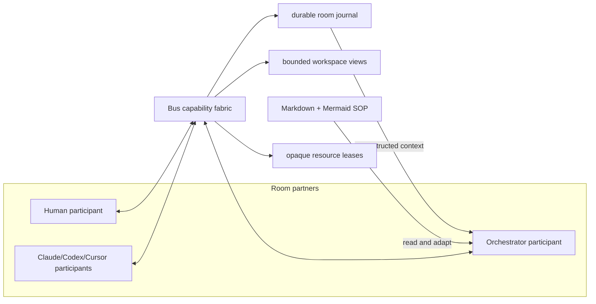

# 交付由智能体主导的房间编排器 harness

**状态**：create-plan-complete
**作者**：dylanliu8949
**创建日期**：2026-09-15
**基于提交**：413dbecff7f183f6e1914993e1e012384717b896
**分支**：master
**前置任务（如适用）**：先落盘当前共享 worktree 中已完成但未提交的 ordered-recipient / prompt-grouped history 改动；该改动与本计划的 `src/bus/model.rs`、`src/client/shell/bus/` ownership 重叠，执行本计划时不能作为 dirty baseline 共存
**后续任务（如适用）**：`plans/2026-09-15-room-orchestrator-content-workflow-bundle.md`

> **语言无关说明**：本模板适用于本仓库涉及的任意目标语言。Rust 是产品主语言，workflow helper 使用 Python，少量集成资源使用 TypeScript。下方代码片段示例必须改用任务的目标语言表达。

> **状态说明**：
> 状态值为 `<phase>-<phase-state>` 的组合：6 个 phase 按下表顺序线性推进；前 5 个 phase 各有 `in-progress` 和 `complete` 两个 phase-state，第 6 个 phase `merge` 只有 `merge-complete`（合并是瞬时操作，没有“进行中”的中间态——`code-review-complete` 之后下一个状态就是 `merge-complete`）。完整枚举共 12 值：`<phase>-in-progress` / `complete` × 5 + `merge-complete` + 特殊终态 `abandoned`（任意阶段可手动写入，表示计划废弃）。该字段是机器可读的工作流门控，请勿引入此列表以外的值。
>
> | # | phase | 含义 | `in-progress` 写入时机 | `complete` 写入时机 |
> |---|-------|------|-----------------------|---------------------|
> | 1 | `create-plan` | 计划文档撰写 | `/create-plan` 启动 | 落盘等待审查 |
> | 2 | `review-plan` | 计划审查 | `/address-review-comments` 首次处理评审时（`/review-plan` 对计划只读、不写状态） | 审查通过（`/execute-plan` 的最低门槛） |
> | 3 | `plan-execution` | 任务图实施 | `/execute-plan` 启动 | 全部任务验收 + 自动 EXIT CHECK 达标，并以最后一步 `commit-and-push` 提交、推送精确 tree |
> | 4 | `manual-test` | 人工手动测试 | 开发者手动 | 开发者手动 |
> | 5 | `code-review` | 最终代码审查 | 人工测试完成后开始 | 审查通过 |
> | 6 | `merge` | PR 合入 `master` | — （无 in-progress） | 合并完成后由开发者或合并流程写入（终态） |
>
> **门控规则**：
> - `/review-plan` 与 `/execute-plan` 只依赖本文档格式和状态，不依赖 `/create-plan` session 或额外私有状态；开发者手写但通过同一格式/gate 的计划同样合法
> - `/execute-plan` 在自动 gate 全绿后以 `commit-and-push` 作为最后一步，结束于已提交并推送到当前具名分支的精确 tree；之后依次由开发者人工验证、`/pr` 创建或更新面向 `master` 的 PR、`/review-pr` 审查。只有开发者明确要求时才直接落盘 `master`
> - 本仓库没有校验计划状态的 CI workflow，`状态` 由上述 workflow skill 自己消费。已进入 `plan-execution-complete` 及之后状态的计划文档视为已用，不得被新 PR 复用；需要新工作时新建计划文档

> **⚠️ 不可修改**：以下规则部分必须包含在每个计划文档中，AI 和开发者不得修改此部分。

<!-- 规则优先级：开始 - 此部分不可修改 -->
## 规则优先级

1. 开发者在对话中的最新明确要求。
2. 触及范围内实际存在的 `AGENTS.md`。
3. 本计划的目标、非目标与已归档决策。
4. 本模板、计划指南与代码现状。

事实必须区分为：当前源码已验证、开发者明确决定、待验证假设、延期工作。POC 的 ceiling 假设不得写成生产承诺。

- 计划生成规则和计划执行规则优先于模型的隐式行为
- 当任务指令与计划生成规则或计划执行规则冲突时，必须遵循这些规则
- 如果由于任务约束无法遵循计划生成规则或计划执行规则中的某条规则，应暂停并请求澄清，而不是猜测
- 如需覆盖这些规则，应更新计划模板文档，而不是在单个计划文档中覆盖
<!-- 规则优先级：结束 -->

## 目标

交付一个 durable、room-bound、DeepSeek-backed 的通用能力 shell，使人类、编排器与 coding agents 成为同一房间内的 first-class partners，由编排器智能体自主理解动态 SOP、决定每一步、协调其他参与者、处理失败并推动收敛，同时由 harness 只负责能力、安全、持久化与可观测性，而不拥有任何 workflow 或技术问题求解逻辑。

> **重要**：
> - **目标与非目标共同标示本计划的意图（intent）与范围（scope）**：目标声明**要做什么 / 交付什么**（**强制**——写任何计划正文前必须先清晰设定，见 create-plan 的 GOAL GATE），非目标声明**刻意不做什么**（**可选**——未声明即视为无、AI 不问不猜，但**一旦声明即被强制执行**）；二者一起把计划的意图与边界钉死，是后续 create / review / execute 全程锁定的地基。
> - 计划必须**单一目标**。判断标准是**目标是否内聚**，不是任务数量——一个 XXXL 计划可以有多个粗粒度任务，只要它们共同服务于这一个成果。
> - 类比：「建一座动物园」是单一目标，即使内部有建狮笼、建鸡舍、修围栏等多个任务，它们仍共同拼成一个成果。若顶层目标是多件互不相关的事，则应拆成多份单一目的计划。
> - 目标陈述聚焦**做什么 / 交付什么**（结果），不描述**怎么做**（实现细节留给后续章节）。
> - 计划一律 one-shot 执行、执行后再做 e2e 验证、一个计划一个 PR，与大小无关；不要把「单一目标 + 大」误当成「多目的」而拆散。
> - **目标在 create-plan 阶段定稿后即锁定**：只有开发者可修改。plan review / 任何 agent **不得推翻、扩张、缩小或重新定义**它，只能检查计划正文是否服务于该目标（详见 [`docs/guides/plan-review-guide.md`](../guides/plan-review-guide.md)「工作流结构是既定常量」）。

## 非目标

- 不在 Rust、Python 或其他固定代码中实现 workflow 节点推进、条件分支、循环、收敛判定、重试策略、领域步骤或“happy path”；每一个下一步都必须来自编排器智能体的当前判断和显式 tool call。
- 不把 Markdown/Mermaid 当成机器执行语言；它们是由智能体和人类阅读、解释、修订的 SOP 与图示，harness 只做结构/大小/路径安全检查。
- 不让编排器直接写源码、执行 shell/test/Git、读取 secrets，或自行替代 coding agent 做技术实现、技术审查与 patch 选择。
- 不实现 production system prompt、`agent.md`、`create-workflow`、`execute-workflow`、workflow template、standard workflows、best-of-N skill 或 coding-agent skill wording；这些属于后续 content plan。
- 不添加第二套 coding-agent runtime、terminal delivery、callback settlement、worktree manager、plugin framework 或通用 MCP host。
- 不把 coding agents 建模成 workflow node、lane slot、无身份 job 或可随意丢弃的软件组件；session replacement 必须保留原 participant、消息、assignment、evidence 与 handover provenance。
- 未经开发者明确授权，不执行 live paid DeepSeek call；自动 gate 使用 scripted fake provider。

> **重要**：
> - **可选，但设了就强制**：开发者未显式声明即写「无」——AI **不问、不猜、不外推**（宁可留「无」，不要编）；**一旦声明了任一条非目标，它即被强制执行**（往其方向推进的评审意见一律驳回，见下）。这是与目标的关键差别：目标**强制必设**，非目标**可留空、但设了不可犯**。
> - 与目标一样**锁定**：定稿后只有开发者可改；plan review / 任何 agent 不得新增、扩张或重新定义非目标。
> - 往非目标方向推进的评审意见（如「顺便也做 X」而 X 正是某条非目标）= 扩范围熵，一律驳回（见 [`docs/guides/plan-review-guide.md`](../guides/plan-review-guide.md) 与 [`docs/guides/code-review-guide.md`](../guides/code-review-guide.md)）。

## 当前状态分析

- **当前源码已验证**：Bus 已有 room、agent、ordered recipients、durable queued/submitting/active/completed request、provider callback correlation、agent status、agent PWD、developer control CLI 与 prompt-grouped history；这些是编排器应复用的通信与执行 substrate。
- **当前源码已验证**：`src/bus/runtime.rs` 的单 writer coordinator、`runtime_control.rs` 的 request receipt 和 `model.rs` 的 request lifecycle 已提供发送/读取/等待基础，但 dev mutation receipts 仅在进程内，跨 restart 的 ambiguous side effect 仍需 durable operation identity。
- **当前源码已验证**：`src/bus/settings.rs::BusSettings` 只有 `color_blind_mode` 且为 `Copy`；仓库没有 credential abstraction、`src/bus/orchestrator/`、`.bus/` 或 production content bundle。
- **当前源码已验证**：当前 `@` menu 只有 `All` 和 terminal agents；room header 仍以 notes editor 为中心，right-side coordination state、Goal/Non-goals、to-do、approval、attempt、human-task 和 resource-lease projection 都不存在。
- **当前源码已验证**：`justfile` 定义 `test-one`、`maintenance-test`、`lint`、`test`、`build`、`ci` 与 `windows-lint`；当前 shell 找不到 `just`，且 `cargo nextest` 未安装，执行计划前需 provision，不能以 fallback 冒充 canonical full gates。
- **开发者明确决定**：Orchestrator 是房间内的智能 process owner。Bus 是通用 room-bound capability shell；workflow complexity 只增加 SOP 内容和 model context，不应迫使 harness 增加控制逻辑。
- **开发者明确决定**：Orchestrator 必须知道 requirements、locked Goal/Non-goals、active SOP、agent assignment/status、有限 codebase outline、durable attempts/lessons；它不应吸收源码与技术实现细节，技术问题应转发给相关 coding agent。
- **开发者明确决定**：Human 与 agents 是 room 中的平等协作伙伴。权限可以不对称，但差异必须来自显式 role/capability；数据模型、history、assignment 与 communication 不能把 human 设成唯一主体、把 agents 降格为软件组件。



关键责任边界：

- Orchestrator model 选择接下来做什么、何时等待、何时追问、如何恢复、是否再开一轮、何时请求人类。
- Harness 只验证 tool arguments、room/root/permission/resource scope，持久化 intent/result，并把真实 Bus state 投影回模型和 UI。
- 无 model-authored tool call 就没有 workflow side effect；scripted fake-provider 测试必须证明 harness 不会替模型“推进”。
- Human-only 模式使用同一 coordination panel 与 control capabilities，但没有隐藏自动执行；配置 key 后，新 room 默认启用 AI orchestrator。

## 参考资料

- `skills/AGENTS.md`、`docs/templates/plan-template.md`、`docs/guides/consumer-fallout-format.md`
- `src/bus/model.rs`、`src/bus/store.rs`、`src/bus/runtime.rs`、`src/bus/runtime_commands.rs`、`src/bus/runtime_control.rs`、`src/bus/control_cli.rs`、`src/bus/settings.rs`、`src/bus/launch.rs`
- `src/client/shell/bus/state.rs`、`src/client/shell/bus/input.rs`、`src/client/shell/bus/render.rs`、`src/client/shell/bus/history.rs`
- `build.rs`、`Cargo.toml`、`justfile`
- `/Users/dylanliu/work/vibe-coding-editor/ralph`（已由独立 research lane 完整检查；复用 attempt journal、bounded recovery、immutable evidence lessons，排除 Appium/script-owned workflow）
- [DeepSeek Models & Pricing](https://api-docs.deepseek.com/quick_start/pricing/)
- [DeepSeek Chat Completions](https://api-docs.deepseek.com/api/create-chat-completion/)
- [DeepSeek tool calls](https://api-docs.deepseek.com/guides/tool_calls/)
- [DeepSeek error codes](https://api-docs.deepseek.com/quick_start/error_codes/)
- [Pi agent loop](https://github.com/earendil-works/pi/blob/main/packages/agent/src/agent-loop.ts)
- [Pi compaction design](https://github.com/earendil-works/pi/blob/main/packages/coding-agent/docs/compaction.md)
- [DeepSeek Harness persistence](https://github.com/deepseek-ai/deepseek-harness/blob/master/docs/subsystems/persistence.md)
- [OpenCode V2 session design](https://github.com/anomalyco/opencode/blob/dev/specs/v2/session.md)

> **重要**：
> - 使用官方库 / 框架 / SDK 文档，并在本节记录实际读取的链接
> - 如果任务涉及现有模块，必须包含适用的 `AGENTS.md`；Bus 当前只有 `skills/` 与 vendored libghostty-vt 树维护局部 `AGENTS.md`
> - 如果任务跨模块或触及仓库级契约，必须包含对应的根文档、`docs/` 文档或 `skills/skill-architecture.md`
> - 如果任务涉及第三方 SDK，应包含以下链接：
>   - SDK 集成文档
>   - 如何启用 XX 功能的文档
> - 创建计划时先阅读所有适用 `AGENTS.md`，再由现有模块和调用点确定职责、依赖方向、公开 API、测试与验收入口
> - 新增的模块、文件、类型、函数命名应遵循相邻代码与对应模块 `AGENTS.md` 中体现的命名约定
> - 如果计划包含测试，应参考相邻 Rust `#[cfg(test)]`、模块测试、`scripts/test_*.py` 或集成资源测试的既有模式
> - 如果计划涉及日志输出或运行时不变量，必须读取实际拥有该行为的 Rust 模块和现有测试
> - 如果计划涉及跨平台行为，必须说明 Unix/macOS 与 Windows 各自的可用验证入口
> - 如果此任务基于另一个任务，或未来任务依赖此任务，应包含相关任务计划文档的路径
> - 如果找不到或未提供所有相关文档，AI 应停止计划生成并通知开发者

## 需要决策的事项

**当前计划完整程度**：100%

无待确认事项。

> **注意**：初始生成计划时，此完整程度应留空。随着开发者做出更多决策，AI 应更新此百分比。

> **重要**：
> - 只有当计划完整程度达到或超过 95%（AI 有 95%+ 把握能完成任务）时，开发者才可以执行计划
> - 任何不清楚、缺失或可以用不同解决方案实现的事项都应列在此部分
> - AI 不应猜测，应在计划执行前始终询问相关信息
> - 如果 AI 无法推断出可用选项，可以提出开放性问题
> - 每个决策项可以有多个选项（不限于两个），根据实际情况列出所有可行的选择
> - 每个选项的描述应列出优缺点（pros and cons）
> - 在做出大的方向性决策后，AI 应继续提出后续问题并更新此部分
> - 开发者做出决策后，应更新此完整程度百分比
> - 新增开放决策后，必须把 **状态** 改回 `create-plan-in-progress`。此回退由开发者/计划作者在新增该决策时同步完成；`/address-review-comments` 等审查响应工具不代做此回退

## 已归档的决策

1. **Workflow control owner**
   - **选项**：固定程序控制；固定程序和智能体共同控制；编排器智能体唯一控制。
   - **选择**：编排器智能体唯一控制。Harness 不理解或推进 SOP，只执行并记录智能体选择的 generic capabilities。
   - **依据**：开发者明确选择 B；其 2026 年人工实践已验证动态恢复需要持续理解，而预设控制流会在 entropy 增加时失效。

2. **Harness scaling boundary**
   - **选项**：每种 workflow 扩展 runtime；把 workflow 编译成固定状态机；保持 generic room capability shell。
   - **选择**：保持 generic shell。新增复杂 workflow 只增长 Markdown/Mermaid、attempt history 和 model context；只有新增原子能力或 hard safety boundary 才修改 harness。
   - **依据**：开发者明确要求架构随更强模型、更多 compute 和更多 agents 扩展，而不是以程序控制限制它们。

3. **Workflow representation**
   - **选项**：Python runner；可执行图 DSL；Markdown 中的 Mermaid SOP。
   - **选择**：Markdown + Mermaid SOP，供智能体解释并按现实情况动态修订；harness 只 lint 文档结构与安全边界。
   - **依据**：开发者明确选择 Mermaid-in-Markdown，且说明 workflow 是 SOP 而不是 script。

4. **Approval boundary**
   - **选项**：每一步人工批准；一次批准后无限 authority；初始 proposal 批准后在 locked scope 内自主适应。
   - **选择**：第三项。启动前展示 Goal/Non-goals、to-do、agents/models/effort、资源和权限预算供人类确认；之后在相同 scope 内由智能体自主调整。Goal/Non-goals、authority、destructive/publish action 或 material budget 扩张必须重新批准。
   - **依据**：开发者要求初始 to-do confirmation，同时要求失败时 agent 自主适应并恢复。

5. **Technical-work boundary**
   - **选项**：编排器直接检查代码；prompt-only 约束；capability-level 约束 + prompt defense-in-depth。
   - **选择**：第三项。Harness 不暴露 shell、source write、test 或 Git；文件读取仅为 bounded outline/coordination artifacts。技术问询通过 Bus 转发 coding agent。
   - **依据**：开发者反复强调低成本 orchestrator 不应挡在 frontier coding agents 前面，并要求该约束在 harness level 实现。

6. **First provider and operation mode**
   - **选项**：复用 coding harness；自建小型 native agent loop；引入 LangGraph/通用 agent framework。
   - **选择**：小型 native Rust loop，初始仅 `DeepSeek V4.1 Flash` / wire model `deepseek-flash`，non-thinking、tool-call driven；provider boundary 可扩展，不引入通用框架。
   - **依据**：开发者选择自有 harness 与低成本快速模型；Pi/OpenCode/DeepSeek Harness research 支持 provider-neutral durable loop + validated tools 的最小边界。

7. **Durable recovery model**
   - **选项**：只保存 chat transcript；保存固定 workflow cursor；append-only room event/operation journal + derived context。
   - **选择**：第三项。保存 settled messages、tool intent/result、approvals、attempts、lessons、human tasks 和 leases；context 是可重建 projection，不保存任何程序拥有的 next node。
   - **依据**：长任务需要多次 compaction、agent replacement 和 crash recovery，但 workflow decisions 始终属于 model。

8. **Participant model**
   - **选项**：human controller + agent components；统一 participant identity 且完全相同权限；first-class partners + explicit asymmetric capabilities。
   - **选择**：第三项。Human、orchestrator、coding agent 都能被寻址、接收 assignment、产生 message/evidence/status 并保留 history；approval、technical work、filesystem 和 process ownership 由 role/capability 分配。
   - **依据**：开发者明确指出 Bus 的参与者平等原则；平等协作不要求相同权限，但禁止在 architecture 中把 agents 当作 subordinate software parts。

## 大小

**大小**：XXL

> **大小说明**：
> - `大小` 字段只允许填写一个等级 token：`XS`、`S`、`M`、`L`、`XL`、`XXL` 或 `XXXL`。
> - 禁止在 `大小` 字段后追加括号说明、scope、涉及文件数量、抽象数量或工作清单。
> - scope、涉及文件、抽象与工作内容应写在「当前状态分析」、「需要修改/添加的文件」和「实施步骤」中，而不是塞进 `大小` 字段。
> - `XS`: 超小任务（代码变更行数 < 50，涉及文件数 < 3，新增抽象数 0）
> - `S`: 小任务（代码变更行数 50-200，涉及文件数 3-5，新增抽象数 0-1）
> - `M`: 中等任务（代码变更行数 200-500，涉及文件数 5-10，新增抽象数 1-3）
> - `L`: 大任务（代码变更行数 500-1000，涉及文件数 10-20，新增抽象数 3-5）
> - `XL`: 超大任务（代码变更行数 > 1000，涉及文件数 > 20，新增抽象数 > 5）
> - `XXL`: 特大任务（代码变更行数 > 3000，涉及文件数 > 50，跨多个模块的架构变更）— 适合由 AI Agent 主导执行、有完整单元测试覆盖的场景
> - `XXXL`: 巨型任务（代码变更行数 > 5000，涉及文件数 > 100，系统级架构重构）— 仅适用于 AI Agent 全程执行 + 完整自动化测试套件可兜底的 yolo 场景
>
> **机械性变更降级规则**：
> 上述大小阈值衡量的是**设计/审查复杂度**，不是 diff 行数或文件数。如果绝大部分变更是纯机械操作——每处都遵循同一条可机械验证的规则、不涉及业务逻辑或设计判断——应将大小**至少降一档，必要时大幅降级**。
>
> 判断准则：审查者是否需要逐文件思考？如果只需抽样核对同一替换规则，就是机械性变更；触发机械变更的源头抽象仍按原始复杂度计。

> **⚠️ 不可修改**：以下规则部分必须包含在每个计划文档中，AI 和开发者不得修改此部分。

<!-- 计划生成规则：开始 - 此部分不可修改 -->
## 计划生成规则

- **作者**字段必须填写 GitHub 用户名（通过 `gh api user -q .login` 获取），不得使用 "claude_code"、"AI" 等非人类标识符。此字段用于追踪计划质量归属。
- **分支**字段必须是当前具名分支。默认使用 feature 分支；只有开发者明确要求时才允许直接在 `master` 落盘。
- 一份计划只有一个目标；大小不等于多目的。
- AI 生成的计划文档必须包含本模板中的所有部分；标记为「（如适用）」的部分是可选的，开发者可以选择主动删除。
- 所有 `> **重要**：` 块必须从模板中复制，不得修改或省略。
- 开放决策存在时，保持 `create-plan-in-progress`，不生成文件契约、任务图或测试计划。
- **当前计划完整程度**初始应留空，AI 不得自动填写百分比；随着开发者做出决策并解决「需要决策的事项」，AI 应更新此百分比。
- **大小**、**需要修改/添加的文件**、**错误跟踪**、**断言检测**、**实施步骤**和**测试计划**初始应留空，仅当以下条件全部满足后才生成和更新内容：
  - 「参考资料」已完整
  - 「需要决策的事项」中无未解决的问题
  - 当前计划完整程度达到或超过 95%
- 决策清空后，正文完整程度必须达到至少 95%，任务通常为 1–5 个粗粒度单元。
- 开发者做出决策后：
  - 必须将决策保存到「已归档的决策」
  - 如果上述各生成部分不为空，必须同步更新它们以反映新的决策
- 当以下条件全部满足时，AI 必须自动将**当前计划完整程度**更新为 100%：
  - 「需要决策的事项」中没有未解决的问题（所有决策已归档）
  - 所有必需的生成部分均已填写，并与已归档决策保持一致
- `拥有文件` 是排他写入边界。不同任务 owner 不得重叠；明确文件必须由一个且仅一个 owner 覆盖。
- `consumes` 必须同时出现在 `blocked-by`；任务依赖必须是无环图。
- POC 计划只承诺验证目标所需的最小闭环。生产打包、性能指标、网络、云服务等只有在目标明确要求时才能进入范围。
<!-- 计划生成规则：结束 -->

## 需要修改/添加的文件

- **修改文件**：`Cargo.toml`、`Cargo.lock`、`build.rs`、`src/bus/mod.rs`
  - **用途**：注册最小 HTTP/credential/persistence dependencies、orchestrator module 与 fixed production-content seam；不包含 workflow 语义。
- **修改文件**：`src/bus/settings.rs`；**新文件**：`src/bus/credentials.rs`
  - **用途**：future-ready model selector 与 separate private/redacted API-key storage；key 不进入 `BusState`、snapshots、history 或 logs。
  ```rust
  pub enum OrchestratorModel { DeepSeekV41Flash }
  pub struct CredentialGeneration { pub generation: u64, pub digest: String }
  ```
- **新目录**：`src/bus/orchestrator/`
  - **用途**：room agent loop、provider adapter、append-only journal、context builder、tool registry/policy、operation outbox、structural workflow linter、opaque resource leases 与 tests。
  ```rust
  pub trait ModelAdapter {
      async fn complete(&self, request: ModelRequest, cancel: CancellationToken)
          -> Result<ModelResponse, ProviderError>;
  }

  pub enum RoomEvent {
      HumanMessage { prompt_id: PromptId },
      AgentChanged { agent_id: AgentId, revision: u64 },
      ToolSettled { operation_id: OperationId },
      SteeringQueued { prompt_id: PromptId },
  }
  ```
- **修改文件**：`src/bus/model.rs`、`src/bus/store.rs`
  - **用途**：first-class human/orchestrator/coding-agent participant identity、recipient、room brief/projection 与 backward-compatible persisted state migration；不保存 model-owned next step。
  ```rust
  pub enum ParticipantId { Human, Orchestrator, Agent(AgentId) }
  pub enum RoomRecipient { Orchestrator, Agent(AgentId) }
  pub struct RoomBrief { pub goal: String, pub non_goals: String, pub revision: u64, pub locked: bool }
  ```
- **修改文件**：`src/bus/runtime.rs`、`src/bus/runtime_commands.rs`、`src/bus/runtime_control.rs`、`src/bus/runtime_control_tests.rs`、`src/bus/control_cli.rs`、`src/bus/control_cli_tests.rs`、`src/bus/launch.rs`、`src/bus/entry.rs`
  - **用途**：把 UI、CLI 和 model tools 统一接到同一 typed room operations；为 agent create/send、brief/to-do/attempt/approval、human task、permission、resource lease 和 temp workflow write 提供 durable idempotent receipts。
  ```rust
  pub enum RoomOperation {
      CreateAgent(AgentLaunchProfile),
      SendMessage(RoomMessage),
      UpdateCoordination(CoordinationPatch),
      AcquireResource(ResourceLeaseRequest),
      RequestHuman(HumanTaskRequest),
  }
  ```
- **修改目录**：`src/client/shell/bus/`
  - **用途**：Settings 的 Orchestrator agent section、`@Orchestrator`/separator/`All` exclusion、room Goal/Non-goals、visible proposal/to-do/attempt/decision/lease/human-task panel 与 exact approvals。
  ```rust
  pub enum RecipientEntry { Orchestrator, Separator, AllAgents, Agent(AgentId) }
  pub enum CoordinationAction { ApproveProposal(ProposalRevision), RejectProposal(ProposalRevision), ResolveHumanTask(HumanTaskId) }
  ```
- **新文件**：`scripts/bus_orchestrator_acceptance.py`、`scripts/test_bus_orchestrator_acceptance.py`；**修改文件**：`justfile`
  - **用途**：scripted model + fake Bus transport acceptance，证明每次 dispatch/adaptation/recovery 均由 model tool call 驱动，同时覆盖 restart、ambiguity、permissions、resource lease 与 UI/control projection。

> **重要**：
> - 每个有行为变化的 source 文件都必须附一段简洁的**高级概念代码片段**，用于锁定公开签名、关键类型或控制流；片段不含 import、不标行数，也不代替完整实现。
> - **不要在代码片段中包含 import 语句**——import 是实现细节，不传达设计意图。
> - **路径迁移只说明一次，不要逐处列举**：当某个 Rust 模块或公开符号迁移导致消费方路径机械跟改，只需说明所有引用都指向新路径，不把每个 `use` 改动逐条列出。
> - 对于关键的实现细节，可以添加代码片段，但不需要完整实现；也可以在片段中用注释说明需要在何处添加或修改什么。
> - **禁止标注代码行数估算**（如 `~20 LOC`、`约 50 行`、`+30/-10`）：行数对执行 agent 是噪音，文件职责和高级概念片段才是有用信息。
> - `大小` 字段也不能承载文件数量、抽象数量或工作清单；这些内容应由本节逐文件说明。
> - 需要说明新组件如何融入现有架构时使用 mermaid 绘图。
> - 此部分应详尽，包含所有将被添加或修改的文件，并写明 repo-relative 路径。
> - 测试文件可在本节或「测试计划」中用 `describe` / case 骨架表达，但必须能对应到计划中的行为契约。
> - **例外**：以下类型的文件无需在此部分逐一列出代码片段，可直接修改：
>   - 包 / 构建配置文件（如 `Cargo.toml`、`justfile`、`.github/workflows/*.yml` 等）
>   - lock 文件（如 `Cargo.lock`）
>   - 文档文件（如 `.md`、`.txt`）
>   - 仅涉及 import 语句变更的文件
> - 上述例外只豁免本节逐文件代码片段，不豁免任务 ownership、验收闸门或模块 SOT 同步。计划已经明确点名的文件与测试路径必须进入本节文件契约，并被一个且仅一个任务 owner containment 覆盖；合理 deviation 可在稳定 owner 内新增未预知文件。
> - 改变 skill 架构或公开工作流契约时，`skills/AGENTS.md`、`skills/skill-architecture.md` 与受影响的共享 guide 必须进入同一 owner 与 gate。

## 错误跟踪（如适用）

> **重要**：
> - 保持 Bus 当前日志与 stderr 边界；先从实际拥有该错误的 Rust 模块和直接消费者确认现有契约，不引入第二套日志 sink。
> - 级别按**结果语义**判断，不由是否进入 `catch` 或返回值真假机械决定：`debug` 开发期内部细节、`info` 正常关键轨迹、`warn` 异常但已按明确契约恢复或降级、`error` 当前操作失败但进程仍可继续、`fatal` 进程或 Session 已无法安全继续。
> - 每条记录必须给出稳定、可检索的 `msg` 和有界的 `scope`；结构化字段放 `data`，原始错误放 `err`（保留 `name`/`message`/`stack`/`cause`）。
> - 同一事实只由其拥有者记录，日志不得含 key、prompt/reply/file body、authorization header、reasoning、tool payload 或 terminal text。

- `orchestrator.provider.failed` (`warn` for bounded retry, `error` when user action required): room ID、provider/model、attempt、classified code、retry delay；401/402/422 不重试。
- `orchestrator.operation.uncertain` (`warn`): room/operation ID、operation kind、Bus request ID；进入 reconcile，不 blind resend。
- `orchestrator.policy.denied` (`warn`): room/tool/category/root/agent/reason code；不记录 arguments body。
- `orchestrator.journal.unavailable` (`error`): room、path identity、operation；停止该 room model/tool effects，其他 room 继续。

## 断言检测（如适用）

> **重要**：
> - 本仓库**没有**共享断言辅助包。检查必须写在**最接近状态所有者的位置**并就地 fail-fast，保留原始原因。
> - Rust 侧优先用类型和穷尽匹配表达不变量；生产环境必须守住的契约使用始终生效的检查，不依赖 `debug_assert!`。
> - 预期失败进入 typed error；断言只用于上游 bug。

- 一个 room 同时最多一个 mutating orchestrator turn；违反时在 room actor owner fail-fast，并测试 concurrent wakeups。
- tool result 只能对应已 durable-committed 的 operation intent，且同一 operation ID 参数必须恒定；冲突 fail closed。
- approval 必须匹配 exact current proposal revision 与 locked brief revision；stale approval 被 typed rejection，不降级到最新值。
- resource lease 的 owner/epoch/release 必须一致；不同 attempt 不能通过 stale release 解锁。
- settled tool call/result 在 context projection 中不可拆分；compaction/restart tests 验证该 invariant。

## 实施步骤

> **重要**：
> - 一个任务 = 一段可独立 task acceptance 的完整工作；只因明确并行收益或硬依赖边拆分。天然串行且落在同一文件簇的工作必须合并。
> - `任务<N>` 是计划内全局唯一、不可变的机读 id，从 1 按源码顺序连续递增；名称非空且唯一。
> - `blocked-by` 是唯一调度边；`consumes` 只引用已在 `blocked-by` 中声明的生产方 `任务<N>`；产物名称和契约写在生产方 `produces`。
> - 任意两个任务的 `拥有文件` 必须 containment-aware 两两隔离，依赖边不豁免 overlap；聚合文件和 SOT 只能由一个任务拥有。
> - `拥有文件` 是任务间的排他写入 / 调度边界和最外层写入上限，不是预计 diff 的精确 allowlist。
> - 本计划明确点名的新增 / 修改 / 删除文件与具体测试文件必须进入文件契约，并被一个且仅一个任务 owner containment 覆盖。
> - `验收闸门` 固定以 `[TASK_LOCAL]` 开头，只给出真实存在的局部命令与二元判定；完整 repo gate 留给 EXIT CHECK。
> - 自动 gate 完成前所有 actor 必须零 Git；全部自动 gate 全绿后才以 `commit-and-push` 落盘。

### 任务 1：建立通用 room agent loop、provider、journal 与 capability policy

- [ ] **完成**
- **目标**：交付没有 workflow 语义的 room-bound model loop，包含 private credential、DeepSeek adapter、durable event/operation journal、reconstructible context、validated sequential tools、bounded read access、temp workflow write、resource lease 与 scripted provider tests。
- **拥有文件**：`Cargo.toml`、`Cargo.lock`、`build.rs`、`src/bus/mod.rs`、`src/bus/settings.rs`、`src/bus/credentials.rs`、`src/bus/io.rs`、`src/bus/local_sessions.rs`、`src/bus/orchestrator/`
- **blocked-by**：无
- **produces**：`ROOM_AGENT_CAPABILITY_CONTRACT`
- **consumes**：无
- **工具**：DeepSeek official API docs、Pi agent loop/compaction、DeepSeek Harness persistence、existing `src/bus/io.rs` atomic/private helpers、`just test-one orchestrator`
- **参考实现**：`src/bus/runtime.rs` single-writer pattern；Ralph attempt telemetry only as a cautionary reference, never as control architecture
- **约束**：所有 tools sequential；persist intent before effects and result immediately after；room/root/agent IDs injected by capability；workflow lint never chooses next action；no live network in tests；reasoning content not rendered or logged；key reloaded by generation before call；production content absent remains a visible unavailable state
- **验收闸门**：[TASK_LOCAL] `just test-one orchestrator` + nonzero tests prove provider normalization/error classes, key redaction, journal replay, context compaction, tool/policy/path limits, operation idempotency, resource leases and “no tool call, no side effect”

### 任务 2：把 orchestrator capabilities 接入 Bus room operations 与 durable delivery

- [ ] **完成**
- **目标**：UI、CLI 和 room agent tools 通过同一个 typed operation layer 创建/监督 agent、发消息、读状态/history、更新 coordination state、处理 human tasks/permissions，并在 restart/ambiguous delivery 后安全 reconcile。
- **拥有文件**：`src/bus/model.rs`、`src/bus/store.rs`、`src/bus/runtime.rs`、`src/bus/runtime_commands.rs`、`src/bus/runtime_control.rs`、`src/bus/runtime_control_tests.rs`、`src/bus/control_cli.rs`、`src/bus/control_cli_tests.rs`、`src/bus/launch.rs`、`src/bus/entry.rs`
- **blocked-by**：任务1
- **produces**：`ROOM_OPERATION_CONTRACT`
- **consumes**：任务1
- **工具**：existing Bus model/store/runtime/control tests、`scripts/test_bus_dev_acceptance.py`、`just test-one bus::`
- **参考实现**：current request callback correlation and guarded launch/delete behavior
- **约束**：human/orchestrator/coding agent are first-class participants with explicit roles/capabilities；terminal delivery remains Bus-owned；orchestrator recipient excluded from `All`；operation receipts survive restart；agent model/effort use provider allowlists rather than free-form args；technical inquiries route as messages；permission approval uses exact terminal identity/revision/digest and fixed allowlisted response；risky or unknown permissions create human assignment
- **验收闸门**：[TASK_LOCAL] `just test-one bus::` + nonzero tests prove v1 migration, ordered mixed recipients, durable operation dedupe/reconcile, agent create/send/status/history, brief/to-do/attempt/human-task/lease projection, permission race rejection and room isolation

### 任务 3：交付 non-technical Settings、recipient 与 room coordination UI

- [ ] **完成**
- **目标**：配置 key 后每个新 room 默认出现独立 Orchestrator participant，并在 room UI 中完成对话、初始 proposal confirmation、Goal/Non-goals、to-do、attempt/lesson、agent status、lease 与 human-task interactions。
- **拥有文件**：`src/client/shell/bus/`
- **blocked-by**：任务1、任务2
- **produces**：`ROOM_ORCHESTRATOR_UI_CONTRACT`
- **consumes**：任务1、任务2
- **工具**：existing shell state/input/render/history tests、`just test-one client::shell::bus`
- **参考实现**：current settings form, notes editor, prompt-grouped ordered reply slots and lower-sensitivity scroll behavior
- **约束**：recipient order is Orchestrator, separator, All, agents；All never selects Orchestrator；`@Orchestrator` is ordinary conversation trigger only；no automatic start before exact proposal confirmation；human can edit unlocked brief and later inspect every adaptation; narrow layout switches Conversation/To-do without hiding composer; legacy notes remain readable
- **验收闸门**：[TASK_LOCAL] `just test-one client::shell::bus` + nonzero snapshot/input/state tests cover settings redaction, default activation, recipient semantics, proposal actions, panels, restarts, narrow/short layouts, accessibility/color-blind and scroll/history regressions

### 任务 4：证明 intelligent-agent-owned orchestration 与 failure recovery

- [ ] **完成**
- **目标**：用 real Bus process、scripted model 和 fake terminal transport 验证 harness 只执行 agent-authored decisions，并能在 crash、provider failure、agent failure、all-spikes-failed、human task 与 exclusive benchmark resource contention 中保留证据并恢复。
- **拥有文件**：`scripts/bus_orchestrator_acceptance.py`、`scripts/test_bus_orchestrator_acceptance.py`、`justfile`
- **blocked-by**：任务1、任务2、任务3
- **produces**：`AGENT_LED_ACCEPTANCE_EVIDENCE`
- **consumes**：任务1、任务2、任务3
- **工具**：existing `scripts/test_bus_dev_acceptance.py` isolated-root pattern、new control CLI, `python3 -m unittest scripts.test_bus_orchestrator_acceptance`
- **参考实现**：Ralph failure lessons: attempt identity, immutable evidence and final composition checks; explicitly exclude Appium/generated-test control
- **约束**：script supplies environment/events only, never calculates workflow next step；scripted model response must contain every create/send/wait/adapt/retry/lease/release/human-escalation choice；test fails if harness acts between model calls；all network stays loopback and all roots throwaway；`--content` 只接受 closed `test-agent-led` 或 binary-owned `production` selectors，拒绝 path/URL/repository shadow，供 successor content plan 复用同一 driver
- **验收闸门**：[TASK_LOCAL] `python3 -m unittest scripts.test_bus_orchestrator_acceptance` + `python3 scripts/bus_orchestrator_acceptance.py --profile agent-led --content test-agent-led --fake-provider` both exit 0 and evidence reports `workflow_transitions_by_harness=0`, `live_provider_calls=0`, `real_agent_launches=0`

## 测试计划

> **重要**：
> - **自动化测试优先**：AI agent 可以运行 `just test-one <filter>`、`just test`、`just lint` 和适用的 Python/Bun 测试，因此脚本可执行的验证不归类为手动测试。
> - **手动测试仅限于最后手段**：只有终端交互、视觉流畅度、真实 shell/PTY 生命周期或当前不能安全自动化的 OS 行为才使用。
> - 测试按 Rust 单元/模块测试、维护脚本测试、集成资源测试和真实终端验收的最小充分层级放置。
> - 跨平台逻辑使用 `cfg` 与对应 CI/目标验证；不要用运行时条件跳过来伪装覆盖。

### Rust 与 script 测试

- Model loop: streaming/complete tool calls, finish reasons, retry/cancel, context overflow/compaction, steering, token usage, no reasoning exposure.
- Journal/outbox: crash before effect, after Bus accept before local receipt, after reply before model wake, duplicate exact request, conflicting operation ID, corrupted/future journal.
- Capability boundary: cross-room/root denial, symlink/reparse/case escape, hidden/VCS/credential denial, byte/line caps, `.bus/temp` only writes, `.bus/standard` requires human exact action.
- Participant semantics: humans and agents have addressable identity, assignments, messages, evidence, status and durable history; tests vary capabilities independently of participant kind and preserve retired/replaced agent provenance.
- Agent ownership: each dispatch/retry/adaptation/recovery follows a preceding model call; the harness never derives a next step from Mermaid, to-do status, agent result or timeout.
- Dynamic spike scenario: model creates multiple independent agents, chooses hypotheses/effort, serializes benchmarks through one opaque lease, keeps the best evidence; when all fail, model collects each `handover.md`, records lessons, authors a new temp SOP revision and starts a new attempt.
- Human worker: model creates a manual gesture/visual validation task, waits for the human result and incorporates it as evidence without fabricating completion.
- Long context: ten checkpoint/compaction cycles preserve Goal/Non-goals, approvals, attempts, lessons, unresolved human tasks, operation receipts and artifact hashes; volatile status refreshes from Bus.

### 全局 EXIT CHECK

按顺序运行：

1. `just lint`
2. `just test`
3. `just build`

> **重要**：
> - 前两步必需且顺序固定。`just build` 是可选的第三个槽位，仅在计划行为需要构建证明时保留。
> - 每个槽位只接受与当前 `justfile` 一致的完整仓库命令，不接受 task filter；计划特有的命令属于 `[TASK_LOCAL]` 闸门。
> - 需要 Windows 证明时，按影响范围额外运行 `just windows-lint` 或 CI 的 Windows gate，并如实记录当前宿主无法完成的真实终端交互。
> - 无法由 agent 完整运行的设备 / 视觉验收只进入「手动测试」。

由于新增 HTTP、credential 和跨平台 path policy，完成前三项后另行运行 `just windows-lint`；它是跨平台补充证据，不占用固定 EXIT CHECK 槽位。

### 手动测试（仅在无法自动化时使用）

- [ ] **步骤 1**：在 Settings 选择 DeepSeek V4.1 Flash，粘贴/保存 key，再创建 room。
  - **预期结果**：key 始终 masked；新 room 的 `@` menu 第一项是 Orchestrator，其后空隔行、All 和 agents；All 不勾选 Orchestrator。
- [ ] **步骤 2**：告诉 Orchestrator 一个 custom goal，确认它提出 Goal/Non-goals、to-do、agents/models/effort/resource needs 后批准。
  - **预期结果**：批准前没有 coding agent 被创建或收到任务；批准后 agent 自主调度且每个调整显示在 coordination panel。
- [ ] **步骤 3**：在进行中要求 sitrep，再提出关于 feature A 的技术问询并制造一个 agent blocked/permission prompt。
  - **预期结果**：Orchestrator 从 durable state 给 sitrep，把技术问题转发给 feature A owner，安全 permission 可 exact approve-once，风险项转给人类。
- [ ] **步骤 4**：中断并 resume Bus 后继续同一 room。
  - **预期结果**：Goal/Non-goals、to-do、attempts、lessons、agent/reply correlation 与 unresolved operations 恢复；没有重复创建或发送。

> **⚠️ 不可修改**：以下规则部分必须包含在每个计划文档中，AI 和开发者不得修改此部分。

<!-- 计划执行规则：开始 - 此部分不可修改 -->
## 计划执行规则

- AI 只以计划状态判断评审就绪：首次执行必须为 `review-plan-complete`，恢复执行允许为 `plan-execution-in-progress`。
- `execute-plan` 不再重复检查计划完整程度或逐文件审查状态；文件契约、任务 owner、依赖图与验收闸门仍必须通过结构和安全校验。
- **最小变更原则**：
  - 仅修改任务直接要求的代码
  - 除非明确要求，否则不得重写、重新排序或重构不相关的文件或模块
  - 除非必要，否则不得修改空白字符（不删除空行、不添加空行、不更改缩进或格式）
  - 保留所有现有的命名、风格、模式和架构
  - 不确定是否需要额外的自定义逻辑、抽象或新结构时，应停止并请求人工确认，而不是发明新机制
- **注释质量原则**：
  - 不要生成重复代码内容的注释
  - 不要描述函数名、参数名、返回类型或基本逻辑（循环、空值检查、简单条件判断）
  - 仅在解释**为什么**时添加注释，而非解释**是什么**
  - 允许的注释内容：非显而易见的逻辑或行为、关键假设或约束、平台特定问题、副作用或生命周期交互、代码中不明显的重要推理
  - 宁愿**不添加注释**，也不要添加无意义或冗余注释
  - Public-repository comments must use concise English
- **禁止 TODO 原则**：
  - 不得编写 TODO、FIXME、XXX 或占位符注释
  - 不得留下存根实现、空代码块、静默降级或伪造成功
  - 生成的每段代码必须完整、具体且可在上下文中运行
  - 如果无法完全实现某项功能，应停止并请求澄清，而不是猜测或留下占位符
- **任务范围原则**：
  - **一个计划 = 一次性执行 = 一个 PR，与大小无关**：任务图只用于安全并行和硬依赖调度，不是人工断点；编排方不得将非法图或资源限制不透明地静默串行化。
  - 执行开始前记录 `DIRTY_BASELINE`；与任务 owner 重叠的预存脏路径必须 STOP，不重叠的 baseline 必须保持逐字不变。
  - 执行期任务只能写自己的 owner；发现 owner gap 必须停止并修计划，不得越界。
  - 每个任务必须发布与当前 generation、文件内容和 gate 日志绑定的 evidence，再经过 `/execute-plan` 内部 task review。
  - 全部任务 Ready 后，在同一 candidate tree 上运行完整 EXIT CHECK；任何修复改树都从 final lint 重建证据。
  - 最终工作树必须包含任务 checkbox、deviation report 和 `plan-execution-complete` 状态，再计算 tree hash。
  - 全部 task Ready 后，`/execute-plan` 在 final gate 前机械写入 `plan-execution-complete`，使状态本身进入被验证 tree；任一 final gate 失败或 tree 漂移必须恢复 in-progress，修复后重新写入 complete 并从 final lint 重建证据。
  - agent-driven e2e 必须在该精确 tree 上运行；人工 e2e 只记录待验证 tree 与清单，不冒充通过。
  - 任务内不得出现 `(需要手动操作)`；人工验证只存在于「手动测试」section。人工结果若是后续实施的硬前置，必须拆成两份计划。
  - task acceptance 只是局部安全门；人工验证后仍必须运行完整 `/review-pr`。
  - XXL/XXXL 也使用同一粗粒度任务图；任务数量不按计划大小机械扩张。
  - 无需考虑渐进式迁移策略，应直接完整实现所需功能。
- **Git 落盘原则**（以 [`commit-and-push`](../../skills/commit-and-push/SKILL.md) 为 SOT）：
  - 从进入 `plan-execution-in-progress` 到全部自动 gate 完成，所有 actor 必须零 Git：不得 `git add`、`commit`、`push`、`stash`、`rebase` 或切换 ref。
  - 自动 gate 全绿后只允许以 `commit-and-push` 作为最后一步落盘，之后不得再改树。
  - 默认不在共享分支落盘；开发者明确要求直接在 `master` commit-and-push 时，该要求授权普通提交和显式 `git push origin master:master`，但不授权 force-push。
  - feature 分支落盘后交回开发者人工验证，再由 `pr` 创建或更新面向 `master` 的 PR，并由 `review-pr` 完成最终审查；`execute-plan` 自身不 rebase、不创建 PR。
<!-- 计划执行规则：结束 -->
