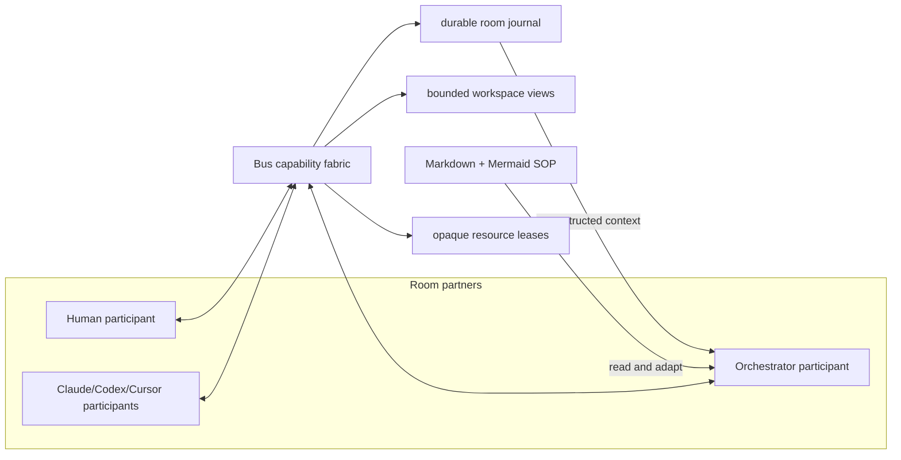

# 交付由智能体主导的房间编排器 harness

**状态**：review-plan-complete
**作者**：dylanliu8949
**创建日期**：2026-09-15
**基于提交**：7bc910f2aba2f79ca4ddbc83e76a3c44f8fa88d5
**分支**：master
**前置任务（如适用）**：先落盘当前共享 worktree 中已完成但未提交的 ordered-recipient / prompt-grouped history 改动；该改动与本计划的 `src/bus/model.rs`、`src/client/shell/bus/` ownership 重叠，执行本计划时不能作为 dirty baseline 共存
**后续任务（如适用）**：`plans/2026-09-15-room-orchestrator-content-workflow-bundle.md`

> **语言无关说明**：本模板适用于本仓库涉及的任意目标语言。Rust 是产品主语言，workflow helper 使用 Python，少量集成资源使用 TypeScript。下方代码片段示例必须改用任务的目标语言表达。

> **状态说明**：
> 状态值为 `<phase>-<phase-state>` 的组合：6 个 phase 按下表顺序线性推进；前 5 个 phase 各有 `in-progress` 和 `complete` 两个 phase-state，第 6 个 phase `merge` 只有 `merge-complete`（合并是瞬时操作，没有“进行中”的中间态——`code-review-complete` 之后下一个状态就是 `merge-complete`）。完整枚举共 12 值：`<phase>-in-progress` / `complete` × 5 + `merge-complete` + 特殊终态 `abandoned`（任意阶段可手动写入，表示计划废弃）。该字段是机器可读的工作流门控，请勿引入此列表以外的值。
>
> | # | phase | 含义 | `in-progress` 写入时机 | `complete` 写入时机 |
> |---|-------|------|-----------------------|---------------------|
> | 1 | `create-plan` | 计划文档撰写 | `/create-plan` 启动 | 落盘等待审查 |
> | 2 | `review-plan` | 计划审查 | `/address-review-comments` 首次处理评审时（`/review-plan` 对计划只读、不写状态） | 审查通过（`/execute-plan` 的最低门槛） |
> | 3 | `plan-execution` | 任务图实施 | `/execute-plan` 启动 | 全部任务验收 + 自动 EXIT CHECK 达标，并以最后一步 `commit-and-push` 提交、推送精确 tree |
> | 4 | `manual-test` | 人工手动测试 | 开发者手动 | 开发者手动 |
> | 5 | `code-review` | 最终代码审查 | 人工测试完成后开始 | 审查通过 |
> | 6 | `merge` | PR 合入 `master` | — （无 in-progress） | 合并完成后由开发者或合并流程写入（终态） |
>
> **门控规则**：
> - `/review-plan` 与 `/execute-plan` 只依赖本文档格式和状态，不依赖 `/create-plan` session 或额外私有状态；开发者手写但通过同一格式/gate 的计划同样合法
> - `/execute-plan` 在自动 gate 全绿后以 `commit-and-push` 作为最后一步，结束于已提交并推送到当前具名分支的精确 tree；之后依次由开发者人工验证、`/pr` 创建或更新面向 `master` 的 PR、`/review-pr` 审查。只有开发者明确要求时才直接落盘 `master`
> - 本仓库没有校验计划状态的 CI workflow，`状态` 由上述 workflow skill 自己消费。已进入 `plan-execution-complete` 及之后状态的计划文档视为已用，不得被新 PR 复用；需要新工作时新建计划文档

> **⚠️ 不可修改**：以下规则部分必须包含在每个计划文档中，AI 和开发者不得修改此部分。

<!-- 规则优先级：开始 - 此部分不可修改 -->
## 规则优先级

1. 开发者在对话中的最新明确要求。
2. 触及范围内实际存在的 `AGENTS.md`。
3. 本计划的目标、非目标与已归档决策。
4. 本模板、计划指南与代码现状。

事实必须区分为：当前源码已验证、开发者明确决定、待验证假设、延期工作。POC 的 ceiling 假设不得写成生产承诺。

- 计划生成规则和计划执行规则优先于模型的隐式行为
- 当任务指令与计划生成规则或计划执行规则冲突时，必须遵循这些规则
- 如果由于任务约束无法遵循计划生成规则或计划执行规则中的某条规则，应暂停并请求澄清，而不是猜测
- 如需覆盖这些规则，应更新计划模板文档，而不是在单个计划文档中覆盖
<!-- 规则优先级：结束 -->

## 目标

交付一个 durable、room-bound、DeepSeek-backed 的通用能力 shell，使人类、编排器与 coding agents 成为同一房间内的 first-class partners，由编排器智能体自主理解动态 SOP、决定每一步、协调其他参与者、处理失败并推动收敛，同时由 harness 只负责能力、安全、持久化与可观测性，而不拥有任何 workflow 或技术问题求解逻辑。

> **重要**：
> - **目标与非目标共同标示本计划的意图（intent）与范围（scope）**：目标声明**要做什么 / 交付什么**（**强制**——写任何计划正文前必须先清晰设定，见 create-plan 的 GOAL GATE），非目标声明**刻意不做什么**（**可选**——未声明即视为无、AI 不问不猜，但**一旦声明即被强制执行**）；二者一起把计划的意图与边界钉死，是后续 create / review / execute 全程锁定的地基。
> - 计划必须**单一目标**。判断标准是**目标是否内聚**，不是任务数量——一个 XXXL 计划可以有多个粗粒度任务，只要它们共同服务于这一个成果。
> - 类比：「建一座动物园」是单一目标，即使内部有建狮笼、建鸡舍、修围栏等多个任务，它们仍共同拼成一个成果。若顶层目标是多件互不相关的事，则应拆成多份单一目的计划。
> - 目标陈述聚焦**做什么 / 交付什么**（结果），不描述**怎么做**（实现细节留给后续章节）。
> - 计划一律 one-shot 执行、执行后再做 e2e 验证、一个计划一个 PR，与大小无关；不要把「单一目标 + 大」误当成「多目的」而拆散。
> - **目标在 create-plan 阶段定稿后即锁定**：只有开发者可修改。plan review / 任何 agent **不得推翻、扩张、缩小或重新定义**它，只能检查计划正文是否服务于该目标（详见 [`docs/guides/plan-review-guide.md`](../guides/plan-review-guide.md)「工作流结构是既定常量」）。

## 非目标

- 不在 Rust、Python 或其他固定代码中实现 workflow 节点推进、条件分支、循环、收敛判定、重试策略、领域步骤或“happy path”；每一个下一步都必须来自编排器智能体的当前判断和显式 tool call。
- 不把 Markdown/Mermaid 当成机器执行语言；它们是由智能体和人类阅读、解释、修订的 SOP 与图示，harness 只做结构/大小/路径安全检查。
- 不把 Orchestrator model 当成 coding agent：provider-visible tool registry/capability shell 在类型与 schema 层面不包含 shell/exec、build/test/lint、arbitrary file write/edit/patch、Git、source/test/plan/unrelated-doc mutation、generic coding-harness tools 或 secret access，也不把内部 `BusCommand`/developer control surface 整体透传给模型；所有 repository implementation、technical review 与 patch judgment 都由 coding agents 完成，prompt 或 workflow Markdown 禁令不能替代该结构边界。该禁令不排除本计划明确列出的 path-confined typed workflow capability：Orchestrator 可在 `.bus/temp/**` author/revise SOP，并且只能在 developer 对 exact reviewed content/diff 显式批准后请求 typed `.bus/standard/**` promotion。
- 不实现 production system prompt、`agent.md`、`create-workflow`、`execute-workflow`、workflow template、standard workflows、best-of-N skill 或 coding-agent skill wording；这些属于后续 content plan。
- 不添加第二套 coding-agent runtime、terminal delivery、callback settlement、worktree manager、plugin framework 或通用 MCP host。
- 不在 model harness 中添加 terminal recorder、transcript mirror、continuous ingestion、generic screen interpretation 或 completion classifier；终端读取只能是 Bus CLI/Worker 经现有 native pane read path 执行的 on-demand complete-viewport 或 caller-selected recent-tail `lines=N` observation，不能暴露 hidden reasoning、持久化 terminal text、mutate 或 steer participant。唯一窄例外是本计划明确列出的 typed permission observation：native owner 只对当前 provider permission surface 做 fixed allowlist match 并返回 factual prompt/digest/eligibility，不能解释 technical content、classify completion 或选择 workflow action。
- 不把 coding agents 建模成 workflow node、lane slot、无身份 job 或可随意丢弃的软件组件；session replacement 必须保留原 participant、消息、assignment、evidence 与 handover provenance。
- 未经开发者明确授权，不执行 live paid DeepSeek call；自动 gate 使用 scripted fake provider。

> **重要**：
> - **可选，但设了就强制**：开发者未显式声明即写「无」——AI **不问、不猜、不外推**（宁可留「无」，不要编）；**一旦声明了任一条非目标，它即被强制执行**（往其方向推进的评审意见一律驳回，见下）。这是与目标的关键差别：目标**强制必设**，非目标**可留空、但设了不可犯**。
> - 与目标一样**锁定**：定稿后只有开发者可改；plan review / 任何 agent 不得新增、扩张或重新定义非目标。
> - 往非目标方向推进的评审意见（如「顺便也做 X」而 X 正是某条非目标）= 扩范围熵，一律驳回（见 [`docs/guides/plan-review-guide.md`](../guides/plan-review-guide.md) 与 [`docs/guides/code-review-guide.md`](../guides/code-review-guide.md)）。

## 当前状态分析

- **前置任务落盘后成立**：ordered recipients 与 prompt-grouped history 当前只存在于共享 worktree 的未提交改动；执行本计划前必须按「前置任务」落盘，并重新确认本计划 owner 没有与 dirty baseline 重叠。其余 room、agent、durable queued/submitting/active/completed request、provider callback correlation、agent status、agent PWD 与 developer control CLI 是当前已提交 substrate。
- **当前源码已验证**：`src/bus/runtime.rs` 的单 writer coordinator、`runtime_control.rs` 的 request receipt 和 `model.rs` 的 request lifecycle 已提供发送/读取/等待基础，但事实分散在 visual status、`current_request`、FIFO、callback、`pending_final`、`uncertain_outcome` 与 outer message status 中；`status_revision` 每次 poll 都增长，不能直接作为 model wake revision。dev mutation receipts 仅在进程内，跨 restart 的 ambiguous side effect 仍需 durable operation identity。
- **当前源码已验证（`7bc910f2`）**：`./run dev ...` 在每次 control/status/wait 调用前执行 `cargo build`，并发 dogfood waits 会争用 Cargo build lock；已运行的 Bus 仍缺少仓库级 non-building control launcher。Bus CLI help/parser 已接受 optional `--source visible|recent` 与 `--lines N`，visible 已拒绝 `--lines`；`src/bus/runtime_control.rs` 已把 `agent.read` 分类为 non-mutating query，用 stable Bus `AgentId` 所属 public `pane_id` 调 native `AgentGet` 校验 terminal/pane/name/session，再调用 native `AgentRead`，并原样转发 caller-supplied N。它仍为无 source/lines 的 bare Bus read 注入 `recent` 400 compatibility value，尚未要求 Bus/Orchestrator recent caller 显式提供 positive N。Native Herdr `agent read`/`pane read` 继续接受 `lines=None` 与 legacy sources；shared `read_terminal_snapshot` 只在 native recent `lines=None` 时使用 80-line compatibility default，对 explicit `Some(N)` 已无 `min(1000)` 或其他 clamp。Native recent reader computes the last requested rows；visible with `lines=None` returns complete `visible_text()`。`TerminalRuntime` 已暴露 current rows/columns 与 `content_seq()`，但 public `PaneReadResult` 仍只有既有 identity/source/format/text/revision/`truncated` fields，缺少 viewport dimensions 与 requested/returned/available-or-exhausted facts，并由部分 handler 把 revision 设为 `0`。`src/bus/control.rs` 的 response frame ceiling 是 16 MiB and returns explicit `response_too_large`；除此之外没有源码依据支持 200-line/64-KiB 或 explicit-N maximum content cap。Native working alternate-screen error 建议使用 visible；Bus 现有 parser 已能表达该 source，但完整 correlation/viewport metadata contract 仍待本计划实现。
- **2026-09-15 dogfood 已验证**：直接调用已构建 binary 的 session/control endpoint 成功消除了 monitoring 期间的 Cargo build-lock contention；同一轮 Bus wrapper 对 `agent read --source visible` 返回 `invalid_arguments`。未来 surface 必须把这条 non-building path 建模为 generic inspect/wait/read capability，只观察事实，不选择 workflow progression。
- **当前源码已验证**：`message.send` 每次都创建新的 Prompt/Request 并进入 agent FIFO；当前没有与 active request/provider turn 绑定的 steering operation，因此 mid-work pivot 会被误表达为下一份 assignment。
- **当前源码已验证（`3c96cbf8`）**：Claude `Stop` 带 nonempty `background_tasks` / `session_crons` 时已成为 explicit `BackgroundPending`，不再结算 Request；同一 trusted session 的后续新 turn 会 rebind continuation，只有 later final 才结算。另有 exact `request.recover --confirm` 仅在该 Request 仍是 agent current request 且 agent 已确认 Idle 时把 historically wedged Request 标为 `Abandoned` 并释放 agent，不替 Orchestrator 选择如何处理 queued work。普通 correlated parent final、visual Idle、outer `complete=true`、later provider activity 与 canonical filesystem artifact 仍是彼此独立的 facts；只有 Orchestrator 判断 higher-level work 是否完成及下一步。
- **2026-09-15 developer dogfood**：plan author 三次被 safe read-only permission prompt 阻塞，coordinator 均先通过 room terminal API 检查 exact prompt，再做一次性批准后恢复。该事实要求 narrow、auditable、revision/digest-bound approve-once capability；每次批准是独立的 already-authorized operation，不能扩张为 reusable shell/send-keys authority。
- **2026-09-15 developer dogfood + 当前源码已验证**：当前 Bus dev CLI 的 `agent` 子命令只有 add/read/focus/setup-confirm/delete，没有 permission observation 或 approve-once command；native `agent.send_keys` 直接接受 arbitrary key vector。Dogfood 中为放行一个已人工判定安全的 gate 曾不得不绕过 Bus CLI、直接调用 raw Herdr send-keys 一次。该缺口必须由 Bus-owned factual permission observation/fingerprint 与 atomic one-shot approve capability 补齐；Orchestrator 永不获得 raw native `agent.send_keys` 或任意 keystroke surface。
- **开发者明确决定（content-plan best-of-N）**：本计划必须产出 content-agnostic `ROOM_AGENT_CONTENT_INTERFACE_V1` 与 `TRUSTED_ROOM_ASSIGNMENT_V1`。前者只负责 versioned bundle validation/packing、model-authored content read 与 deterministic prompt layering；后者只把 Worker-owned locked Room Brief 和 assignment identity 投影为已授权 delivery fact。Production wording、SOP semantics 与 coding-skill consumption 仍由后续 content plan 拥有。
- **当前源码已验证**：`src/bus/settings.rs::BusSettings` 只有 `color_blind_mode` 且为 `Copy`；committed tree 没有 credential abstraction、`src/bus/orchestrator/`、tracked `.bus/` 或 production content bundle。现有 internal `BusCommand` 同时含 notes、attachment/path、terminal focus、agent lifecycle 与 entire dev-control entrypoint，适合 Human/UI coordinator 但不是 model-safe tool registry；`runtime_control.rs` 另以 explicit method/field allowlist 拒绝 unknown input。未来 Orchestrator 必须拥有独立 closed typed registry，不能从这两个 broad internal surfaces 自动继承能力。
- **当前源码已验证**：当前 `@` menu 只有 `All` 和 terminal agents；room header 仍以 notes editor 为中心，right-side coordination state、Goal/Non-goals、to-do、approval、attempt、human-task 和 resource-lease projection 都不存在。
- **当前源码已验证**：`justfile` 定义 `test-one`、`maintenance-test`、`lint`、`test`、`build`、`ci` 与 `windows-lint`；当前 shell 找不到 `just`，且 `cargo nextest` 未安装，执行计划前需 provision，不能以 fallback 冒充 canonical full gates。
- **开发者明确决定**：Orchestrator 是房间内的智能 process owner。Bus 是通用 room-bound capability shell；workflow complexity 只增加 SOP 内容和 model context，不应迫使 harness 增加控制逻辑。
- **开发者明确决定**：Orchestrator 必须知道 requirements、locked Goal/Non-goals、active SOP、agent assignment/status、有限 codebase outline、durable attempts/lessons；它不应吸收源码与技术实现细节，技术问题应转发给相关 coding agent。
- **开发者明确决定**：Human 与 agents 是 room 中的平等协作伙伴。权限可以不对称，但差异必须来自显式 role/capability；数据模型、history、assignment 与 communication 不能把 human 设成唯一主体、把 agents 降格为软件组件。



关键责任边界：

- Orchestrator model 选择接下来做什么、何时等待、何时追问、如何恢复、是否再开一轮、何时请求人类。
- Harness 只验证 tool arguments、room/root/permission/resource scope，持久化 intent/result，执行已由 model 或 human 明确授权的 operation，并把真实 Bus state 投影回模型和 UI。
- Bus CLI/Worker 拥有 on-demand terminal observation：它从 stable room `AgentId` 解析并校验当前 runtime identity，以 native pane selector 执行两个 exact forms。`agent read AGENT --source visible` 返回 complete current viewport and dimensions when available，并拒绝 `--lines`。`agent read AGENT [--source recent] --lines N` 端到端传递 intelligent Orchestrator 明确选择的 positive `N`，返回最后 N 个 rendered rows；success 只有在实际 available scrollback 少于 N 时才能返回更少，并同时返回 requested/returned/available-or-exhausted/revision facts。Bus 不选择小上限、不 silent-clamp，也不发明 offset/page/continuation token；source-proven control transport overflow remains an explicit error with no partial text。Model harness 只调用同一 typed read query、不录屏、不镜像 transcript、不解释内容；Human 与 approved Orchestrator 获得同一 read capability，只有 Orchestrator model 决定这些 evidence 是否改变 workflow/recovery。
- Bus CLI/Worker 同样拥有 safe permission 的两段式 typed surface：`agent permission AGENT` 只观察当前 provider permission prompt 并返回 exact factual correlation tuple 与 single-use fingerprint；`agent approve-once AGENT --fingerprint FINGERPRINT --response allow-once` 只提交该 fingerprint 和 fixed enum response。一个 Worker operation 先重验 exact room/agent/incarnation/launch/current Request/turn，再调用一个 native compare-and-send handler；native handler 在写 response bytes 的同一临界区重验 terminal/session/pane/content revision/prompt digest 与 allowlisted response。任一 stale/missing/mismatch、unknown/risky prompt 或已消费 fingerprint 都 zero-key fail closed，并返回可安全公开的 current facts 供 Orchestrator 决定是否 `RequestHuman`。Human 与 approved Orchestrator 使用同一 typed capability；raw `agent.send_keys`、arbitrary key/string、reusable grant 与 workflow progression 均不可表达。
- Orchestrator 的 intelligent process ownership 不授予 coding-agent authority。Model adapter 只能看到从 closed Rust enums exhaustively 生成的 room/process query/operation schemas；unknown/hallucinated tool 在进入 Worker command 前 typed-denied。保留 bounded codebase outline、registered artifact/SOP reads 与 Bus room/process tools，但不暴露 raw path/file handle、generic reader/writer、shell/process、build/test/lint、arbitrary patch/edit/write 或 Git adapter；source、tests、plans 与 unrelated docs 的 mutation 不可表达，repository implementation 必须通过 model 明确选择 coding-agent assignment 完成。
- Workflow repository mutation 只有两个 typed lanes。`PersistWorkflowDraft` 让模型提交 bounded SOP Markdown 与 typed draft identity/revision，不提交 path；Worker canonicalize approved root and fixed namespace 后只原子写入 `.bus/temp/<room-id>/<draft-id>.md`。`PromoteWorkflowDraft` 不接受 path/content，且仅在 developer 已通过 separate Human review surface 对 immutable draft ID/revision/content digest、canonical standard workflow identity、current standard base digest 与 exact rendered diff digest 显式批准后，才可由 Human 或 Orchestrator 请求 Worker settle；Worker 重验 approval/current facts、派生 `.bus/standard/<workflow-id>.md`、single-use consume approval and atomic replace。两者都拒绝 traversal、symlink/reparse/case escape 与 arbitrary target；前者不能触达 `.bus/standard`，后者不能触达 approval-bound standard target 之外的 source/test/plan/unrelated docs。Runtime 只结算 already-authorized operation，不选择是否 author、review、promote 或下一步。
- 新建/发送/steer/retry/abandon-idle-request/replace/revise-SOP/lease/human-escalation 等 workflow 选择必须有对应的 model-authored tool call；Human 可通过相同 typed operation 显式授权 approved recovery。FIFO 投递、hook readiness、callback settlement、operation receipt、assignment verification、lease epoch/expiry bookkeeping 与 semantic-fact wake 只是既有授权的 capability settlement/fact exposure，不是新的 workflow 决策。
- A correlated provider parent final may settle its Request, but does not itself mark the higher-level workflow work successful；later activity after an accepted final/settlement and artifact changes are separate facts。Runtime 只能在这些事实发生语义变化时递增 projection revision 并唤醒编排器，或结束 model 已请求的 bounded wait；它绝不根据 response text、timeout、status、artifact、SOP、to-do 或 agent result 选择下一步。
- 每个 room 的 model/provider loop 在 Bus coordinator thread 外运行，只读取 immutable snapshots/events，并通过现有 command boundary 请求 typed operations；Bus Worker 始终是唯一 mutation writer。
- Human-only 模式使用同一 coordination panel 与 control capabilities，但没有隐藏自动执行；配置 key 后，新 room 默认启用 AI orchestrator。

## 参考资料

- `skills/AGENTS.md`、`skills/skill-architecture.md`、`docs/templates/plan-template.md`、`docs/guides/consumer-fallout-format.md`、planned `docs/guides/room-orchestrator-content-interface-format.md`、planned `docs/guides/room-brief-projection-format.md`
- `src/bus/model.rs`、`src/bus/store.rs`、`src/bus/files.rs`、`src/bus/diagnostics.rs`、`src/bus/runtime.rs`、`src/bus/runtime_commands.rs`、`src/bus/runtime_control.rs`、`src/bus/runtime_callbacks.rs`、`src/bus/control.rs`、`src/bus/control_cli.rs`、`src/bus/settings.rs`、`src/bus/launch.rs`
- `src/client/shell/bus/state.rs`、`src/client/shell/bus/input.rs`、`src/client/shell/bus/render.rs`、`src/client/shell/bus/history.rs`
- `src/api/mod.rs`、`src/api/schema.rs`、`src/api/schema/common.rs`、`src/api/schema/agents.rs`、`src/api/schema/panes.rs`、`src/api/server.rs`、`src/app/api.rs`、`src/app/api_helpers.rs`、`src/app/api/agents.rs`、`src/app/api/panes.rs`、`src/app/mod.rs`、`src/pane.rs`、`src/pane/terminal.rs`、`src/terminal/runtime.rs`、`src/server/headless.rs`、`src/server/alt_screen_read.rs`、`tests/api_ping.rs`
- `run`、`scripts/test_run_launcher.py`、`scripts/bus_dev_acceptance.py`、`scripts/test_bus_dev_acceptance.py`、`build.rs`、`Cargo.toml`、`justfile`、`.github/workflows/ci.yml`
- `/Users/dylanliu/work/vibe-coding-editor/ralph`（已由独立 research lane 完整检查；复用 attempt journal、bounded recovery、immutable evidence lessons，排除 Appium/script-owned workflow）
- [DeepSeek Models & Pricing](https://api-docs.deepseek.com/quick_start/pricing/)
- [DeepSeek Chat Completions](https://api-docs.deepseek.com/api/create-chat-completion/)
- [DeepSeek tool calls](https://api-docs.deepseek.com/guides/tool_calls/)
- [DeepSeek error codes](https://api-docs.deepseek.com/quick_start/error_codes/)
- [Pi agent loop](https://github.com/earendil-works/pi/blob/main/packages/agent/src/agent-loop.ts)
- [Pi compaction design](https://github.com/earendil-works/pi/blob/main/packages/coding-agent/docs/compaction.md)
- [DeepSeek Harness persistence](https://github.com/deepseek-ai/deepseek-harness/blob/master/docs/subsystems/persistence.md)
- [OpenCode V2 session design](https://github.com/anomalyco/opencode/blob/dev/specs/v2/session.md)

> **重要**：
> - 使用官方库 / 框架 / SDK 文档，并在本节记录实际读取的链接
> - 如果任务涉及现有模块，必须包含适用的 `AGENTS.md`；Bus 当前只有 `skills/` 与 vendored libghostty-vt 树维护局部 `AGENTS.md`
> - 如果任务跨模块或触及仓库级契约，必须包含对应的根文档、`docs/` 文档或 `skills/skill-architecture.md`
> - 如果任务涉及第三方 SDK，应包含以下链接：
>   - SDK 集成文档
>   - 如何启用 XX 功能的文档
> - 创建计划时先阅读所有适用 `AGENTS.md`，再由现有模块和调用点确定职责、依赖方向、公开 API、测试与验收入口
> - 新增的模块、文件、类型、函数命名应遵循相邻代码与对应模块 `AGENTS.md` 中体现的命名约定
> - 如果计划包含测试，应参考相邻 Rust `#[cfg(test)]`、模块测试、`scripts/test_*.py` 或集成资源测试的既有模式
> - 如果计划涉及日志输出或运行时不变量，必须读取实际拥有该行为的 Rust 模块和现有测试
> - 如果计划涉及跨平台行为，必须说明 Unix/macOS 与 Windows 各自的可用验证入口
> - 如果此任务基于另一个任务，或未来任务依赖此任务，应包含相关任务计划文档的路径
> - 如果找不到或未提供所有相关文档，AI 应停止计划生成并通知开发者

## 需要决策的事项

**当前计划完整程度**：100%

无待确认事项。

> **注意**：初始生成计划时，此完整程度应留空。随着开发者做出更多决策，AI 应更新此百分比。

> **重要**：
> - 只有当计划完整程度达到或超过 95%（AI 有 95%+ 把握能完成任务）时，开发者才可以执行计划
> - 任何不清楚、缺失或可以用不同解决方案实现的事项都应列在此部分
> - AI 不应猜测，应在计划执行前始终询问相关信息
> - 如果 AI 无法推断出可用选项，可以提出开放性问题
> - 每个决策项可以有多个选项（不限于两个），根据实际情况列出所有可行的选择
> - 每个选项的描述应列出优缺点（pros and cons）
> - 在做出大的方向性决策后，AI 应继续提出后续问题并更新此部分
> - 开发者做出决策后，应更新此完整程度百分比
> - 新增开放决策后，必须把 **状态** 改回 `create-plan-in-progress`。此回退由开发者/计划作者在新增该决策时同步完成；`/address-review-comments` 等审查响应工具不代做此回退

## 已归档的决策

1. **Workflow control owner**
   - **选项**：固定程序控制；固定程序和智能体共同控制；编排器智能体唯一控制。
   - **选择**：编排器智能体唯一控制。Harness 不理解或推进 SOP，只执行并记录智能体选择的 generic capabilities。
   - **依据**：开发者明确选择 B；其 2026 年人工实践已验证动态恢复需要持续理解，而预设控制流会在 entropy 增加时失效。

2. **Harness scaling boundary**
   - **选项**：每种 workflow 扩展 runtime；把 workflow 编译成固定状态机；保持 generic room capability shell。
   - **选择**：保持 generic shell。新增复杂 workflow 只增长 Markdown/Mermaid、attempt history 和 model context；只有新增原子能力或 hard safety boundary 才修改 harness。
   - **依据**：开发者明确要求架构随更强模型、更多 compute 和更多 agents 扩展，而不是以程序控制限制它们。

3. **Workflow representation**
   - **选项**：Python runner；可执行图 DSL；Markdown 中的 Mermaid SOP。
   - **选择**：Markdown + Mermaid SOP，供智能体解释并按现实情况动态修订；harness 只 lint 文档结构与安全边界。
   - **依据**：开发者明确选择 Mermaid-in-Markdown，且说明 workflow 是 SOP 而不是 script。

4. **Approval boundary**
   - **选项**：每一步人工批准；一次批准后无限 authority；初始 proposal 批准后在 locked scope 内自主适应。
   - **选择**：第三项。启动前展示 Goal/Non-goals、to-do、agents/models/effort、资源和权限预算供人类确认；之后在相同 scope 内由智能体自主调整。Goal/Non-goals、authority、destructive/publish action 或 material budget 扩张必须重新批准。
   - **依据**：开发者要求初始 to-do confirmation，同时要求失败时 agent 自主适应并恢复。

5. **Technical-work boundary**
   - **选项**：编排器直接检查代码；prompt-only 约束；capability-level 约束 + prompt defense-in-depth。
   - **选择**：第三项。Harness 不暴露 shell、source write、test 或 Git；文件读取仅为 bounded outline/coordination artifacts。技术问询通过 Bus 转发 coding agent。
   - **依据**：开发者反复强调低成本 orchestrator 不应挡在 frontier coding agents 前面，并要求该约束在 harness level 实现。

6. **First provider and operation mode**
   - **选项**：复用 coding harness；自建小型 native agent loop；引入 LangGraph/通用 agent framework。
   - **选择**：小型 native Rust loop，初始仅 `DeepSeek V4.1 Flash` / wire model `deepseek-flash`，non-thinking、tool-call driven；provider boundary 可扩展，不引入通用框架。
   - **依据**：开发者选择自有 harness 与低成本快速模型；Pi/OpenCode/DeepSeek Harness research 支持 provider-neutral durable loop + validated tools 的最小边界。

7. **Durable recovery model**
   - **选项**：只保存 chat transcript；保存固定 workflow cursor；append-only room event/operation journal + derived context。
   - **选择**：第三项。保存 settled messages、tool intent/result、approvals、attempts、lessons、human tasks、artifact evidence 和 leases；context 是可重建 projection，不保存任何程序拥有的 next node。Artifact existence/hash 是独立证据，不自动完成 assignment 或选择 progression。
   - **依据**：长任务需要多次 compaction、agent replacement 和 crash recovery，但 workflow decisions 始终属于 model。

8. **Participant model**
   - **选项**：human controller + agent components；统一 participant identity 且完全相同权限；first-class partners + explicit asymmetric capabilities。
   - **选择**：第三项。Bus 只允许一个 Human；Human、Orchestrator、coding Agent 都有 stable `ParticipantId`，都能作为 message author/recipient、接收 assignment、产生 evidence/status 并保留 history。Orchestrator 不是 `Provider`，也不进入 coding-agent PTY `AgentRecipients` FIFO；Human↔Orchestrator 走 room message/wake，coding Agent assignment/reply 走现有 Request/FIFO 并保留 author/work correlation。`All` 明确只选 coding agents。
   - **依据**：开发者明确指出 Bus 的参与者平等原则；平等协作不要求相同权限，但禁止在 architecture 中把 agents 当作 subordinate software parts。

9. **Persistence and mutation authority**
   - **选项**：独立 orchestrator store + Bus store 双 writer；journal authoritative 且另存可写 coordination 副本；Bus Worker 单 writer + one versioned durable document。
   - **选择**：第三项。Bus Worker 是 room、participant、delivery、coordination、logical append-only journal 与 operation ledger 的唯一 mutation writer；同一 versioned durable document 原子保存 journal entries、domain state 与 derived indexes。`RoomBrief`、to-do、attempt、approval、human task、lease、UI/context projection 都由 journal revision 派生，不存在第二份可独立修改的 SOT。Provider HTTP/model loop 在 coordinator thread 外；UI、CLI、model tools 都通过同一 typed command boundary。External effect 前先保存 immutable intent；effect 后由 Worker 保存 result/receipt 与 domain mutation。Crash 落在二者之间时只暴露 `uncertain/reconcile-needed` 事实，runtime 不自动重发或选择恢复动作。
   - **依据**：当前 `Worker`/`JsonStore` 已是单 writer/单 versioned document；将新 journal、receipt 与 coordination 纳入同一 authority 可消除双 store 分歧，同时保留 model 对 recovery 的唯一判断权。

10. **Production content interface ownership**
   - **选项**：后续 content plan 同时修改 loader/runtime；只交付 static content；prerequisite 拥有 content-agnostic loader、后续计划只填充 bundle。
   - **选择**：第三项。Task 1 产出 `ROOM_AGENT_CONTENT_INTERFACE_V1`：required system/agent slots、named skill/reference entries、closed selector、caps/digests、model-authored reads 与 deterministic layering；不包含任何 production wording、workflow step 或 skill-driven capability view。`production` 在完整合法 successor bundle 存在前 typed-unavailable，content 增长不要求修改 Rust。
   - **依据**：四份独立 recommendation 均选择 prerequisite-owned generic interface；该边界保持一个 loader owner，不违反 successor 的 harness/runtime 非目标，也不把静态交付冒充 production content。

11. **Trusted Room Brief assignment carrier**
   - **选项**：普通 in-band Markdown block；延期 coding-skill branches；Worker-produced versioned trusted assignment projection。
   - **选择**：第三项。Task 1 产出 `TRUSTED_ROOM_ASSIGNMENT_V1`：Worker 在结算已授权 coding-agent Request delivery 时，把 exact room/work/message/request、author/recipient/incarnation、locked/approved brief revision、Goal/Non-goals 与 active bundle digest 写成 immutable projection，并通过 harness-owned outer framing/active identity 关联当前 Request；untrusted assignment body 单独定界。Harness 同时拥有 producer、per-incarnation discovery 与 production-safe read-only verifier；successor content parser 只消费 verifier 的 typed result 并拥有 skill/standalone semantics。Invalid/stale/mismatched projection 只返回事实，不 dispatch skill、不 fallback、不选择 recovery。
   - **依据**：四份独立 recommendation 均选择 harness trust root；in-band lookalike 无法证明 provenance，延期会缩减 locked Room Brief 目标。Projection 是 participant-neutral delivery fact，不是 workflow/result protocol。

12. **Coding-agent terminal observation owner**
   - **选项**：model harness 维护 transcript/recorder；另建外部 terminal capture service；扩展 Bus 现有 `agent read`/native pane inspection path。
   - **选择**：第三项。Bus CLI/Worker 提供 generic、read-only、on-demand agent terminal read；先把 selector 解析成 stable room `AgentId`，以当前 launch/terminal/session/public-pane identity fail-closed 地读取 native surface。Exact Bus/Orchestrator forms are `agent read AGENT --source visible`，which returns the complete current viewport and rejects `--lines`，and `agent read AGENT [--source recent] --lines N`，which requires and honors the intelligent Orchestrator's positive requested N end to end。Recent success returns the last N rendered rows or fewer only when actual available scrollback is smaller，plus requested/returned/available-or-exhausted/revision facts。Native Herdr `agent read`/`pane read` remain backward-compatible with `lines=None`、legacy sources and their existing recent-80 default；explicit `Some(N)` is not capped。There is no Bus/native-selected maximum for explicit N，silent clamp，offset/page or continuation token。Model harness 只消费 query result；action capabilities 保持独立。
   - **依据**：这是 current dogfood 与 subsequent coding-pass source evidence 的直接开发者决定，不是 reviewer finding。Native `AgentReadParams` already exposes only `source` plus tail `lines: Option<u32>`；`ghostty_recent_read_range` derives the last N rows and no caller offset/page token exists。The coding pass found an earlier `api_helpers` `min(1000)` implementation clamp；current HEAD has already removed it，so this plan protects exact explicit-N forwarding without reintroducing the clamp and does not break native `lines=None` compatibility。开发者 REJECT author-invented arbitrary 200-line/64-KiB cap、the discovered 1,000-line clamp and speculative pagination。The source-proven 16-MiB control frame ceiling remains a distinct explicit `response_too_large` failure with no partial text or invented resume token；for recent history the Orchestrator may choose a smaller N in a new read，while Bus never makes that workflow/context decision。

13. **Orchestrator tool registry 与 workflow repository mutation boundary**
   - **选项**：用 prompt/Markdown 禁止 coding tools、同时复用 generic coding harness；把 internal `BusCommand`/dev CLI 动态过滤后交给模型；建立 closed typed room/process registry，并把 repository mutation 限定为 pathless draft authoring 与 developer-approved standard promotion 两条 workflow-specific lanes。
   - **选择**：第三项。Orchestrator 不是 coding agent；provider schema 与 dispatcher 都只由 exact `RoomQuery`/`RoomOperation` variants 生成，没有 dynamic registration、generic tool passthrough、shell/process、build/test/lint、arbitrary file write/edit/patch、Git 或 repository-general filesystem adapter。Bounded outline/artifact/SOP reads 与 room/process capabilities 保留。`PersistWorkflowDraft(WorkflowDraftMutation)` 允许 Orchestrator author/revise `.bus/temp/<room-id>/<draft-id>.md`；`PromoteWorkflowDraft(ApprovedWorkflowPromotion)` 只引用 separate Human surface 签发的 single-use developer approval，approval exact-bind immutable draft revision/content digest、canonical standard workflow identity、current base digest 与 reviewed diff digest。两种 model call 都没有 path；Worker canonicalize and derive exact namespace target，standard promotion 在 approval missing/stale/mismatch 时 fail closed。
   - **依据**：开发者明确要求 Architecture B 代表 intelligent process judgment、不是 coding-agent privileges，同时澄清 workflow authorship 是 Orchestrator role、workflow files reside in repository。Closed enum/schema/dispatcher 加 exact negative tests 使 source/test/plan/unrelated-doc 和 generic write 禁令结构化成立；typed draft/promotion lanes 保留模型自主 author/adapt SOP，并把 `.bus/standard/**` publication 锁到 developer 实际审过的 content/diff。

14. **Safe permission observation 与 approve-once CLI owner**
   - **选项**：把 raw native `agent.send_keys` 暴露给 Orchestrator；只用 prompt/SOP 要求模型谨慎；由 Bus CLI/Worker/native 提供 factual observation fingerprint + fixed-response atomic approve-once pair。
   - **选择**：第三项。Exact CLI forms are `agent permission AGENT` and `agent approve-once AGENT --fingerprint FINGERPRINT --response allow-once`。Query returns the exact room/agent/incarnation/launch/terminal/session/pane/current Request/provider turn/content revision/prompt digest tuple、current permission text/facts、allowlist eligibility and a single-use fingerprint，without sending bytes。Operation accepts no prompt、key sequence or reusable grant：Worker exact-matches its room/process half，then one native handler exact-matches the terminal/prompt half and fixed response immediately before writing the provider-specific bytes。Only successful atomic settlement consumes the fingerprint and records a durable audit receipt；all stale/mismatched/unknown/risky/replayed cases send zero keys and return facts。
   - **依据**：current dev CLI parser/help and method allowlist contain no permission command，while native `AgentSendKeysParams` accepts arbitrary `Vec<String>` and its handler writes the encoded bytes。Current dogfood therefore needed raw Herdr send-keys once after a Human inspected a safe gate。A closed query/operation pair removes that authority gap while preserving Human/approved-Orchestrator parity、the non-coding tool boundary and Architecture B：runtime validates and settles one already-authorized capability operation，but only the intelligent Orchestrator decides whether to approve、wait、ask Human or change workflow。

### Role/capability contract

下表是 Task 1 所产出 `ROOM_AGENT_CORE_CONTRACT` 的唯一 capability sub-contract / role baseline；operation boundary deny by default。Human 可通过明确批准授予或撤销 proposal-scoped capability，但 grant/revocation 自身始终 human-only、durable、revision-bound，不能由自然语言或 model self-approval 推导。

| Capability | Human | Orchestrator | Coding Agent |
| --- | --- | --- | --- |
| address/message/assignment/evidence/status/history | 允许 | 允许 | 允许 |
| on-demand complete-viewport/recent-tail terminal observation | 在 room UI/CLI approved access 内允许 | 在 approved room/scope 内允许，通过与 Human 相同的 Bus read query | 默认不授予跨 participant inspection；自身 native terminal 行为不变 |
| inspect/wait room facts、create/supervise/steer/suspend/retire/replace、coordination、lease、bounded artifact/SOP、RequestHuman | 允许使用 human UI/CLI | 在 approved room/scope 内允许 | 默认拒绝 process mutation；只回复 assignment 并发布技术 evidence |
| typed workflow authorship/publication | 可管理 drafts，并在 separate review surface 对 exact standard diff 签发 single-use developer approval | 可调用 pathless `PersistWorkflowDraft` author/revise fixed `.bus/temp` target；只有持有 exact developer approval 才可调用 pathless `PromoteWorkflowDraft` settle 对应 `.bus/standard` target | 不通过 Orchestrator registry；coding agent 的 repository scope 由其 assignment/permissions 决定 |
| exact idle current-Request abandonment | 允许，通过 confirmed UI/CLI 使用同一 typed operation | 在 approved room/scope 内允许使用同一 typed operation | 不授予 |
| source/test/plan/unrelated-doc mutation、shell/Git、generic file/coding-harness tools 与详细 technical implementation/review judgment | 可人工执行，但 harness 不代做 | provider schema、registry 与 dispatcher 中均不存在；不能通过 grant/content/SOP 添加；typed workflow lanes 不扩张该边界 | 仅在 assignment/root/permission scope 内允许；执行全部 repository implementation |
| locked Goal/Non-goals、authority、destructive/publish action、material budget、project-hook consent、capability grant/revocation | human-only | 只能提出 revision-bound proposal/RequestHuman | 只能提出 evidence/request |
| factual permission observation + fixed safe approve-once | 允许，通过与 Orchestrator 相同的 Bus CLI/query-operation surface | 在 approved room/scope 与 launch-profile allowlist 内允许；只能提交 observed single-use fingerprint + fixed `allow-once` enum，必须 atomic compare-and-send | 不授予；自身 provider permission interaction 不变 |

Risky/unknown permission、missing current Request/turn、任何 stale identity/revision/digest 或 replayed fingerprint 都返回 typed denial 和可安全公开的 current facts 给 Orchestrator，且绝不发送 keys；只有 Orchestrator 的后续 `RequestHuman` tool call 才创建 human assignment。Approved agent launch profile 必须绑定 provider、model/effort、root 与 hook-consent revision；超出该 exact profile 必须重新请求 human authority。

## 大小

**大小**：XXL

> **大小说明**：
> - `大小` 字段只允许填写一个等级 token：`XS`、`S`、`M`、`L`、`XL`、`XXL` 或 `XXXL`。
> - 禁止在 `大小` 字段后追加括号说明、scope、涉及文件数量、抽象数量或工作清单。
> - scope、涉及文件、抽象与工作内容应写在「当前状态分析」、「需要修改/添加的文件」和「实施步骤」中，而不是塞进 `大小` 字段。
> - `XS`: 超小任务（代码变更行数 < 50，涉及文件数 < 3，新增抽象数 0）
> - `S`: 小任务（代码变更行数 50-200，涉及文件数 3-5，新增抽象数 0-1）
> - `M`: 中等任务（代码变更行数 200-500，涉及文件数 5-10，新增抽象数 1-3）
> - `L`: 大任务（代码变更行数 500-1000，涉及文件数 10-20，新增抽象数 3-5）
> - `XL`: 超大任务（代码变更行数 > 1000，涉及文件数 > 20，新增抽象数 > 5）
> - `XXL`: 特大任务（代码变更行数 > 3000，涉及文件数 > 50，跨多个模块的架构变更）— 适合由 AI Agent 主导执行、有完整单元测试覆盖的场景
> - `XXXL`: 巨型任务（代码变更行数 > 5000，涉及文件数 > 100，系统级架构重构）— 仅适用于 AI Agent 全程执行 + 完整自动化测试套件可兜底的 yolo 场景
>
> **机械性变更降级规则**：
> 上述大小阈值衡量的是**设计/审查复杂度**，不是 diff 行数或文件数。如果绝大部分变更是纯机械操作——每处都遵循同一条可机械验证的规则、不涉及业务逻辑或设计判断——应将大小**至少降一档，必要时大幅降级**。
>
> 判断准则：审查者是否需要逐文件思考？如果只需抽样核对同一替换规则，就是机械性变更；触发机械变更的源头抽象仍按原始复杂度计。

> **⚠️ 不可修改**：以下规则部分必须包含在每个计划文档中，AI 和开发者不得修改此部分。

<!-- 计划生成规则：开始 - 此部分不可修改 -->
## 计划生成规则

- **作者**字段必须填写 GitHub 用户名（通过 `gh api user -q .login` 获取），不得使用 "claude_code"、"AI" 等非人类标识符。此字段用于追踪计划质量归属。
- **分支**字段必须是当前具名分支。默认使用 feature 分支；只有开发者明确要求时才允许直接在 `master` 落盘。
- 一份计划只有一个目标；大小不等于多目的。
- AI 生成的计划文档必须包含本模板中的所有部分；标记为「（如适用）」的部分是可选的，开发者可以选择主动删除。
- 所有 `> **重要**：` 块必须从模板中复制，不得修改或省略。
- 开放决策存在时，保持 `create-plan-in-progress`，不生成文件契约、任务图或测试计划。
- **当前计划完整程度**初始应留空，AI 不得自动填写百分比；随着开发者做出决策并解决「需要决策的事项」，AI 应更新此百分比。
- **大小**、**需要修改/添加的文件**、**错误跟踪**、**断言检测**、**实施步骤**和**测试计划**初始应留空，仅当以下条件全部满足后才生成和更新内容：
  - 「参考资料」已完整
  - 「需要决策的事项」中无未解决的问题
  - 当前计划完整程度达到或超过 95%
- 决策清空后，正文完整程度必须达到至少 95%，任务通常为 1–5 个粗粒度单元。
- 开发者做出决策后：
  - 必须将决策保存到「已归档的决策」
  - 如果上述各生成部分不为空，必须同步更新它们以反映新的决策
- 当以下条件全部满足时，AI 必须自动将**当前计划完整程度**更新为 100%：
  - 「需要决策的事项」中没有未解决的问题（所有决策已归档）
  - 所有必需的生成部分均已填写，并与已归档决策保持一致
- `拥有文件` 是排他写入边界。不同任务 owner 不得重叠；明确文件必须由一个且仅一个 owner 覆盖。
- `consumes` 必须同时出现在 `blocked-by`；任务依赖必须是无环图。
- POC 计划只承诺验证目标所需的最小闭环。生产打包、性能指标、网络、云服务等只有在目标明确要求时才能进入范围。
<!-- 计划生成规则：结束 -->

## 需要修改/添加的文件

- **修改文件**：`Cargo.toml`、`Cargo.lock`、`build.rs`、`run`、`scripts/test_run_launcher.py`、`scripts/bus_dev_acceptance.py`、`scripts/test_bus_dev_acceptance.py`、`docs/how-to-bus-cli.md`
  - **用途**：注册最小 HTTP/credential dependencies 与 binary-owned `ROOM_AGENT_CONTENT_INTERFACE_V1`。`build.rs` 只从 fixed selector tree 打包通过 schema validation 的 bundle：required singleton `system`/`agent`、named `skills[]`/`references[]`、compatibility/content version、UTF-8、per-file/total caps 与 SHA-256；unknown keys、duplicate names、path escape、missing required entry、digest mismatch 或 content-declared tool/capability fail closed 且不输出 prompt body。Closed selectors 只有 `test-agent-led` / `production`，拒绝 path/URL/env/repository shadow；本计划不嵌入 production wording，完整合法 successor bundle 落盘前 `production` typed-unavailable，新增 skill/reference content 不要求 Rust 改动。`run` 新增 non-building `./run dev-control ...` path：只连接已运行 Bus 并执行 state/status/wait/read/permission-observe/approve-once，找不到现有 debug binary 时 fail closed 并提示单独 build，不在每次 observation/approval 前调用 Cargo。Agent-read Bus CLI contract is exact：`agent read AGENT --source visible` forwards visible with `lines=None` and rejects `--lines`；`agent read AGENT [--source recent] --lines N` defaults omitted source to recent、requires positive N and forwards that exact N unchanged；bare Bus read and explicit recent without N return `MissingLines` rather than choosing a default。There is no offset/page/continuation argument or maximum-lines parser policy。Native Herdr read syntax/defaults remain outside this Bus policy and backward-compatible。`scripts/bus_dev_acceptance.py` selects its own explicit recent N，and its unittest asserts the exact argv rather than mocking the shape away。Permission CLI contract is exact：`agent permission AGENT` is a read-only query，and `agent approve-once AGENT --fingerprint FINGERPRINT --response allow-once` is the only permission mutation form；the parser accepts neither raw keys nor an arbitrary response string。`docs/how-to-bus-cli.md` documents visible/recent reads without a fixed Bus default，the factual permission/approve-once pair，confirmed `request recover REQUEST_ID --confirm` queue-preserving abandonment，and production-safe `assignment verify --frame` without presenting any as workflow progression。Launcher/help/parser/document-contract tests preserve normal `dev` rebuild/failure behavior and cover the new non-building branch、missing-running-binary failure、both exact read forms、bare/missing/zero/invalid N、visible-with-lines rejection、exact large-N forwarding beyond 1,000、both exact permission forms、missing/unknown response、blank/stale-looking fingerprint syntax、rejection of raw-key/extra fields and the public guide's exact forms；no test retains the rejected 200-line/64-KiB/1,000-line limits or exposes native `agent.send_keys`。
- **修改文件**：`src/bus/mod.rs`、`src/bus/settings.rs`；**新文件**：`src/bus/credentials.rs`、`src/bus/trusted_assignment.rs`；**新目录**：`src/bus/orchestrator/`
  - **用途**：future-ready model selector、private/redacted API-key storage、coordinator-thread 外的 room model/provider loop、context builder、closed sequential tool registry/policy、structural workflow linter、bounded read-only outline/artifact/SOP access、generic content loader/assembler、trusted-assignment codec/read-only verifier 与 tests。Provider tool schemas 只能由 exact `RoomQuery`/`RoomOperation` enums 穷尽生成，registry 没有 dynamic registration 或 generic passthrough API；decode unknown name/field fails before constructing a Worker command。该模块不依赖 coding harness、process/shell runner、build/test/lint runner、arbitrary patch/edit/write、Git 或 repository-general filesystem adapter，也不能把 internal `BusCommand`、dev CLI、raw native `AgentSendKeys`、prompt、bundle、skill 或 SOP 转成额外 capability。Permission observation is an explicit read-only `RoomQuery`，and permission approval is only `ApprovePermissionOnce(ExactPermissionGrant)`；neither admits arbitrary key or response text。Its only repository-mutating calls are the exact typed workflow variants listed below；neither accepts a path，and the promotion variant cannot settle without an existing immutable developer approval。Context order 固定为 system → agent → skill/reference index → model 通过 `ReadContent` 明确选择的 bodies → trusted room projection → length-delimited untrusted content；active content 永不改变 role/grant tool view，也不从 SOP、status 或 timeout 推导。`trusted_assignment.rs` owns the format codec and verifies an outer frame only against Worker-authoritative active Request facts；it returns typed evidence and cannot select a skill、standalone fallback or workflow action。Journal/outbox/lease 逻辑在该目录实现，但 mutation 只能提交给 Bus Worker；这里不是第二 writer/store，也不拥有 workflow progression。
  ```rust
  pub enum OrchestratorModel { DeepSeekV41Flash }
  pub struct CredentialGeneration { pub generation: u64, pub digest: String }

  pub trait ModelAdapter {
      async fn complete(&self, request: ModelRequest, cancel: CancellationToken)
          -> Result<ModelResponse, ProviderError>;
  }

  pub enum OrchestratorCommand {
      Query(RoomQuery),
      Operation(RoomOperation),
  }

  pub struct OrchestratorToolRegistry;

  impl OrchestratorToolRegistry {
      pub fn schemas(&self) -> &'static [OrchestratorToolSchema];
      pub fn decode(&self, call: ModelToolCall) -> Result<OrchestratorCommand, ToolPolicyError>;
  }

  pub enum RoomWake {
      HumanMessage { message_id: RoomMessageId },
      WorkChanged { work_id: WorkId, revision: u64 },
      OperationSettled { operation_id: OperationId, revision: u64 },
      ArtifactChanged { artifact_id: ArtifactId, revision: u64 },
  }
  ```
- **新文件**：`src/bus/workflow_drafts.rs`
  - **用途**：实现 Bus Worker-owned workflow repository persistence，而不是 model filesystem tool。Draft operation 只接受 `WorkflowDraftMutation` 与 bounded UTF-8 Markdown；create 由 Bus 发放 opaque `WorkflowDraftId`，revise 必须 compare exact revision。Owner canonicalize approved root 后从 room ID 与 draft ID 固定派生 `.bus/temp/<room-id>/<draft-id>.md`。Promotion operation 只接受 `ApprovedWorkflowPromotion` reference；separate Human review surface 先持久化 immutable `DeveloperWorkflowApproval`，绑定 developer identity、draft ID/revision/content digest、canonical `WorkflowId`、current `.bus/standard` base digest 与 exact reviewed diff digest。Worker 在 promotion settlement 时重算并 exact-match 全部事实、single-use consume approval，再派生 `.bus/standard/<workflow-id>.md` atomic replace。两条路径都拒绝 caller path/name、absolute/relative traversal、symlink/reparse/case escape、non-regular target、超过 128 KiB、invalid SOP structure 与 stale revision/base/approval；任何验证/IO 失败都不产生 partial file or journal success，且没有 source/test/plan/unrelated-doc target branch。
  ```rust
  pub enum WorkflowDraftMutation {
      Create { document: WorkflowDraftDocument },
      Revise { draft_id: WorkflowDraftId, expected_revision: u64, document: WorkflowDraftDocument },
  }

  pub struct WorkflowDraftDocument {
      pub markdown: BoundedSopMarkdown,
  }

  pub struct ApprovedWorkflowPromotion {
      pub approval_id: DeveloperWorkflowApprovalId,
  }

  pub struct DeveloperWorkflowApproval {
      pub approval_id: DeveloperWorkflowApprovalId,
      pub developer: DeveloperIdentity,
      pub draft_id: WorkflowDraftId,
      pub draft_revision: u64,
      pub content_digest: Digest,
      pub workflow_id: WorkflowId,
      pub standard_base_digest: Option<Digest>,
      pub reviewed_diff_digest: Digest,
  }

  impl WorkflowDraftStore {
      pub fn persist(&self, room: RoomId, mutation: WorkflowDraftMutation)
          -> Result<WorkflowDraftReceipt, WorkflowDraftError>;
      pub fn promote(&self, room: RoomId, promotion: ApprovedWorkflowPromotion)
          -> Result<WorkflowPromotionReceipt, WorkflowPromotionError>;
  }
  ```
- **修改文件**：`src/bus/model.rs`、`src/bus/store.rs`、`src/bus/diagnostics.rs`
  - **用途**：first-class participant/message authorship、stable participant/runtime-incarnation lineage、logical append-only journal、operation ledger、semantic-revisioned work settlement、trusted assignment active identity 与 backward-compatible persisted state migration。One versioned document is authoritative；context、coordination panel 与 indexes 都是可重建 projection，不保存 model-owned next step。For a locked-room coding Request，Worker persists the outer frame as part of the same `Prompt` record before delivery；`Prompt::rendered_payload` is the sole serializer for both terminal bytes and callback matching，so the first framed `PromptStarted` must match exactly and only a later same-session/new-turn mismatch can qualify as a trusted continuation。
  ```rust
  pub enum ParticipantId { Human, Orchestrator, Agent(AgentId) }
  pub enum RoomRecipient { Human, Orchestrator, Agent(AgentId) }
  pub struct RoomMessage { pub author: ParticipantId, pub to: RoomRecipient, pub work: Option<WorkId> }
  pub struct ParticipantIncarnation { pub participant: ParticipantId, pub generation: u64, pub predecessor: Option<ParticipantId> }
  pub struct RoomBrief { pub goal: String, pub non_goals: String, pub revision: u64, pub approved_revision: u64, pub locked: bool }

  pub struct TrustedRoomAssignmentV1 {
      pub schema_version: u32,
      pub room_id: RoomId,
      pub work_id: Option<WorkId>,
      pub message_id: RoomMessageId,
      pub request_id: RequestId,
      pub author: ParticipantId,
      pub recipient: ParticipantId,
      pub recipient_incarnation: u64,
      pub provider_launch_id: String,
      pub brief_revision: u64,
      pub approved_revision: u64,
      pub locked: bool,
      pub goal: String,
      pub non_goals: String,
      pub content_bundle_digest: String,
      pub outer_frame_digest: String,
      pub record_digest: String,
  }

  pub struct TrustedAssignmentOuterFrameV1 {
      pub schema_version: u32,
      pub request_id: RequestId,
      pub recipient_incarnation: u64,
      pub record_digest: String,
  }

  pub struct WorkSettlement {
      pub work_id: WorkId,
      pub participant: ParticipantId,
      pub message_id: RoomMessageId,
      pub request_id: Option<RequestId>,
      pub operation_id: OperationId,
      pub semantic_revision: u64,
      pub delivery: DeliveryFact,
      pub callback_lineage: CallbackLineage,
      pub provider_request_settlement: ProviderRequestSettlement,
      pub provider_activity: Vec<ProviderActivityFact>,
      pub wait_reason: Option<WaitReason>,
      pub queue_position: Option<u64>,
      pub uncertain: bool,
      pub artifacts: Vec<ArtifactEvidence>,
  }
  ```
- **修改文件**：`src/bus/runtime.rs`、`src/bus/runtime_commands.rs`、`src/bus/runtime_control.rs`、`src/bus/runtime_control_tests.rs`、`src/bus/runtime_callbacks.rs`、`src/bus/runtime_resume.rs`、`src/bus/runtime_tests.rs`、`src/bus/runtime_resume_tests.rs`、`src/bus/runtime_focus_tests.rs`、`src/bus/callbacks.rs`、`src/bus/cursor_reply.rs`、`src/bus/control.rs`、`src/bus/control_cli.rs`、`src/bus/launch.rs`、`src/bus/entry.rs`、`src/bus/resume_launch.rs`、`src/bus/transport.rs`
  - **用途**：把 UI、CLI 和 model tools 统一接到 Worker-owned typed operations/queries，而不把 internal `BusCommand` 或 dev-control method space 暴露给 model；提供 durable idempotent operation receipts、semantic fact events、non-building inspect/wait/on-demand agent terminal read、correlated parent-final Request settlement、`BackgroundPending`/trusted same-session continuation、Human/Orchestrator 共用的 exact idle-Request abandonment、accepted-final/settlement 后的 provider activity facts、active-turn steering、participant lifecycle、restart reconcile、human task、permission、resource lease、typed workflow persistence 与 model-authored content reads。`PersistWorkflowDraft` 只把 validated `WorkflowDraftMutation` 交给 `workflow_drafts.rs` owner；`PromoteWorkflowDraft` only forwards an approval ID，and Worker resolves the immutable developer approval plus bound draft/base/diff facts before any standard write。Neither operation accepts path/string filename、reuses attachment/file APIs or provides a generic write result；receipts only state logical workflow ID/revision/digest/derived target class and cannot authorize another promotion or progression。Terminal read 延伸现有 `agent.read`：control/CLI 只传 typed selection；Worker 将 selector 解析为 stable `AgentId`，snapshot room participant/incarnation/current Request/status 与 complete launch/terminal/session/public-pane identity，以 public pane selector 做 native `AgentGet` → native read → `AgentGet`，并只在 before/read/after identity 全部 exact match 时返回 observation。`agent read AGENT --source visible` sends native visible with `lines=None`、rejects `--lines` and returns the complete current viewport plus rows/columns from the same snapshot。`agent read AGENT [--source recent] --lines N` requires positive N at the Bus boundary，removes the remaining Bus bare-read 400 substitution，forwards the exact requested N to native recent tail reading and returns N rendered rows or fewer only when actual available scrollback is smaller。Native Herdr callers remain free to send `lines=None` and receive the existing recent-80 behavior；explicit native `Some(N)` remains unclamped，and the already-removed `api_helpers` `min(1000)` must not be reintroduced。Success reports requested lines、returned lines、available lines or exhausted、content revision and correlated agent/runtime facts；there is no offset/page/continuation token or silent `truncated` substitute。The current 16-MiB `MAX_RESPONSE_BYTES` in `src/bus/control.rs` remains a distinct source-proven transport ceiling：an oversized response returns explicit `response_too_large` with the actual ceiling and no partial terminal text。Bus does not invent a cursor；for recent history only a new Orchestrator call may choose a smaller N。Missing runtime field、cross-room participant、native pane disappearance、identity/name/session/launch change、read-result pane mismatch、invalid source、missing/zero/invalid N or visible-with-lines return stable typed errors and no uncorrelated text。Read remains non-mutating, has no durable operation receipt, never stores/logs terminal text, never wakes from continuous capture, and never interprets technical content、completion or next action。Model harness 调用同一 query，没有 recorder/transcript subsystem；mutation/steering remains a separate `RoomOperation`。Worker 在同一 durable intent 中为每个 locked-room coding-agent Request 生成 immutable `TRUSTED_ROOM_ASSIGNMENT_V1` record、active pointer 与 outer frame，materialize 到 per-incarnation harness-owned directory 后才向 terminal 发送 persisted rendered payload；failure before a complete record/pointer/prompt publication sends nothing。Launch/resume exposes `BUS_BINARY`、`BUS_TRUSTED_ASSIGNMENT_DIR`、`BUS_TRUSTED_ASSIGNMENT_ENDPOINT` and an incarnation-scoped read-only `BUS_TRUSTED_ASSIGNMENT_TOKEN`；the production-safe `bus assignment verify --frame <outer-frame>` uses those values to compare the frame、immutable record、atomic active pointer and authoritative Worker current Request，without using the dev-control gate。Resume refreshes the read token；replace creates a new incarnation/directory，and stale endpoint/token/pointer/frame combinations fail closed。Untrusted body remains separately delimited；the same persisted rendered payload is used for terminal delivery and callback start binding。现有 `AgentRecipients` 继续只表示 coding-agent PTY FIFO，避免把 Orchestrator 做成假 Provider 或破坏 UI consumer。
  - **Permission CLI/Worker contract**：`src/bus/control_cli.rs` parser/help exposes only `agent permission AGENT` → read-only `agent.permission.observe` and `agent approve-once AGENT --fingerprint FINGERPRINT --response allow-once` → mutating `agent.permission.approve_once`；`runtime_control.rs` maps both Human CLI and approved Orchestrator tools to the same `RoomQuery::ObservePermissionPrompt` / `RoomOperation::ApprovePermissionOnce` owners。Observation resolves the stable room `AgentId` and snapshots exact room、agent、participant incarnation、launch、terminal、session、public pane、current Request、provider turn、content revision and canonical prompt digest together with provider-visible prompt facts；it sends no bytes、creates no operation receipt and does not infer workflow meaning。Approval accepts only the returned fingerprint plus fixed enum response，persists one immutable operation intent，then rechecks room/agent/incarnation/launch/current Request/turn in Worker before invoking one native atomic compare-and-send request containing the exact terminal/session/pane/content-revision/prompt-digest half。The native handler re-snapshots and compares those facts plus the allowlisted response in the same critical section that writes the provider-specific bytes。Success consumes that fingerprint exactly once and persists an audit receipt；duplicate/restart retry returns the prior receipt without another write。Any missing/stale/mismatched fact、unknown/risky prompt、unapproved response or consumed fingerprint returns typed current facts with zero keys，and only a later model-authored `RequestHuman` may change the workflow。Raw native `AgentSendKeys` remains outside both Bus permission CLI and the Orchestrator registry。
  ```rust
  pub enum RoomOperation {
      CreateAgent(ApprovedAgentLaunchProfile),
      SendMessage(RoomMessage),
      SteerActiveWork { work_id: WorkId, expected_request: RequestId, expected_turn: ProviderTurnId, message: RoomMessage },
      SuspendWork(WorkId),
      AbandonIdleRequest { request_id: RequestId, expected_agent: AgentId, expected_incarnation: u64, expected_semantic_revision: u64, expected_turn: Option<ProviderTurnId> },
      RetireParticipant(ParticipantId),
      ReplaceParticipant(ReplacementRequest),
      ResolveQueuedWork(QueuedWorkDisposition),
      UpdateCoordination(CoordinationPatch),
      PersistWorkflowDraft(WorkflowDraftMutation),
      PromoteWorkflowDraft(ApprovedWorkflowPromotion),
      AcquireResource(ResourceLeaseRequest),
      ReleaseResource(ResourceLeaseRelease),
      ApprovePermissionOnce(ExactPermissionGrant),
      RequestHuman(HumanTaskRequest),
  }

  pub enum RoomQuery {
      InspectWork { work_id: WorkId },
      WaitForChange { after_revision: u64, timeout: Duration },
      ReadAgent { participant: ParticipantId, selection: AgentTerminalReadSelection },
      ObservePermissionPrompt { participant: ParticipantId },
      ReadCodebaseOutline { cursor: Option<OutlineCursor> },
      ReadArtifact { artifact_id: ArtifactId, max_bytes: u32 },
      ReadWorkflowDraft { draft_id: WorkflowDraftId, max_bytes: u32 },
      ReadContent { kind: ContentKind, name: String },
  }

  pub enum AgentTerminalReadSelection {
      VisibleViewport,
      RecentTail { lines: NonZeroU32 },
  }

  pub struct AgentTerminalObservation {
      pub room_id: RoomId,
      pub agent_id: AgentId,
      pub agent_name: String,
      pub participant_incarnation: u64,
      pub status: AgentStatus,
      pub current_request: Option<RequestId>,
      pub launch_id: String,
      pub terminal_id: String,
      pub session_id: String,
      pub pane_id: String,
      pub captured_at_ms: u64,
      pub source: AgentTerminalReadSource,
      pub viewport_rows: Option<u16>,
      pub viewport_columns: Option<u16>,
      pub requested_lines: Option<u32>,
      pub returned_lines: u32,
      pub available_lines: Option<u64>,
      pub exhausted: Option<bool>,
      pub revision: TerminalContentRevision,
      pub text: String,
  }

  pub struct PermissionPromptFingerprint {
      pub room_id: RoomId,
      pub agent_id: AgentId,
      pub participant_incarnation: u64,
      pub launch_id: String,
      pub terminal_id: String,
      pub session_id: String,
      pub pane_id: String,
      pub current_request: RequestId,
      pub provider_turn: ProviderTurnId,
      pub content_revision: TerminalContentRevision,
      pub prompt_digest: Digest,
  }

  pub struct PermissionPromptObservation {
      pub fingerprint: PermissionPromptFingerprint,
      pub prompt_text: String,
      pub eligibility: PermissionEligibility,
      pub allowed_responses: Vec<ApprovedPermissionResponse>,
      pub observed_at_ms: u64,
  }

  pub enum PermissionEligibility {
      Allowlisted { action: SafePermissionAction, root: ApprovedRootIdentity },
      Unknown,
      Risky,
  }

  pub struct ExactPermissionGrant {
      pub fingerprint: PermissionPromptFingerprint,
      pub response: ApprovedPermissionResponse,
  }

  pub enum ApprovedPermissionResponse { AllowOnce }

  pub enum AgentReadErrorCode {
      AgentNotFound,
      CrossRoom,
      RuntimeIdentityMissing,
      RuntimeIdentityChanged,
      NativeReadFailed,
      InvalidReadSource,
      MissingLines,
      InvalidLines,
      LinesNotAllowedForVisible,
      ResponseTooLarge,
  }

  pub enum TrustedAssignmentVerification {
      Verified(TrustedRoomAssignmentV1),
      Absent,
      Invalid(TrustedAssignmentError),
  }
  ```
- **新文件**：`docs/guides/room-orchestrator-content-interface-format.md`、`docs/guides/room-brief-projection-format.md`
  - **用途**：分别作为 `ROOM_AGENT_CONTENT_INTERFACE_V1` 与 `TRUSTED_ROOM_ASSIGNMENT_V1` 的唯一 cross-plan format SOT，锁定合法字段/版本/empty representation、selector 与 entry rules、canonical digest、trusted environment names、per-incarnation directory/immutable-record/atomic-active-pointer layout、outer-frame grammar、production-safe verifier input/output/exit codes、prompt layering/correlation、positive/malformed examples 与 fail-closed behavior。`Absent` is legal only when both the received prompt has no frame and Worker has no active projection for that incarnation；any one-sided absence or mismatch is typed `Invalid` and never standalone fallback。These formats contain no production wording、SOP transition or next-action field。
- **修改文件**：`scripts/test_skill_migration_contract.py`
  - **用途**：把两个 planned cross-plan `*-format.md` SOT 加入 exact template/format inventory；Task 1 direct unittest proves the new paths are registered，while final `just test` replays the same repository contract。
- **修改文件**：`src/api/mod.rs`、`src/api/schema.rs`、`src/api/schema/common.rs`、`src/api/schema/agents.rs`、`src/api/schema/panes.rs`、`src/api/schema/response.rs`、`src/api/schema/tests.rs`、`src/api/server.rs`、`src/api/herdr-api.schema.json`、`src/app/api.rs`、`src/app/api_helpers.rs`、`src/app/api/agents.rs`、`src/app/api/panes.rs`、`src/app/mod.rs`、`src/pane.rs`、`src/pane/terminal.rs`、`src/terminal/runtime.rs`、`src/server/headless.rs`、`src/server/headless/tests/mod.rs`、`src/server/alt_screen_read.rs`、`tests/api_ping.rs`
  - **用途**：additively 扩展现有 native `AgentRead`/`PaneReadResult` rather than add a recorder or break Herdr callers。Native `AgentRead`/`PaneRead` keep existing source choices and optional-lines behavior，including `lines=None` and legacy visible-with-lines；recent `None` retains the compatibility default of 80，while recent explicit `Some(N)` passes unchanged through app helper → native tail and returns the last N rendered rows or fewer only when actual available scrollback is smaller。Visible with `lines=None` takes one atomic terminal snapshot and returns every current viewport row plus rows/columns and real `content_seq` revision；the stricter visible-with-lines rejection belongs only to the Bus/Orchestrator surface。`PaneReadResult` preserves every existing `pane_id`/`workspace_id`/`tab_id`/`source`/`format`/`text`/`revision`/`truncated` field and adds dimensions/requested/returned/available-or-exhausted facts；the additive facts are authoritative for the exact Bus observation contract，while `truncated` remains for native compatibility and cannot silently substitute for them。The already-removed `api_helpers` `min(1000)` clamp is not reintroduced。The public contract adds no offset/page/continuation token。If the source-proven 16-MiB control frame cannot carry a successful result，control returns explicit `response_too_large` with no partial text；Bus never clips the read or chooses a smaller N。Working alternate-screen recent still fails closed and directs callers to the exact visible form。`request_changes_ui` keeps reads read-only；no recorder、background subscription or terminal-text log。Direct schema/handler/subscription/headless literals and API snapshots are updated under this owner，with regressions for legacy native optional-lines behavior and all preserved fields。另增加 native `AgentPermissionObserve` 与 `AgentApproveOnce`，而不是复用 raw `AgentSendKeys`。Observe is read-only and returns the current provider permission prompt surface、terminal/session/public-pane identity、real content revision、canonical prompt digest、fixed allowlist match and allowed response enum without sending bytes；it does not claim Bus launch authority。Approve is mutating and accepts only the expected native terminal/session/pane identity、revision/digest plus fixed response enum；the same native handler re-reads and exact-compares every field immediately before writing the provider-specific response bytes。Unknown/risky/not-current prompts、stale identity/revision/digest and unsupported response return typed facts with no write。Worker alone supplies and rechecks Bus launch identity before invoking native，so stale launch produces zero native calls and zero keys。`request_changes_ui` contract tests classify observe non-mutating and approve-once mutating；no public Bus parser or Orchestrator schema accepts `keys: Vec<String>`。Durable single-use operation/audit ownership remains in Worker，so the native primitive cannot authorize replay、workflow progression or a human task。
  ```rust
  pub struct PaneReadResult {
      pub pane_id: String,
      pub workspace_id: String,
      pub tab_id: String,
      pub source: ReadSource,
      pub format: ReadFormat,
      pub text: String,
      pub revision: u64,
      pub truncated: bool,
      pub viewport_rows: Option<u16>,
      pub viewport_columns: Option<u16>,
      pub requested_lines: Option<u32>,
      pub returned_lines: u32,
      pub available_lines: Option<u64>,
      pub exhausted: Option<bool>,
  }
  ```
  ```rust
  pub struct AgentApproveOnceParams {
      pub target: String,
      pub expected_terminal_id: String,
      pub expected_pane_id: String,
      pub expected_session_id: String,
      pub expected_content_revision: u64,
      pub expected_prompt_digest: String,
      pub response: ApprovedPermissionResponse,
  }

  pub struct AgentPermissionObservation {
      pub terminal_id: String,
      pub pane_id: String,
      pub session_id: String,
      pub content_revision: u64,
      pub prompt_digest: String,
      pub prompt_text: String,
      pub eligibility: PermissionEligibility,
      pub allowed_responses: Vec<ApprovedPermissionResponse>,
  }
  ```
- **修改目录**：`src/client/shell/bus/`
  - **用途**：Settings 的 Orchestrator agent section、author-attributed room history、`@Orchestrator`/separator/`All` exclusion、semantic work-settlement state、room Goal/Non-goals、visible proposal/to-do/attempt/decision/lease/artifact/human-task panel、canonical standard-workflow diff review 与 exact developer approvals。Promotion review renders logical workflow identity、draft revision/content digest、current base digest and exact diff from Worker facts；chat text cannot approve。
  ```rust
  pub enum RecipientEntry { Orchestrator, Separator, AllAgents, Agent(AgentId) }
  pub enum CoordinationAction {
      ApproveProposal(ProposalRevision),
      ApproveWorkflowPromotion(WorkflowPromotionReviewId),
      RejectProposal(ProposalRevision),
      ResolveHumanTask(HumanTaskId),
  }
  ```
- **新文件**：`scripts/bus_orchestrator_acceptance.py`、`scripts/test_bus_orchestrator_acceptance.py`；**修改文件**：`justfile`
  - **用途**：real headless Bus process + scripted model + fake terminal transport acceptance；unittest 必须 subprocess exact closed fake-provider driver、读取其 evidence artifact 并断言 counters，再连同 `scripts.test_run_launcher` 加入 `maintenance-test`，使 final `just test` 重放同一场景。默认拒绝 live provider；每次 dispatch/adaptation/recovery choice 均由 scripted model tool call 驱动，同时覆盖 restart、ambiguity、permissions、resource lease、artifact evidence 与 UI/control projection。Negative scenario 让 scripted model 请求 shell、patch/edit/write-file、Git、generic filesystem 与 generic coding-harness names，证明 provider schema 不包含它们且 forged call 在 Worker command 前 fail closed；随后只有另一个 model-authored coding-agent assignment 才产生 repository implementation evidence。Separate SOP adaptation 只能通过 typed `PersistWorkflowDraft`，driver 不直接写 `.bus/temp`；standard write first fails without approval，then succeeds only after fake developer review records the exact approval and a separate model call requests `PromoteWorkflowDraft`，while every non-workflow file remains byte-identical。

> **重要**：
> - 每个有行为变化的 source 文件都必须附一段简洁的**高级概念代码片段**，用于锁定公开签名、关键类型或控制流；片段不含 import、不标行数，也不代替完整实现。
> - **不要在代码片段中包含 import 语句**——import 是实现细节，不传达设计意图。
> - **路径迁移只说明一次，不要逐处列举**：当某个 Rust 模块或公开符号迁移导致消费方路径机械跟改，只需说明所有引用都指向新路径，不把每个 `use` 改动逐条列出。
> - 对于关键的实现细节，可以添加代码片段，但不需要完整实现；也可以在片段中用注释说明需要在何处添加或修改什么。
> - **禁止标注代码行数估算**（如 `~20 LOC`、`约 50 行`、`+30/-10`）：行数对执行 agent 是噪音，文件职责和高级概念片段才是有用信息。
> - `大小` 字段也不能承载文件数量、抽象数量或工作清单；这些内容应由本节逐文件说明。
> - 需要说明新组件如何融入现有架构时使用 mermaid 绘图。
> - 此部分应详尽，包含所有将被添加或修改的文件，并写明 repo-relative 路径。
> - 测试文件可在本节或「测试计划」中用 `describe` / case 骨架表达，但必须能对应到计划中的行为契约。
> - **例外**：以下类型的文件无需在此部分逐一列出代码片段，可直接修改：
>   - 包 / 构建配置文件（如 `Cargo.toml`、`justfile`、`.github/workflows/*.yml` 等）
>   - lock 文件（如 `Cargo.lock`）
>   - 文档文件（如 `.md`、`.txt`）
>   - 仅涉及 import 语句变更的文件
> - 上述例外只豁免本节逐文件代码片段，不豁免任务 ownership、验收闸门或模块 SOT 同步。计划已经明确点名的文件与测试路径必须进入本节文件契约，并被一个且仅一个任务 owner containment 覆盖；合理 deviation 可在稳定 owner 内新增未预知文件。
> - 改变 skill 架构或公开工作流契约时，`skills/AGENTS.md`、`skills/skill-architecture.md` 与受影响的共享 guide 必须进入同一 owner 与 gate。

## 错误跟踪（如适用）

> **重要**：
> - 保持 Bus 当前日志与 stderr 边界；先从实际拥有该错误的 Rust 模块和直接消费者确认现有契约，不引入第二套日志 sink。
> - 级别按**结果语义**判断，不由是否进入 `catch` 或返回值真假机械决定：`debug` 开发期内部细节、`info` 正常关键轨迹、`warn` 异常但已按明确契约恢复或降级、`error` 当前操作失败但进程仍可继续、`fatal` 进程或 Session 已无法安全继续。
> - 每条记录必须给出稳定、可检索的 `msg` 和有界的 `scope`；结构化字段放 `data`，原始错误放 `err`（保留 `name`/`message`/`stack`/`cause`）。
> - 同一事实只由其拥有者记录，日志不得含 key、prompt/reply/file body、authorization header、reasoning、tool payload 或 terminal text。

- `orchestrator.provider.failed` (`warn` for bounded retry, `error` when user action required): room ID、provider/model、attempt、classified code、retry delay；401/402/422 不重试。
- `orchestrator.operation.uncertain` (`warn`): room/operation ID、operation kind、Bus request ID；进入 reconcile，不 blind resend。
- `orchestrator.policy.denied` (`warn`): room/tool category/root/agent 与 stable reason code（包括 `tool_not_registered`、`unexpected_tool_field`、`workflow_draft_target_forbidden`、`workflow_promotion_approval_missing`、`workflow_promotion_approval_stale`、`workflow_promotion_diff_mismatch`、`permission_prompt_unknown`、`permission_prompt_risky`、`permission_fingerprint_stale`、`permission_response_not_allowed`）；不记录 arguments、SOP、diff、permission prompt、terminal text 或 file body。
- `orchestrator.journal.unavailable` (`error`): room、path identity、operation；停止该 room model/tool effects，其他 room 继续。

## 断言检测（如适用）

> **重要**：
> - 本仓库**没有**共享断言辅助包。检查必须写在**最接近状态所有者的位置**并就地 fail-fast，保留原始原因。
> - Rust 侧优先用类型和穷尽匹配表达不变量；生产环境必须守住的契约使用始终生效的检查，不依赖 `debug_assert!`。
> - 预期失败进入 typed error；断言只用于上游 bug。

- 一个 room 同时最多一个 mutating orchestrator turn；违反时在 room actor owner fail-fast，并测试 concurrent wakeups。
- tool result 只能对应已 durable-committed 的 operation intent，且同一 operation ID 参数必须恒定；冲突 fail closed。
- Bus Worker 是 journal、domain state、operation receipt 与 derived index 的唯一 writer；任何 direct orchestrator/UI/CLI store write 都 fail closed。
- Orchestrator provider schema 与 dispatcher 必须来自同一 closed `RoomQuery`/`RoomOperation` enum set，且 registry 没有 runtime registration/passthrough；shell/exec/process、build/test/lint、arbitrary patch/edit/write、Git、raw path/filesystem、generic coding-harness 与 internal `BusCommand`/dev-control bridge 在 schema 中不存在。模型即使输出这些名字或 content/skill/SOP 声称授予它们，也必须在 Worker command 建立前返回 typed unknown/forbidden-tool，且零 external/durable effect。Source、test、plan 与 unrelated-doc mutation must be unreachable through every registered tool。
- `PersistWorkflowDraft` 与 approval-gated `PromoteWorkflowDraft` 是仅有的 model-visible repository mutation variants，且都不是 generic filesystem tools。Draft input 只有 `WorkflowDraftMutation`、绝无 path/name；Worker canonicalize approved root and fixed `.bus/temp` namespace，再从 room + opaque draft ID 派生 `.bus/temp/<room-id>/<draft-id>.md`，在 no-follow/reparse-safe containment、128-KiB UTF-8/SOP schema 与 exact revision 全部通过后 atomic replace。Promotion input 只有 single-use approval ID；approval 必须由 explicit developer review surface 签发并 exact-bind developer、draft ID/revision/content digest、canonical standard workflow ID、current base digest 与 reviewed diff digest，Worker 重算并派生唯一 `.bus/standard/<workflow-id>.md` target。Missing/forged/reused/stale approval、changed draft/base/diff、absolute/relative traversal、symlink/reparse/case escape、source/test/plan/unrelated-doc/other target 或 malformed content 都 typed-denied 且不留下 partial file/receipt。
- `semantic_revision` 只在 externally observable work/operation/artifact fact 改变时增长；重复 poll 与相同 `RuntimeStatus` observation 不增长也不重复 wake。
- Correlated provider parent final 必须绑定原始 author/work/request/session/turn 并正常结算该 Request；runtime 不读取 response text 来区分 progress/final。Request settlement、visual Idle、outer `complete=true`、later provider activity 与 artifact existence 都是独立 facts，任一单独出现都不能替 Orchestrator 宣告 higher-level work/SOP outcome。
- Accepted final 或 settled Request 之后同一 participant incarnation/session 的 callback activity 即使因 `WrongTurn`、unbound 或 no-active-request 被拒，也必须以 reason/identity（不含 prompt/reply body）durably recorded、递增 semantic revision 并 wake Orchestrator；不得自动 reopen、retry 或 progress。
- Steering 必须匹配 exact active work/request/provider turn；unsupported/stale target 返回 typed denial，绝不退化成无关联的新 assignment。
- Terminal observation 必须由 Worker 先把 caller-scoped participant 解析为 stable room `AgentId`，要求 complete participant-incarnation/launch/terminal/session/public-pane identity，并在同一 public pane 上用 native `AgentGet` bracketing the native read；before/read/after 任一 missing/stale/mismatch 都 typed-fail 且 response 不含 uncorrelated terminal text。Bus visible accepts no lines and returns the complete same-revision viewport and rows/columns；Bus recent requires the intelligent Orchestrator's positive N、passes it unchanged through the native tail read and returns exactly N rendered rows or fewer only when actual available scrollback is smaller。Native Herdr `AgentRead`/`PaneRead` remain source-compatible and preserve current optional-lines behavior，including `lines=None`、recent-80 default and legacy visible-with-lines；explicit recent `Some(N)` is never capped。Bus observations return agent ID/name/status/current Request、runtime identity、capture time/source、requested/returned/available-or-exhausted facts and content revision as applicable。No 200-line、64-KiB、1,000-line or other maximum for explicit N、offset/page/continuation token or silent clamp is allowed；the verified control transport ceiling returns an explicit error with no partial terminal text。不得写 journal/transcript/log、改变 status/revision/queue/focus、发送 bytes、steer、settle Request、classify completion 或触发下一次 read。
- `AbandonIdleRequest` 必须原子匹配 exact current Submitting/Active Request、agent、participant incarnation、observed semantic revision、optional provider turn 与 confirmed Idle；stale/wrong/non-Idle input typed-denied。Human confirmed UI/CLI 和 approved Orchestrator tool 进入同一个 Worker operation/receipt；成功只把该 Request 标为 `Abandoned` 并释放 agent，不修改 queue。Existing queued Requests retain their prior authorization and may resume normal FIFO settlement；若 Human/Orchestrator 要改变它们，必须在 abandonment 前另行选择 `ResolveQueuedWork`。
- retire/replace 永不删除 participant、message、request、assignment、artifact 或 handover provenance；active/uncertain work 在 reconcile 或 explicit authorized `AbandonIdleRequest` 前不能复制投递。
- approval 必须匹配 exact current proposal revision 与 locked brief revision；stale approval 被 typed rejection，不降级到最新值。
- Permission observation 必须通过 `RoomQuery::ObservePermissionPrompt` / `agent permission AGENT` resolve stable room AgentId，并从同一 current prompt snapshot 返回 exact room/agent/incarnation/launch/terminal/session/public-pane/current Request/provider turn/content revision/prompt digest、current prompt text/facts、allowlist eligibility、fixed allowed responses 与 single-use fingerprint；query 不发送 bytes、不写 receipt、不解释 workflow。`ApprovePermissionOnce` / `agent approve-once AGENT --fingerprint FINGERPRINT --response allow-once` 只接受该 fingerprint 与 fixed enum；一个 Worker operation 在调用 native 前原子重验 room/agent/incarnation/launch/current Request/turn，native owner 的同一 compare-and-send handler 在写 bytes 前重验 terminal/pane/session/content revision/prompt digest 与 fixed response allowlist。成功 single-use consume fingerprint 并写 durable audit receipt；retry returns the same receipt without another write。Missing/stale/mismatched/unknown/risky/replayed input 返回 current facts 且 zero keys，不自动升级、RequestHuman 或选择 workflow。Human 与 approved Orchestrator 使用完全相同的 typed operation；raw native `AgentSendKeys`、arbitrary key/string、broad shell 与 reusable permission authority 在其 CLI/schema/registry 中不可表达。
- resource lease 的 owner/epoch/release 必须一致；不同 attempt 不能通过 stale release 解锁。
- content loader 只能验证/组装 closed bundle；`ReadContent` 必须对应 model-authored exact name/kind，unknown/incompatible/digest-mismatched entry fail closed。Content body、active skill 或 SOP 绝不能改变 tool/capability view，也不能触发 operation。
- `TRUSTED_ROOM_ASSIGNMENT_V1` 只能由 Worker 从同一 durable state 中的 exact authorized Request 与 locked、approved-current Room Brief 生成；immutable record、atomic active pointer 与 persisted Prompt outer frame 必须在 terminal delivery 前完整发布。Launch/resume/replace 提供的 directory/endpoint/token 只允许该 participant incarnation 调用 production read-only verifier；record、active Request identity、author/recipient/incarnation、launch、bundle/frame digest 或 scoped verifier capability 任一不匹配都返回 typed `Invalid`，不得退回 in-band/standalone interpretation。只有 prompt frame 与 authoritative active projection 同时不存在才返回 `Absent`。
- Trusted outer frame 是 persisted `Prompt::rendered_payload` 的组成部分；terminal transport 与 callback matcher consume identical bytes。Initial `PromptStarted` 的 missing/tampered frame 必须 `WrongPrompt`；trusted continuation 只在 framed start 已绑定后，由同一 session 的 later distinct provider turn/payload rebind，不能把 initial mismatch 当 continuation。
- settled tool call/result 在 context projection 中不可拆分；compaction/restart tests 验证该 invariant。

## 实施步骤

> **重要**：
> - 一个任务 = 一段可独立 task acceptance 的完整工作；只因明确并行收益或硬依赖边拆分。天然串行且落在同一文件簇的工作必须合并。
> - `任务<N>` 是计划内全局唯一、不可变的机读 id，从 1 按源码顺序连续递增；名称非空且唯一。
> - `blocked-by` 是唯一调度边；`consumes` 只引用已在 `blocked-by` 中声明的生产方 `任务<N>`；产物名称和契约写在生产方 `produces`。
> - 任意两个任务的 `拥有文件` 必须 containment-aware 两两隔离，依赖边不豁免 overlap；聚合文件和 SOT 只能由一个任务拥有。
> - `拥有文件` 是任务间的排他写入 / 调度边界和最外层写入上限，不是预计 diff 的精确 allowlist。
> - 本计划明确点名的新增 / 修改 / 删除文件与具体测试文件必须进入文件契约，并被一个且仅一个任务 owner containment 覆盖。
> - `验收闸门` 固定以 `[TASK_LOCAL]` 开头，只给出真实存在的局部命令与二元判定；完整 repo gate 留给 EXIT CHECK。
> - 自动 gate 完成前所有 actor 必须零 Git；全部自动 gate 全绿后才以 `commit-and-push` 落盘。

### 任务 1：交付 single-writer room agent core、typed operations 与 durable recovery

- [ ] **完成**
- **目标**：在一个可独立编译/测试的 core owner 中交付 coordinator-thread 外的 room-bound model loop、private credential、DeepSeek adapter、Worker-owned logical append-only journal/operation ledger、reconstructible context、first-class participant/capability enforcement、closed non-coding Orchestrator tool registry、typed room operations/queries、Bus-owned on-demand complete-viewport/recent-tail terminal observation、semantic work settlement、participant lifecycle、bounded read-only codebase/artifact/SOP access、pathless typed workflow-draft persistence、developer-approved typed standard-workflow promotion、content-agnostic `ROOM_AGENT_CONTENT_INTERFACE_V1`、trusted `TRUSTED_ROOM_ASSIGNMENT_V1` producer/discovery/read-only verifier、resource lease、factual permission observation/fingerprint + atomic approve-once guard 与 test-only real-process seams；不包含 production wording或 workflow 语义。
- **拥有文件**：`Cargo.toml`、`Cargo.lock`、`build.rs`、`run`、`scripts/test_run_launcher.py`、`scripts/bus_dev_acceptance.py`、`scripts/test_bus_dev_acceptance.py`、`scripts/test_skill_migration_contract.py`、`src/bus/`、`src/api/mod.rs`、`src/api/schema.rs`、`src/api/schema/common.rs`、`src/api/schema/agents.rs`、`src/api/schema/panes.rs`、`src/api/schema/response.rs`、`src/api/schema/tests.rs`、`src/api/server.rs`、`src/api/herdr-api.schema.json`、`src/app/api.rs`、`src/app/api_helpers.rs`、`src/app/api/agents.rs`、`src/app/api/panes.rs`、`src/app/mod.rs`、`src/pane.rs`、`src/pane/terminal.rs`、`src/terminal/runtime.rs`、`src/server/headless.rs`、`src/server/headless/tests/mod.rs`、`src/server/alt_screen_read.rs`、`tests/api_ping.rs`、`docs/how-to-bus-cli.md`、`docs/guides/room-orchestrator-content-interface-format.md`、`docs/guides/room-brief-projection-format.md`
- **blocked-by**：无
- **produces**：`ROOM_AGENT_CORE_CONTRACT`（包含 closed non-coding tool registry、capability、operation/query、workflow draft/promotion、developer approval、settlement、persistence、lifecycle、permission、`ROOM_AGENT_CONTENT_INTERFACE_V1`、`TRUSTED_ROOM_ASSIGNMENT_V1` 与 test-seam contracts）
- **consumes**：无
- **工具**：DeepSeek official API docs、Pi agent loop/compaction、DeepSeek Harness persistence、existing Bus model/store/runtime/control/callback/headless tests、`scripts/test_run_launcher.py`、`scripts/test_bus_dev_acceptance.py`、`scripts/test_skill_migration_contract.py`、`docs/how-to-bus-cli.md`、the two owned format SOTs、`just test-one room_orchestrator_core_`、`just test-one agent_approve_once_`、`python3 -m unittest scripts.test_run_launcher scripts.test_bus_dev_acceptance scripts.test_skill_migration_contract`
- **参考实现**：`src/bus/runtime.rs` single-writer/command/snapshot pattern、现有 Request/FIFO/callback correlation/guarded launch-delete；Ralph attempt telemetry only as a cautionary reference, never as control architecture
- **约束**：所有 model tools sequential；model/provider HTTP 不占用 coordinator thread；Worker 是唯一 durable mutation writer；persist immutable intent before external effect and result/receipt immediately after；room/root/participant IDs injected by capability；Orchestrator registry/schema/dispatcher is closed and never inherits internal `BusCommand`、dev CLI、coding harness or content-declared tools；model has no shell/process、arbitrary patch/edit/write-file、Git、raw filesystem/paths or repository-general mutation，and all source/test/plan/unrelated-doc implementation/review/patch judgment is delegated by model-authored assignment to coding agents；bounded outline/artifact/SOP reads remain typed and read-only；repository mutation is expressible only as pathless `PersistWorkflowDraft` under canonical `.bus/temp` or pathless `PromoteWorkflowDraft` for the one `.bus/standard` target exact-bound to a single-use developer approval over reviewed draft/base/content/diff digests；both fail closed on traversal/symlink/reparse/case escape and can never reach non-workflow paths；workflow lint never chooses next action；`AgentRecipients` remains coding-terminal-only；role matrix deny-by-default；exact approved launch profile carries hook consent；risk/unknown permission returns typed denial and only a later model call may request Human；`BackgroundPending` remains progress、trusted same-session continuation rebinds、ordinary correlated final settles only its provider Request、later provider activity/artifact are separate facts，and runtime never infers higher-level completion from text；Human confirmed UI/CLI and approved Orchestrator model share exact `AbandonIdleRequest`，which validates current/Idle/incarnation/revision/turn facts、abandons only the named Request and never chooses queued-work disposition；steering never degrades to new assignment；retire/replace preserves provenance and never blind-replays stale work；semantic revision changes only with facts；wait/read/status use the running process without build；terminal observation is a Bus CLI/Worker-owned on-demand query over the existing native pane path：Bus `agent read AGENT --source visible` returns the complete same-revision viewport/dimensions and rejects `--lines`；Bus `agent read AGENT [--source recent] --lines N` requires positive N、rejects a bare/missing-N recent request、passes N unchanged and returns the last N rows or fewer only on actual scrollback exhaustion with requested/returned/available-or-exhausted/revision facts。Native Herdr `AgentRead`/`PaneRead` preserve `lines=None` and the existing recent-80 compatibility default，while explicit `Some(N)` has no 200/64-KiB/1,000-line or other maximum policy clamp。No offset/page/continuation token or silent truncation exists；the source-proven 16-MiB control ceiling remains an explicit no-partial-text error，and only the model may respond by choosing another N。Human and approved Orchestrator use the same capability，the model harness neither captures nor stores it，and only the model chooses whether the evidence changes workflow/recovery；content read is model-authored and cannot change tool grants；trusted assignment producer/directory discovery/read-only verifier/prompt correlation are harness-owned participant-delivery facts，not a result/workflow envelope，and verifier output never selects skill/fallback/progression；no live network in tests；reasoning content not rendered/logged；key reloaded by generation before call；no production wording and `production` content remains typed unavailable until successor bundle validation succeeds
- **验收闸门**：[TASK_LOCAL] `just test-one room_orchestrator_core_` + `just test-one agent_approve_once_` + `python3 -m unittest scripts.test_run_launcher scripts.test_bus_dev_acceptance scripts.test_skill_migration_contract` 均 exit 0 and select nonzero tests；the stable Rust prefixes include exact named cases for provider normalization/error classes、key redaction、closed registry/schema exact snapshot、unknown/extra tool and field rejection before Worker command、absence of shell/exec/process/arbitrary-patch/edit/write-file/Git/raw-filesystem/generic-coding-harness/internal-command bridges even when prompt/content/SOP asks、source/test/plan/unrelated-doc targets unreachable through every model tool、bounded outline/artifact/SOP read allowlist、coding-agent delegation path、`PersistWorkflowDraft` create/revise receipts、opaque ID/fixed `.bus/temp` derived target、128-KiB/UTF-8/schema/revision guards、draft-to-standard/other-root/traversal/symlink/reparse/case-escape/no-partial-write denial、immutable developer approval creation only from Human review surface、`PromoteWorkflowDraft` exact approval/draft/base/content/diff binding、canonical `.bus/standard` derived target、missing/forged/reused/stale/mismatched approval denial、non-workflow bytes unchanged、single-writer journal replay/compaction、operation crash windows/dedupe/uncertain reconcile、role allow/deny/forged/revoked/cross-room cases、author/recipient delivery classes、Idle-with-owned-request、semantic revision dedupe、outer→request→operation correlation、launch/hook readiness、Claude `BackgroundPending` plus trusted same-session continuation and later final、ordinary parent-final settlement without higher-level classification、Human and approved Orchestrator authorization of the same `AbandonIdleRequest` operation、no-authority/stale-incarnation/stale-revision/wrong-turn/non-Idle denial、successful `Abandoned` receipt with queue unchanged and later ordinary FIFO settlement、post-final/post-settlement provider activity persists and wakes without progression、filesystem artifact evidence、active-turn steering stale/unsupported behavior、restart FIFO、retire/replace/handover/stale queue、exact `agent read AGENT --source visible` and `agent read AGENT [--source recent] --lines N` parser/help forms、bare/missing-N Bus recent rejection、stable room-AgentId resolution、native public-pane selection、visible complete-viewport text with same-snapshot rows/columns and visible-with-lines rejection、recent positive-N requirement and exact forwarding for N below/equal/above 1,000、native Herdr agent/pane optional-lines compatibility including `lines=None`/recent-80 and visible-with-lines、all existing `PaneReadResult` fields preserved with additive observation facts、all direct schema/handler/subscription/headless literals updated、recent returned-N-or-actual-exhaustion semantics、requested/returned/available-or-exhausted/content-revision facts、absence of offset/page/continuation schema、16-MiB control-ceiling explicit no-partial-text error、no 200-line/64-KiB/1,000-line maximum for explicit N or silent clamp、missing/stale/mismatched pre/post runtime identity returning no uncorrelated text、Human/Orchestrator parity、read-only classification and zero status/revision/queue/focus/bytes/journal changes、non-building concurrent waits、resource lease、approve-once request classification、three independently audited safe-prompt approvals、atomic permission race rejection、Worker stale-launch denial before any native call、native terminal/pane/session/revision/digest race denial、`ROOM_AGENT_CONTENT_INTERFACE_V1` absent/valid/malformed/digest/layering/model-authored-read cases、`TRUSTED_ROOM_ASSIGNMENT_V1` record/active-pointer/frame publication before send、launch discovery env、production verifier `Verified`/`Absent`/`Invalid`、framed start exact-match、tampered initial `WrongPrompt`、trusted continuation、resume token refresh、replace/stale identity and forged-in-band cases、closed fake seams，以及 “no authorizing model/human decision, no workflow operation” while authorized capability settlement continues；launcher unittest separately preserves `dev` rebuild/failure behavior and covers non-building control、missing-running-binary fail-closed、both exact Bus read forms、bare/missing-N/zero/invalid recent、visible-with-lines rejection、exact large-N forwarding and absence of offset/page/continuation arguments；Bus acceptance unittest proves its live driver supplies an explicit recent N and the public guide documents read、permission、idle recovery and assignment-verifier contracts without a fixed Bus default；skill migration unittest proves both new `*-format.md` paths are in the exact inventory

Task 1 permission acceptance additionally locks the exact CLI/parser/runtime/native chain：help and parser expose the Task-1-owned permission observation and approve-once forms only；the read-only method allowlist rejects extra identity/response/key fields，and the mutation method requires a fresh nonblank fingerprint plus the fixed `allow-once` enum。Named Rust cases prove Human and approved Orchestrator reach the same `ObservePermissionPrompt`/`ApprovePermissionOnce` contracts；the Bus-level observation fingerprint covers exact room/agent/incarnation/launch/terminal/session/public-pane/current Request/provider turn/content revision/prompt digest。The race regression observes a safe prompt，then independently changes Worker-owned launch/current Request/turn and native-owned content revision/session/pane/prompt digest before approval；stale Worker launch is rejected before any native request，and every native-half mismatch returns current safe facts while the native test transport records zero bytes。Success writes only the provider-specific allow-once response、consumes the fingerprint、records one audit receipt，and exact retry/restart replay never writes twice。Unknown/risky prompt、unsupported response、cross-room/agent/launch/session mismatch and forged/reused fingerprint all fail closed。Native request/observation schema contains no `launch_id` because native does not own that Bus fact。Schema/help snapshots prove raw `AgentSendKeys`、`keys` and arbitrary response text are absent from both Orchestrator tools and the Bus permission CLI；native request-classification tests keep observe read-only and approve-once mutating。

### 任务 2：交付 non-technical Settings、participant messaging 与 room coordination UI

- [ ] **完成**
- **目标**：配置 key 后每个新 room 默认出现独立 Orchestrator participant，并在 room UI 中完成 author-attributed conversation、初始 proposal confirmation、Goal/Non-goals、to-do、attempt/lesson、semantic work settlement、artifact evidence、agent lifecycle、lease、human-task 与 standard-workflow diff review/approval interactions。
- **拥有文件**：`src/client/shell/bus/`
- **blocked-by**：任务1
- **produces**：`ROOM_ORCHESTRATOR_UI_CONTRACT`
- **consumes**：任务1
- **工具**：existing shell state/input/render/history tests、`just test-one room_orchestrator_ui_`
- **参考实现**：current settings form, notes editor, prompt-grouped ordered reply slots and lower-sensitivity scroll behavior
- **约束**：recipient order is Orchestrator, separator, All, agents；All selects coding agents only；Human/Orchestrator/Agent authors remain distinguishable；`@Orchestrator` wakes the room model loop and never enters PTY FIFO；no automatic start before exact proposal confirmation；human can edit unlocked brief and inspect every model-authored adaptation；standard promotion review shows canonical workflow identity、draft revision/content digest、current base digest and exact rendered diff before developer approval，and approval is an explicit separate action rather than chat text；active/settled/wedged/queued and launching/hook/uncertain reasons come from `WorkSettlement`, not visual status；artifacts are evidence links, not automatic completion；narrow layout switches Conversation/To-do without hiding composer；legacy notes remain readable
- **验收闸门**：[TASK_LOCAL] `just test-one room_orchestrator_ui_` exits 0；the stable prefix includes exact snapshot/input/state/history cases for settings redaction、default activation、author/recipient semantics、proposal actions、semantic settlement/wait reasons、steering correlation、retire/replace provenance、artifact evidence、workflow diff review and explicit developer approval、stale-diff approval invalidation、panels、restarts、narrow/short layouts、accessibility/color-blind and scroll/history regressions

### 任务 3：证明 intelligent-agent-owned orchestration 与 failure recovery

- [ ] **完成**
- **目标**：用 real headless Bus process、scripted model 和 fake terminal transport 验证 harness 只执行 model/human-authorized decisions，并能用 Bus-owned complete-viewport/recent-tail terminal evidence 辅助 model 在 crash、provider failure、callback-lineage error、agent failure、all-spikes-failed、human task 与 exclusive benchmark resource contention 中保留独立证据并恢复。
- **拥有文件**：`scripts/bus_orchestrator_acceptance.py`、`scripts/test_bus_orchestrator_acceptance.py`、`justfile`
- **blocked-by**：任务1、任务2
- **produces**：`AGENT_LED_ACCEPTANCE_EVIDENCE`
- **consumes**：任务1、任务2
- **工具**：Task 1 closed headless test seam、non-building control/query surface、the new test's throwaway-root/subprocess harness、`python3 -m unittest scripts.test_bus_orchestrator_acceptance`
- **参考实现**：Ralph failure lessons: attempt identity, immutable evidence and final composition checks; explicitly exclude Appium/generated-test control
- **约束**：script supplies environment/fact events only and never calculates workflow next step；scripted model response contains every create/send/wait/adapt/steer/retry/abandon-idle-request/retire/replace/lease/release/human-escalation choice；driver distinguishes unauthorized workflow operation from automatic settlement of an already authorized operation；model-facing schemas never contain coding tools、generic filesystem tools or arbitrary paths，and driver cannot translate a hallucinated shell/patch/edit/write-file/Git/generic-harness call into another command；all source/test/plan/unrelated-doc implementation requires a separate model-authored assignment to a coding-agent participant；SOP creation/revision uses only `PersistWorkflowDraft` with typed content/identity while Bus derives the `.bus/temp` target；standard publication uses only `PromoteWorkflowDraft` after the fake Human review surface records exact developer approval over the current draft/base/content/diff digests，while Bus derives the `.bus/standard` target；concurrent status/wait/read calls use the already-running process and never invoke Cargo；the driver invokes the exact Bus agent-read surface only after a scripted model read call，carries either visible or the model-selected positive recent-tail N through the typed schema unchanged and returns the Bus-owned observation unchanged as evidence。Neither driver nor runtime interprets it、classifies completion、chooses or reduces N、steers、mutates or schedules another read；all network stays loopback and all roots throwaway；default rejects live providers；`--content` 只接受 closed `test-agent-led` 或 binary-owned `production` selectors，拒绝 path/URL/repository shadow；本计划中 `production` 必须 fail closed 为 unavailable，success path 只使用 `test-agent-led`；the unittest must subprocess that exact success path and validate its artifact rather than mock away the driver；content/assignment interfaces are exercised only as generic validation/projection mechanics and never add production wording or scripted progression
- **验收闸门**：[TASK_LOCAL] `python3 -m unittest scripts.test_bus_orchestrator_acceptance` exits 0；its named real-process case subprocesses `python3 scripts/bus_orchestrator_acceptance.py --profile agent-led --content test-agent-led --fake-provider` and asserts evidence `unauthorized_workflow_operations=0`, `forbidden_orchestrator_tool_effects=0`, `unapproved_workflow_promotions=0`, `coding_agent_implementation_assignments>0`, `typed_workflow_draft_writes>0`, `approved_workflow_promotions>0`, `authorized_capability_settlements>0`, `visible_agent_observations>0`, `recent_agent_observations>0`, `silent_terminal_truncations=0`, `live_provider_calls=0`, `real_agent_launches=0`。Task 3's `justfile` change adds both `scripts.test_bus_orchestrator_acceptance` and `scripts.test_run_launcher` to `maintenance-test`, so the repository unit gate described below replays the same driver and launcher contracts。The capability scenario proves forbidden coding/general-mutation tools are absent from the model schema and direct forged calls typed-deny with no command/file effect，then records implementation only after the scripted Orchestrator explicitly assigns a coding agent；a distinct adaptation call writes one validated SOP draft through PersistWorkflowDraft to the Bus-derived .bus/temp target while source/test/plan/unrelated-doc bytes remain unchanged。Promotion first fails without approval；the fake developer then reviews the exact canonical standard diff and approves its draft revision/content、standard base and diff digests，after which a separate scripted Orchestrator call uses PromoteWorkflowDraft to update only the Bus-derived .bus/standard target。Reusing the approval or changing draft/base/diff fails with zero write。The terminal-read dogfood scenario holds a fake coding agent in an alternate-screen Working surface，has the scripted Orchestrator call the Task-1-owned exact visible form and proves text covers the entire native viewport with exact rows/columns、revision、agent/name/status/current-Request/launch/session/pane/capture-source/time and no policy truncation；the same scenario proves its lines option is rejected。Separate scripted calls use both Task-1-owned recent-tail forms with N below and above 1,000，prove exact N reaches the native tail reader，and assert returned rows equal N or are fewer only with factual scrollback exhaustion；requested/returned/available-or-exhausted/revision facts are preserved。Offset/page/continuation arguments are rejected because the native contract has none。An injected response-size case proves the source-verified 16-MiB production ceiling yields explicit `response_too_large` and no partial terminal text；only a later model call may select another N。Every read leaves queues/status/semantic revisions/terminal bytes unchanged and requires a separate model-authored action or wait for progression；missing and swapped runtime identities return no uncorrelated text。The lifecycle scenario records Claude BackgroundPending, a trusted same-session continuation and only its later final settlement；a separate ordinary-final scenario exposes later provider activity and canonical artifact as independent facts；the scripted Orchestrator calls AbandonIdleRequest against exact observed facts，the Worker settles it as Abandoned without selecting queued-work disposition，and normal delivery of any unchanged already-authorized FIFO item remains a separate settlement。Only the scripted Orchestrator chooses progression

Task 3's dogfood evidence additionally requires `safe_permission_observations>0`、`atomic_permission_approvals>0` and `raw_agent_send_keys=0`。The scripted Orchestrator first calls the Task-1-owned permission observation query against a fake coding agent blocked on a known safe read-only gate，chooses the fixed allow-once response from returned facts，then calls the Task-1-owned atomic approval operation and observes that the coding agent resumes while runtime chooses no follow-up。A paired race reproduces the avoided TOCTOU：after observation the fake terminal advances content/request/turn and swaps pane identity before approval；the stale fingerprint returns current facts、writes zero bytes and only a later explicit model call may create `RequestHuman`。Unknown/risky prompt and exact replay follow the same zero-key path。The driver cannot call raw Herdr/native send-keys；the historical one-off raw dogfood action is recorded only as gap provenance，not an accepted production path。

## 测试计划

> **重要**：
> - **自动化测试优先**：AI agent 可以运行 `just test-one <filter>`、`just test`、`just lint` 和适用的 Python/Bun 测试，因此脚本可执行的验证不归类为手动测试。
> - **手动测试仅限于最后手段**：只有终端交互、视觉流畅度、真实 shell/PTY 生命周期或当前不能安全自动化的 OS 行为才使用。
> - 测试按 Rust 单元/模块测试、维护脚本测试、集成资源测试和真实终端验收的最小充分层级放置。
> - 跨平台逻辑使用 `cfg` 与对应 CI/目标验证；不要用运行时条件跳过来伪装覆盖。

### Rust 与 script 测试

- Model loop: streaming/complete tool calls, finish reasons, retry/cancel, context overflow/compaction, steering, token usage, no reasoning exposure.
- Journal/operation ledger: one Worker/store authority; crash before effect, after external accept before result/receipt, after reply before model wake, duplicate exact request, conflicting operation ID, corrupted/future journal; recovery exposes `uncertain/reconcile-needed` and never chooses or blind-replays.
- Capability boundary: model schema/registry/dispatcher exact snapshot contains only typed room/process queries/operations；shell/exec/process、arbitrary patch/edit/write-file、Git、raw path/filesystem、generic coding-harness and internal `BusCommand`/dev-control bridges are absent，unknown/forged tool calls fail before Worker command even when prompt/content/SOP requests them。Bounded codebase outline、registered artifact/SOP reads remain available without raw paths。Repository mutation is limited to two pathless workflow-specific variants：`PersistWorkflowDraft` writes only Bus-derived opaque `.bus/temp/<room-id>/<draft-id>.md` under 128-KiB UTF-8/structure/revision/atomic guards；`PromoteWorkflowDraft` writes only the canonical `.bus/standard/<workflow-id>.md` target bound by a single-use developer approval over exact draft revision/content、standard base and reviewed diff digests。Tests cover root canonicalization、absolute/relative traversal、symlink/reparse/case escape、missing/forged/reused/stale/mismatched approvals and partial-write failures；every source/test/plan/unrelated-doc/other non-workflow target remains unreachable and byte-identical。Repository implementation occurs only through explicit coding-agent assignment。
- Content interface: `test-agent-led` validates through required system/agent plus named skill/reference schema；absent `production` is typed-unavailable；partial/extra/duplicate/oversized/non-UTF-8/escaping/incompatible/digest-mismatched bundles fail closed；only a model-authored `ReadContent` selects a body，and prompt layering cannot change role/grant capabilities or create an operation。
- Trusted assignment projection: before terminal delivery Worker atomically binds immutable `TRUSTED_ROOM_ASSIGNMENT_V1`、active pointer and persisted Prompt frame to exact room/work/message/request、author/recipient/incarnation、locked current approved brief revision、active bundle digest and launch identity。Launch/resume/replace expose the versioned directory plus production read-only verifier endpoint/token；the canonical verifier compares the prompt frame with authoritative current Request and returns only `Verified`、true `Absent` or typed `Invalid`。Tests cover discovery、publication-before-send、initial rendered-payload/callback exact match、trusted continuation、token rotation and forged/stale/wrong-recipient/digest/frame rejection without standalone fallback or automatic recovery。
- Participant semantics: one Human plus Orchestrator and coding Agents have addressable identity, attributed messages, assignments, evidence, status and durable history；role allow/deny、grant/revocation、forged role 与 cross-room tests prove capability differences do not change first-class participation；Orchestrator never enters Provider/PTY FIFO；retire/replace preserves incarnation、request、artifact 与 handover provenance。
- Work settlement: one semantic-revisioned projection correlates room/participant/message/work/request/operation/callback/artifact；tests cover Idle-with-current-request、queue position/reason、launch/hook readiness、uncertain submit、restart-preserved FIFO、callback ordering and revision dedupe。Claude background Stop is explicit `BackgroundPending`，a trusted same-session continuation rebinds and waits for the later final；an ordinary correlated parent final settles its provider Request without higher-level classification；later same-incarnation/session activity and canonical artifact remain independent facts/wakes。Human confirmed UI/CLI and approved Orchestrator tool share the same `AbandonIdleRequest` operation；only exact current/Idle/incarnation/revision/turn facts can mark that historically wedged Request `Abandoned`，the queue is unchanged，and none of these facts decides queued-work handling、higher-level outcome or progression。
- Inspection/steering: non-building concurrent status/wait/read calls avoid Cargo lock contention。Parser/help tests lock exactly `agent read AGENT --source visible` and `agent read AGENT [--source recent] --lines N` and reject bare/missing-N Bus recent reads。The query resolves stable room `AgentId` and uses the native public pane selector。Visible passes `lines=None`、returns the complete current viewport with same-snapshot rows/columns and rejects `--lines`。Bus recent requires positive N，passes N unchanged through schema/helper/native tail code and returns N rendered rows or fewer only when actual scrollback is exhausted，with requested/returned/available-or-exhausted/content-revision facts。Native regressions preserve Herdr agent/pane legacy sources and optional-lines behavior，including `lines=None`、recent-80 default and visible-with-lines；every existing `PaneReadResult` identity/source/format/text/revision/`truncated` field remains serialized and every direct constructor is updated before the additive facts are asserted。Tests cover Working alternate-screen visible text、optional no-current-Request、N below/equal/above 1,000、actual-short scrollback and exact Human/Orchestrator parity；offset/page/continuation arguments are absent/rejected。The current 16-MiB control ceiling is covered as explicit `response_too_large` with no partial terminal text；there is no 200-line/64-KiB/1,000-line maximum for explicit N or silent truncation。Missing/cross-room/stale/swapped identities and a pane change between preflight/read/postflight return typed failure with no uncorrelated text。The live Bus acceptance driver supplies its own explicit recent N，and its unit test plus `docs/how-to-bus-cli.md` contract assertions prevent the bare fixed-400 form from returning。A successful or failed observation leaves journal、semantic revision、status、current Request、queue、focus and terminal bytes unchanged，creates no subscription/recorder，and never classifies completion；steering remains a separate operation that must bind exact active request/turn or return typed stale/unsupported without creating a fresh assignment。
- Permission: approved launch profile binds hook consent。Read-only observation resolves stable room AgentId and returns a Bus-level single-use fingerprint over exact room/agent/incarnation/launch/terminal/session/public-pane/current Request/provider turn/content revision/prompt digest plus factual prompt/eligibility/allowed-response data，with no bytes sent。Worker alone owns and rechecks room/agent/incarnation/launch/current Request/turn；the same native approve-once handler that writes the response owns and rechecks terminal/session/pane/content revision/prompt digest plus the fixed enum immediately before send。Native request/result schema therefore contains no Bus `launch_id`。Tests replay three consecutive safe read-only prompts as three exact observations and distinct approvals；success consumes each fingerprint and audits once，while duplicate/restart replay writes no second response。The dogfood race changes Worker launch/request/turn and native content revision/session/pane/prompt after observation，proving stale launch makes zero native calls and every native-half mismatch writes zero bytes；missing、cross-room、wrong-incarnation/launch/session、unknown/risky、unsupported response and forged/reused fingerprint follow the same fail-closed path。Human and approved Orchestrator share this typed capability；raw native send-keys、arbitrary key/string、reusable grant and workflow progression remain unavailable，and only a subsequent model-authored `RequestHuman` creates the human task。
- Agent ownership: each create/send/steer/retry/adaptation/abandon-idle-request/retire/replace/lease/human-escalation follows a preceding model call or the identical explicit Human operation；the harness never derives a next step from Mermaid、to-do status、agent result、artifact、visual status or timeout。FIFO delivery、hook readiness、callback settlement、operation receipt、assignment verification and semantic wake continue as authorized capability settlement/fact exposure and are counted separately from workflow decisions。
- Dynamic spike scenario: model creates multiple independent coding agents, delegates every repository implementation/hypothesis, chooses effort, serializes benchmarks through one opaque lease and keeps the best evidence；when all fail, model collects each `handover.md`, records lessons, calls typed `PersistWorkflowDraft` for a new SOP revision and explicitly starts a new attempt。A later standard publication happens only after the developer reviews and approves the exact rendered diff；the model may then request the approval-bound typed promotion while runtime merely validates and settles it。Neither the driver nor runtime edits implementation files or derives the next step。
- Human worker: model creates a manual gesture/visual validation task, waits for the human result and incorporates it as evidence without fabricating completion.
- Long context: ten checkpoint/compaction cycles preserve Goal/Non-goals, approvals, attempts, lessons, unresolved human tasks, operation receipts, participant lineage and artifact hashes; volatile settlement facts refresh from Bus semantic revisions.

### 全局 EXIT CHECK

按顺序运行：

1. `just lint`
2. `just test`
3. `just build`

> **重要**：
> - 前两步必需且顺序固定。`just build` 是可选的第三个槽位，仅在计划行为需要构建证明时保留。
> - 每个槽位只接受与当前 `justfile` 一致的完整仓库命令，不接受 task filter；计划特有的命令属于 `[TASK_LOCAL]` 闸门。
> - 需要 Windows 证明时，按影响范围额外运行 `just windows-lint` 或 CI 的 Windows gate，并如实记录当前宿主无法完成的真实终端交互。
> - 无法由 agent 完整运行的设备 / 视觉验收只进入「手动测试」。

`just test` 通过 `maintenance-test` subprocess closed fake-provider driver 并重新断言 agent-led evidence counters，同时运行 launcher contract；因此任何 final-gate repair 改树后从 lint 重跑时都会重建这两类证据。

由于新增 HTTP、credential 和跨平台 path policy，完成前三项后另行运行 `just windows-lint`；它只提供 Windows target compile/clippy 补充证据，不冒充运行时 path 测试。Symlink/reparse/case escape 的 Windows 运行时证据来自现有 Windows CI job 的 `just ci`；当前 macOS 宿主只记录无法本地执行 reparse case，不声称通过。两者都不占用固定 EXIT CHECK 槽位。

### 手动测试（仅在无法自动化时使用）

- [ ] **步骤 1**：在 Settings 选择 DeepSeek V4.1 Flash，粘贴/保存 key，再创建 room。
  - **预期结果**：key 始终 masked；新 room 的 `@` menu 第一项是 Orchestrator，其后空隔行、All 和 agents；All 不勾选 Orchestrator。
- [ ] **步骤 2**：告诉 Orchestrator 一个 custom goal，确认它提出 Goal/Non-goals、to-do、agents/models/effort/resource needs 后批准。
  - **预期结果**：批准前没有 coding agent 被创建或收到任务；Orchestrator 的 visible tool list 不含 shell、arbitrary patch/edit/write-file、Git、raw filesystem 或 generic coding-harness tools，只含 pathless typed workflow authoring/promotion variants。批准后由 Orchestrator 自主选择 coding-agent assignments，所有 source/test/plan/unrelated-doc implementation 均在对应 coding-agent participant 中发生；SOP adaptation 通过 typed draft operation 写 `.bus/temp`。Standard promotion 在 UI 展示 exact canonical diff，developer 显式批准前 typed-denied；批准后只更新 approval-bound `.bus/standard` target，且 terminal snapshot 始终是 separate read-only evidence。
- [ ] **步骤 3**：在进行中要求 sitrep，再提出关于 feature A 的技术问询并制造一个 agent blocked/permission prompt。
  - **预期结果**：Orchestrator 从 semantic work settlement 给出 active/settled/queued/wedged sitrep，把技术问题转发给 feature A owner；safe permission 只在 exact preapproved identity/revision/digest 下 atomic approve-once，风险/unknown denial 先回到 Orchestrator，再由它显式创建 human task。Human 与 Orchestrator 可按各自 approved access 调用同一 Bus read query 检查 Working alternate-screen；`agent read AGENT --source visible` contains the complete viewport、rows/columns、agent/name/status/current Request、launch/session/pane and capture time/source，and rejects `--lines`。Orchestrator 可用 `agent read AGENT [--source recent] --lines N` 明确选择 context size；result 显示 requested/returned/available-or-exhausted/revision，且 N 不受 1,000-line clamp。Verified transport overflow is explicit `response_too_large` with no partial text or invented cursor；Orchestrator alone decides whether to issue another read with a different N。Read 本身不改变 agent、settle work 或触发 follow-up。Mid-work steering 仍是另一个显式 operation，并显示其 exact active work/turn correlation。
  - **Permission dogfood 补充预期**：`agent permission AGENT` 返回 current safe gate 的 factual prompt、exact correlation tuple、allowlist eligibility 与 fresh fingerprint；Human 或 approved Orchestrator 随后以同一 `agent approve-once AGENT --fingerprint FINGERPRINT --response allow-once` capability 放行，agent 恢复且 audit 显示 single use。Observation 后若 prompt content revision、current Request/turn、launch/session/pane/incarnation 任一改变，旧 fingerprint typed-denied、zero keys，Orchestrator 可再观察或显式请求 Human。Bus CLI/Orchestrator tool list 始终没有 raw `agent.send_keys`、`keys` 或 arbitrary response；本轮曾用 raw Herdr send-keys 的一次操作只作为被关闭的现状缺口记录。
- [ ] **步骤 4**：中断并 resume Bus 后继续同一 room。
  - **预期结果**：Goal/Non-goals、to-do、attempts、lessons、participant incarnation、agent/reply/callback/artifact correlation 与 unresolved operations 恢复；没有重复创建或发送。Visual Idle、outer message complete 与 artifact existence 均只作为 evidence，Orchestrator 仍独立决定下一步。

> **⚠️ 不可修改**：以下规则部分必须包含在每个计划文档中，AI 和开发者不得修改此部分。

<!-- 计划执行规则：开始 - 此部分不可修改 -->
## 计划执行规则

- AI 只以计划状态判断评审就绪：首次执行必须为 `review-plan-complete`，恢复执行允许为 `plan-execution-in-progress`。
- `execute-plan` 不再重复检查计划完整程度或逐文件审查状态；文件契约、任务 owner、依赖图与验收闸门仍必须通过结构和安全校验。
- **最小变更原则**：
  - 仅修改任务直接要求的代码
  - 除非明确要求，否则不得重写、重新排序或重构不相关的文件或模块
  - 除非必要，否则不得修改空白字符（不删除空行、不添加空行、不更改缩进或格式）
  - 保留所有现有的命名、风格、模式和架构
  - 不确定是否需要额外的自定义逻辑、抽象或新结构时，应停止并请求人工确认，而不是发明新机制
- **注释质量原则**：
  - 不要生成重复代码内容的注释
  - 不要描述函数名、参数名、返回类型或基本逻辑（循环、空值检查、简单条件判断）
  - 仅在解释**为什么**时添加注释，而非解释**是什么**
  - 允许的注释内容：非显而易见的逻辑或行为、关键假设或约束、平台特定问题、副作用或生命周期交互、代码中不明显的重要推理
  - 宁愿**不添加注释**，也不要添加无意义或冗余注释
  - Public-repository comments must use concise English
- **禁止 TODO 原则**：
  - 不得编写 TODO、FIXME、XXX 或占位符注释
  - 不得留下存根实现、空代码块、静默降级或伪造成功
  - 生成的每段代码必须完整、具体且可在上下文中运行
  - 如果无法完全实现某项功能，应停止并请求澄清，而不是猜测或留下占位符
- **任务范围原则**：
  - **一个计划 = 一次性执行 = 一个 PR，与大小无关**：任务图只用于安全并行和硬依赖调度，不是人工断点；编排方不得将非法图或资源限制不透明地静默串行化。
  - 执行开始前记录 `DIRTY_BASELINE`；与任务 owner 重叠的预存脏路径必须 STOP，不重叠的 baseline 必须保持逐字不变。
  - 执行期任务只能写自己的 owner；发现 owner gap 必须停止并修计划，不得越界。
  - 每个任务必须发布与当前 generation、文件内容和 gate 日志绑定的 evidence，再经过 `/execute-plan` 内部 task review。
  - 全部任务 Ready 后，在同一 candidate tree 上运行完整 EXIT CHECK；任何修复改树都从 final lint 重建证据。
  - 最终工作树必须包含任务 checkbox、deviation report 和 `plan-execution-complete` 状态，再计算 tree hash。
  - 全部 task Ready 后，`/execute-plan` 在 final gate 前机械写入 `plan-execution-complete`，使状态本身进入被验证 tree；任一 final gate 失败或 tree 漂移必须恢复 in-progress，修复后重新写入 complete 并从 final lint 重建证据。
  - agent-driven e2e 必须在该精确 tree 上运行；人工 e2e 只记录待验证 tree 与清单，不冒充通过。
  - 任务内不得出现 `(需要手动操作)`；人工验证只存在于「手动测试」section。人工结果若是后续实施的硬前置，必须拆成两份计划。
  - task acceptance 只是局部安全门；人工验证后仍必须运行完整 `/review-pr`。
  - XXL/XXXL 也使用同一粗粒度任务图；任务数量不按计划大小机械扩张。
  - 无需考虑渐进式迁移策略，应直接完整实现所需功能。
- **Git 落盘原则**（以 [`commit-and-push`](../../skills/commit-and-push/SKILL.md) 为 SOT）：
  - 从进入 `plan-execution-in-progress` 到全部自动 gate 完成，所有 actor 必须零 Git：不得 `git add`、`commit`、`push`、`stash`、`rebase` 或切换 ref。
  - 自动 gate 全绿后只允许以 `commit-and-push` 作为最后一步落盘，之后不得再改树。
  - 默认不在共享分支落盘；开发者明确要求直接在 `master` commit-and-push 时，该要求授权普通提交和显式 `git push origin master:master`，但不授权 force-push。
  - feature 分支落盘后交回开发者人工验证，再由 `pr` 创建或更新面向 `master` 的 PR，并由 `review-pr` 完成最终审查；`execute-plan` 自身不 rebase、不创建 PR。
<!-- 计划执行规则：结束 -->
