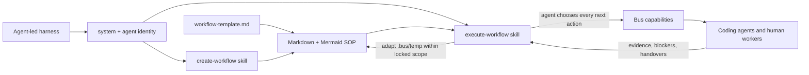

# 交付智能体主导的编排器内容包与动态 SOP

**状态**：review-plan-complete
**作者**：dylanliu8949
**创建日期**：2026-09-15
**基于提交**：7bc910f2aba2f79ca4ddbc83e76a3c44f8fa88d5
**分支**：master
**前置任务（如适用）**：完成、重新审查并验证 `plans/2026-09-15-room-orchestrator-agent-led-harness.md` 的 generic room capability shell、agent-owned control、`ROOM_AGENT_CONTENT_INTERFACE_V1`、`TRUSTED_ROOM_ASSIGNMENT_V1` 与 scripted-provider acceptance
**后续任务（如适用）**：无

> **语言无关说明**：本模板适用于本仓库涉及的任意目标语言。Rust 是产品主语言，workflow helper 使用 Python，少量集成资源使用 TypeScript。下方代码片段示例必须改用任务的目标语言表达。

> **状态说明**：
> 状态值为 `<phase>-<phase-state>` 的组合：6 个 phase 按下表顺序线性推进；前 5 个 phase 各有 `in-progress` 和 `complete` 两个 phase-state，第 6 个 phase `merge` 只有 `merge-complete`（合并是瞬时操作，没有“进行中”的中间态——`code-review-complete` 之后下一个状态就是 `merge-complete`）。完整枚举共 12 值：`<phase>-in-progress` / `<phase>-complete` × 5 + `merge-complete` + 特殊终态 `abandoned`（任意阶段可手动写入，表示计划废弃）。该字段是机器可读的工作流门控，请勿引入此列表以外的值。
>
> | # | phase | 含义 | `in-progress` 写入时机 | `complete` 写入时机 |
> |---|-------|------|-----------------------|---------------------|
> | 1 | `create-plan` | 计划文档撰写 | `/create-plan` 启动 | 落盘等待审查 |
> | 2 | `review-plan` | 计划审查 | `/address-review-comments` 首次处理评审时（`/review-plan` 对计划只读、不写状态） | 审查通过（`/execute-plan` 的最低门槛） |
> | 3 | `plan-execution` | 任务图实施 | `/execute-plan` 启动 | 全部任务验收 + 自动 EXIT CHECK 达标，并以最后一步 `commit-and-push` 提交、推送精确 tree |
> | 4 | `manual-test` | 人工手动测试 | 开发者手动 | 开发者手动 |
> | 5 | `code-review` | 最终代码审查 | 人工测试完成后开始 | 审查通过 |
> | 6 | `merge` | PR 合入 `master` | — （无 in-progress） | 合并完成后由开发者或合并流程写入（终态） |
>
> **门控规则**：
> - `/review-plan` 与 `/execute-plan` 只依赖本文档格式和状态，不依赖 `/create-plan` session 或额外私有状态；开发者手写但通过同一格式/gate 的计划同样合法
> - `/execute-plan` 在自动 gate 全绿后以 `commit-and-push` 作为最后一步，结束于已提交并推送到当前具名分支的精确 tree；之后依次由开发者人工验证、`/pr` 创建或更新面向 `master` 的 PR、`/review-pr` 审查。只有开发者明确要求时才直接落盘 `master`
> - 本仓库没有校验计划状态的 CI workflow，`状态` 由上述 workflow skill 自己消费。已进入 `plan-execution-complete` 及之后状态的计划文档视为已用，不得被新 PR 复用；需要新工作时新建计划文档

> **⚠️ 不可修改**：以下规则部分必须包含在每个计划文档中，AI 和开发者不得修改此部分。

<!-- 规则优先级：开始 - 此部分不可修改 -->
## 规则优先级

1. 开发者在对话中的最新明确要求。
2. 触及范围内实际存在的 `AGENTS.md`。
3. 本计划的目标、非目标与已归档决策。
4. 本模板、计划指南与代码现状。

事实必须区分为：当前源码已验证、开发者明确决定、待验证假设、延期工作。POC 的 ceiling 假设不得写成生产承诺。

- 计划生成规则和计划执行规则优先于模型的隐式行为
- 当任务指令与计划生成规则或计划执行规则冲突时，必须遵循这些规则
- 如果由于任务约束无法遵循计划生成规则或计划执行规则中的某条规则，应暂停并请求澄清，而不是猜测
- 如需覆盖这些规则，应更新计划模板文档，而不是在单个计划文档中覆盖
<!-- 规则优先级：结束 -->

## 目标

交付驱动 agent-led room orchestrator 的版本化内容包，包括 harness-level identity/system policy、domain-neutral `agent.md`、Mermaid-first `workflow-template.md`、`create-workflow` / `execute-workflow` skills、标准 SWE SOPs 与 coding-agent Room Brief 契约，使智能体能够自主解释、修订和执行动态流程而不承担技术实现工作。

> **重要**：
> - **目标与非目标共同标示本计划的意图（intent）与范围（scope）**：目标声明**要做什么 / 交付什么**（**强制**——写任何计划正文前必须先清晰设定，见 create-plan 的 GOAL GATE），非目标声明**刻意不做什么**（**可选**——未声明即视为无、AI 不问不猜，但**一旦声明即被强制执行**）；二者一起把计划的意图与边界钉死，是后续 create / review / execute 全程锁定的地基。
> - 计划必须**单一目标**。判断标准是**目标是否内聚**，不是任务数量——一个 XXXL 计划可以有多个粗粒度任务，只要它们共同服务同一个目标，它就仍是单一目标。
> - 类比：「建一座动物园」是单一目标，即使内部有建狮笼、建鸡舍、修围栏等多个任务，它们仍共同拼成一个成果。若顶层目标是多件互不相关的事，则应拆成多份单一目的计划。
> - 目标陈述聚焦**做什么 / 交付什么**（结果），不描述**怎么做**（实现细节留给后续章节）。
> - 计划一律 one-shot 执行、执行后再做 e2e 验证、一个计划一个 PR，与大小无关；不要把「单一目标 + 大」误当成「多目的」而拆散。
> - **目标在 create-plan 阶段定稿后即锁定**：只有开发者可修改。plan review / 任何 agent **不得推翻、扩张、缩小或重新定义**它，只能检查计划正文是否服务于该目标（详见 [`docs/guides/plan-review-guide.md`](../guides/plan-review-guide.md)「工作流结构是既定常量」）。

## 非目标

- 不修改前置 harness 的 provider、journal、tool registry、permissions、persistence、TUI、control protocol 或 safety policy；content 不能新增 tool 或让 harness 理解 workflow。
- 不让 orchestrator 检查、编写或修复技术实现，不让其从源码自行判断技术正确性、挑选 patch 或替代 coding agent；技术问题必须转发。
- 不增加 shell、source/diff/test/Git、任意文件读取、raw terminal-input、self-approval 或 cross-room capability；prompt 只是 defense-in-depth，hard authority 仍由 harness tool surface 限制。
- 不实现 executable workflow runner、固定 transition table、graph parser、领域 state machine、Appium test generator、Mermaid renderer 或 visual editor。
- 不实现 future best-of-N skill 本体；现有 SOP 可让 orchestrator 收集 N 份独立建议并明确委派 author agent 从完整候选中选择。
- 未经开发者明确授权，不执行 live paid DeepSeek call；正常 gate 只使用 scripted fake provider 和 fixed fixtures。
- 不允许 model/chat 直接把 `.bus/temp` 覆盖到 `.bus/standard`；promotion 仍要求 exact human action。
- 不把 orchestrator-only skills 暴露给 coding agents；只修改 canonical `skills/` sources 与其 derived symlink views。

> **重要**：
> - **可选，但设了就强制**：开发者未显式声明即写「无」——AI **不问、不猜、不外推**（宁可留「无」，不要编）；**一旦声明了任一条非目标，它即被强制执行**（往其方向推进的评审意见一律驳回，见下）。这是与目标的关键差别：目标**强制必设**，非目标**可留空、但设了不可犯**。
> - 与目标一样**锁定**：定稿后只有开发者可改；plan review / 任何 agent 不得新增、扩张或重新定义非目标。
> - 往非目标方向推进的评审意见（如「顺便也做 X」而 X 正是某条非目标）= 扩范围熵，一律驳回（见 [`docs/guides/plan-review-guide.md`](../guides/plan-review-guide.md) 与 [`docs/guides/code-review-guide.md`](../guides/code-review-guide.md)）。

## 当前状态分析

- **当前源码已验证**：在 base commit `7bc910f2` 中尚无 `src/bus/orchestrator/` 与 `.bus/`，所以必须先完成并重新审查 canonical harness successor；本计划不能通过 content 自行添加缺失 runtime capability。
- **当前源码已验证**：canonical coding-agent skills 位于 `skills/`，`.agents/skills` 与 `.claude/skills` 是 derived symlink views；修改必须落到 canonical source。
- **当前源码已验证**：现有 create/review/PR skills 分别拥有自己的 Goal/Non-goals derivation/locking 规则；orchestrated path 需要一个 shared Room Brief contract，同时必须保留 standalone path。
- **当前源码已验证**：现有 standalone planless `review-pr` 只请求/锁定 developer-authored Goal，并把 Non-goals 视为 `none`；本计划保留 direct standalone invocation 与 developer-owned derivation authority，但明确把该 path 加强为 developer-authored Goal + explicit Non-goals 并同时持久化两份 locks，不能再描述为逐字保留旧 locking behavior。
- **当前源码已验证**：`justfile` 提供 repository gates，但本环境没有 `just` 与 `cargo nextest`；执行前必须 provision。
- **开发者明确决定**：system/agent/skills 需要把“orchestrator owns process, coding agents own technical work”写成一致身份；hard tool denial 已在 prerequisite harness，实现内容不能冒充 security boundary。
- **开发者明确决定**：workflow 是可动态成长的 SOP。Mermaid 说明当前建议流程、循环和分支，但 agent 根据真实 room state 决定实际下一步，并在 scope 内更新 `.bus/temp`。
- **开发者明确决定**：initial proposal 显示 Goal/Non-goals、to-do、agents/models/effort、resource/permission needs，并等待 human confirmation；其后只有 scope/authority/risk materially 扩大才重新批准。
- **开发者明确决定**：workflow complexity、agent count、compute 与 intelligence 增长不改变 harness；content 和 context 可增长。
- **开发者明确决定**：content 必须称 human、orchestrator 与 coding agents 为 first-class room partners；workflow 分配 role/capability，而不是把 agents 描述成由人类操作的软件组件。
- **当前源码已验证（`7bc910f2`，包含 dogfood lifecycle fix `3c96cbf8`）**：Claude background Stop 已成为 explicit `BackgroundPending`；trusted same-session continuation 会 rebind 并等待 later final；exact confirmed recovery 只在 named Request 仍由已确认 Idle agent 持有时标记 `Abandoned`。这些都是 content 必须教 Orchestrator 正确解释的 lifecycle facts/capability settlements，不能成为 runtime 自动推进规则。
- **冻结前置契约已验证**：production content 中凡表示可调用 capability 的 token，必须逐字使用 prerequisite 的 closed `RoomQuery` / `RoomOperation` vocabulary。查询为 `InspectWork`、`WaitForChange`、`ReadAgent(VisibleViewport | RecentTail { lines })`、`ObservePermissionPrompt`、`ReadCodebaseOutline`、`ReadArtifact`、`ReadWorkflowDraft`、`ReadContent`；操作为 `CreateAgent`、`SendMessage`、`SteerActiveWork`、`SuspendWork`、`AbandonIdleRequest`、`RetireParticipant`、`ReplaceParticipant`、`ResolveQueuedWork`、`UpdateCoordination`、`PersistWorkflowDraft`、`PromoteWorkflowDraft`、`AcquireResource`、`ReleaseResource`、`ApprovePermissionOnce`、`RequestHuman`。Object/query pairing 同样冻结：embedded system/agent/skill/reference body 只用 `ReadContent`；harness 已暴露 `ArtifactId` 的 registered standard SOP 或其他 registered artifact 用 `ReadArtifact`；Bus `.bus/temp` draft 只用其 `WorkflowDraftId` 调 `ReadWorkflowDraft`。Content 不交换两种 handle、不从 raw path 猜 ID，也不为执行 standard SOP 强制复制 draft。该 vocabulary 只描述 model 可选择的 typed calls；它不把 SOP 变成 executable graph，也不授权 checker/runtime 选择调用顺序。



## 参考资料

- `plans/2026-09-15-room-orchestrator-agent-led-harness.md`（canonical prerequisite；agent owns every workflow decision）
- `plans/2026-09-14-room-orchestrator-content.md`、`plans/2026-09-14-room-orchestrator-harness.md`（legacy plans，迁移后只保留 abandoned pointer）
- `docs/templates/plan-template.md`（完整读取；canonical plan contract）
- `docs/guides/consumer-fallout-format.md`（完整读取；consumer inventory interpretation）
- `skills/AGENTS.md`（完整读取；canonical skill ownership and Bus gate conventions）
- `skills/skill-architecture.md`（完整读取；execution/principle/mechanic/format layering）
- `skills/create-plan/SKILL.md`、`skills/review-plan/SKILL.md`、`skills/execute-plan/SKILL.md`、`skills/pr/SKILL.md`、`skills/review-pr/SKILL.md`、`skills/address-review-comments/SKILL.md`（current coding-agent goal and workflow contracts）
- `docs/guides/review-response-guide.md`（完整读取；review findings remain evidence-bearing claims and technical disposition stays with coding-agent author）
- prerequisite `ROOM_AGENT_CONTENT_INTERFACE_V1`、`TRUSTED_ROOM_ASSIGNMENT_V1`、`docs/guides/room-orchestrator-content-interface-format.md`、`docs/guides/room-brief-projection-format.md`、production-safe `bus assignment verify --frame` typed result、`src/bus/orchestrator/`、`build.rs`、`Cargo.toml`、`justfile`（本计划执行前必须已实现并通过重新审查，不在执行时猜测 seam）
- `scripts/test_skill_migration_contract.py`、`scripts/test_sanitize_review_severity.py`、`scripts/test_bus_dev_acceptance.py`（完整读取；adjacent deterministic Python test patterns and existing no-severity/link contracts）

> **重要**：
> - 使用官方库 / 框架 / SDK 文档，并在本节记录实际读取的链接
> - 如果任务涉及现有模块，必须包含适用的 `AGENTS.md`；Bus 当前只有 `skills/` 与 vendored libghostty-vt 树维护局部 `AGENTS.md`
> - 如果任务跨模块或触及仓库级契约，必须包含对应的根文档、`docs/` 文档或 `skills/skill-architecture.md`
> - 如果任务涉及第三方 SDK，应包含以下链接：
>   - SDK 集成文档
>   - 如何启用 XX 功能的文档
> - 创建计划时先阅读所有适用 `AGENTS.md`，再由现有模块和调用点确定职责、依赖方向、公开 API、测试与验收入口
> - 新增的模块、文件、类型、函数命名应遵循相邻代码与对应模块 `AGENTS.md` 中体现的命名约定
> - 如果计划包含测试，应参考相邻 Rust `#[cfg(test)]`、模块测试、`scripts/test_*.py` 或集成资源测试的既有模式
> - 如果计划涉及日志输出或运行时不变量，必须读取实际拥有该行为的 Rust 模块和现有测试
> - 如果计划涉及跨平台行为，必须说明 Unix/macOS 与 Windows 各自的可用验证入口
> - 如果此任务基于另一个任务，或未来任务依赖此任务，应包含相关任务计划文档的路径
> - 如果找不到或未提供所有相关文档，AI 应停止计划生成并通知开发者

## 需要决策的事项

**当前计划完整程度**：100%

无待确认事项。

> **注意**：初始生成计划时，此完整程度应留空。随着开发者做出更多决策，AI 应更新此百分比。

> **重要**：
> - 只有当计划完整程度达到或超过 95%（AI 有 95%+ 把握能完成任务）时，开发者才可以执行计划
> - 任何不清楚、缺失或可以用不同解决方案实现的事项都应列在此部分
> - AI 不应猜测，应在计划执行前始终询问相关信息
> - 如果 AI 无法推断出可用选项，可以提出开放性问题
> - 每个决策项可以有多个选项（不限于两个），根据实际情况列出所有可行的选择
> - 每个选项的描述应列出优缺点（pros and cons）
> - 在做出大的方向性决策后，AI 应继续提出后续问题并更新此部分
> - 开发者做出决策后，应更新此完整程度百分比
> - 新增开放决策后，必须把 **状态** 改回 `create-plan-in-progress`。此回退由开发者/计划作者在新增该决策时同步完成；`/address-review-comments` 等审查响应工具不代做此回退

## 已归档的决策

1. **Process authority**
   - **选项**：content 描述 fixed runtime；content 只在 failure 时唤醒 agent；content 指示 agent 持续拥有流程。
   - **选择**：第三项。`execute-workflow` 在每次 room event 后由 agent 判断下一步，所有 dispatch/wait/adaptation/recovery 都通过 tool call 明确发生。
   - **依据**：开发者明确选择 B 并要求彻底移除 script+agent design。

2. **Mermaid semantics**
   - **选项**：可执行 DSL；装饰图；SOP 的 normative visual map。
   - **选择**：第三项。图必须与 prose 对齐并可表达循环/分支/并行/人类步骤，但现实状态和 agent judgment 决定执行；agent 可在 `.bus/temp` 修订图与 prose。
   - **依据**：开发者选择 Mermaid-in-Markdown，同时强调 workflow 是 SOP、不是 script。

3. **Production content ownership**
   - **选项**：runtime hard-code；repo file shadow；fixed versioned content bundle。
   - **选择**：第三项。System、agent、两个 skills 与 template 使用 prerequisite seam 内嵌；standard SOPs/README 由 repo `.bus/standard` 持有。
   - **依据**：content 与 harness 分计划、避免 repo prompt injection shadow production identity。

4. **Technical boundary wording**
   - **选项**：orchestrator 可直接分析代码；只用 prompt 禁止；prompt + harness capability denial。
   - **选择**：第三项。Content 要求 route technical questions, compare process evidence, ask agents for recommendations；不能声称 prompt 能阻止越权。
   - **依据**：开发者要求 harness-level constraint，content 只加强角色一致性。

5. **Standard convergence**
   - **选项**：单 reviewer；同 family reviewers；independent mixed-family lanes + separate author + repeated convergence。
   - **选择**：第三项。每轮 lanes 不读 peers；有 finding 时收集 reviewers 与 author recommendations，把完整集合交给 author 做 best-of-N-style resolution；无法 cleanly resolve 时才找 human。全部 canonical lanes 对同一 plan hash Ready 后，Orchestrator 必须显式授权 separate author 执行 hash-bound state finalization；reviewer 和 runtime 都不从 verdict 自动推进。
   - **依据**：开发者对 mixed-model review 和实际 Bus dogfood 的明确流程。

6. **Dynamic scope and approval**
   - **选项**：每次 SOP 改动重批；批准后任意扩 scope；locked boundary 内动态修订。
   - **选择**：第三项。Routine adaptation、attempt/lesson 增长与 `.bus/temp` 更新不重批；Goal/Non-goals、authority、destructive/publish 或 material budget/resource expansion 重批。
   - **依据**：开发者需要 agent 从 entropy 中恢复，同时保留 human authority。

7. **Participant language and authority**
   - **选项**：human controller + agent components；所有参与者完全相同权限；first-class partners + role-specific capabilities。
   - **选择**：第三项。System、agent、skills、template 与 SOP 都使用 participant/partner/assignment/evidence vocabulary；human approval 与 orchestrator process ownership 是能力差异，不是否定 agent 主体性。
   - **依据**：开发者明确指出这是 Bus 的核心模型，并强调 orchestrator agent 拥有很大权力。

8. **Production content interface boundary**
   - **选项**：本计划同时实现 build/runtime assembly；只交付 static content；消费 prerequisite-owned generic interface。
   - **选择**：第三项。Prerequisite 的 `ROOM_AGENT_CONTENT_INTERFACE_V1` 拥有 schema/validation/packing、closed selector、model-authored content read 与 prompt layering；本计划只提供 production manifest、五个 concrete assets、SOPs、static checks 与 production-selector smoke。Manifest 使用 required system/agent entries + named skill/reference entries，使 content 增长不要求 harness 理解 workflow 或增加 Rust branches。
   - **依据**：四份完整独立 recommendation 均选择 A；该 synthesis 保留一个 loader owner、content plan 的 runtime/build 非目标和 production bundle 目标。

9. **Trusted Room Brief carrier and precedence**
   - **选项**：content-owned in-band block；延期六个 skill branches；harness-produced versioned trusted assignment projection。
   - **选择**：第三项。Prerequisite Worker 在已授权 coding-agent Request delivery 中产生 `TRUSTED_ROOM_ASSIGNMENT_V1`，且 prerequisite production verifier 独占 directory、immutable record、active pointer、endpoint/token、frame、current Request、resume/replace provenance 的信任判定。本计划的唯一 shared context adapter 与六个 skill branches 只调用该 verifier 并消费 `Verified | Absent | Invalid` typed result，不读取或重新验证 harness storage，也不信任 in-band lookalike。`Verified` authorizes orchestrated branch；plan Goal/Non-goals 与 `.locked-goal`/locked non-goals 必须 exact match，否则返回 blocker evidence 给 Orchestrator，绝不覆盖、fallback 或自动选择 recovery。Bus-intent branch 中只有 verifier `Absent` 保留 standalone path，`Invalid` 始终 blocker；既有 direct non-Bus invocation 仅在 outer frame 与全部四项 Bus discovery variables 同时不存在时，才由 content adapter 在调用 verifier 前返回 distinct `NotInBusRoom` standalone signal。出现 frame 或任一 discovery variable 即进入 Bus-intent branch，必须具备完整 discovery 并成功调用 verifier，任何 partial/missing discovery、unavailable/timeout/nonzero call 或 malformed result 都 fail closed。
   - **依据**：四份完整独立 recommendation 均选择 A；only harness can bind durable room/work/request、author/recipient and approved brief revision without turning prompt prose into a trust root。

## 大小

**大小**：XL

> **大小说明**：
> - `大小` 字段只允许填写一个等级 token：`XS`、`S`、`M`、`L`、`XL`、`XXL` 或 `XXXL`。
> - 禁止在 `大小` 字段后追加括号说明、scope、文件数量、行数、抽象数量或工作清单。例如应写 `**大小**：S`，不要写 `**大小**：S（client-only：...；约 6-7 个文件；新增 1 个 helper）`。
> - scope、涉及文件、抽象与工作内容应写在「当前状态分析」、「需要修改/添加的文件」和「实施步骤」中，而不是塞进 `大小` 字段。
> - `XS`: 超小任务（代码变更行数 < 50，涉及文件数 < 3，新增抽象数 0）
> - `S`: 小任务（代码变更行数 50-200，涉及文件数 3-5，新增抽象数 0-1）
> - `M`: 中等任务（代码变更行数 200-500，涉及文件数 5-10，新增抽象数 1-3）
> - `L`: 大任务（代码变更行数 500-1000，涉及文件数 10-20，新增抽象数 3-5）
> - `XL`: 超大任务（代码变更行数 > 1000，涉及文件数 > 20，新增抽象数 > 5）
> - `XXL`: 特大任务（代码变更行数 > 3000，涉及文件数 > 50，跨多个模块的架构变更）— 适合由 AI Agent 主导执行、有完整单元测试覆盖的场景
> - `XXXL`: 巨型任务（代码变更行数 > 5000，涉及文件数 > 100，系统级架构重构）— 仅适用于 AI Agent 全程执行 + 完整自动化测试套件可兜底的 yolo 场景
>
> **机械性变更降级规则**：
> 上述大小阈值衡量的是**设计/审查复杂度**，不是 diff 行数或文件数。如果绝大部分变更是纯机械操作——每处都遵循同一条可机械验证的规则、不涉及业务逻辑或设计判断——应将大小**至少降一档，必要时大幅降级**（例如：100 文件的方法重命名实际复杂度可能只是 XS/S，因为审查者抽样 3-5 处确认替换规则一致即可，不需要逐文件思考）。
>
> 典型机械性变更：
> - 重命名公开方法 / 类 / 字段，导致全仓库 N 个调用点跟改
> - 修改某个广泛使用的函数签名（增删参数、改返回类型），所有调用点机械跟改
> - 模块拆分 / 重组，大量文件移动 + import 路径调整
> - 批量修复新增 lint 规则触发的全仓库违规
> - 按 codemod 规则批量替换 API（旧 API → 新 API 迁移）
> - 统一 import 顺序 / 路径 / 别名
> - 目录重组、按规范批量重命名文件
> - 给已有未标注的代码批量加类型注解
>
> 判断准则：
> - 审查者是否需要逐文件思考？如果只需抽样核对「是否都按同一规则改」，就是机械性变更
> - 仍按原始复杂度计大小的部分：触发机械变更的「源头」本身（新增的 lint 规则、codemod 脚本、新 API 接口、新签名的方法声明）不参与降级

> **⚠️ 不可修改**：以下规则部分必须包含在每个计划文档中，AI 和开发者不得修改此部分。

<!-- 计划生成规则：开始 - 此部分不可修改 -->
## 计划生成规则

- **作者**字段必须填写 GitHub 用户名（通过 `gh api user -q .login` 获取），不得使用 "claude_code"、"AI" 等非人类标识符。此字段用于追踪计划质量归属。
- **分支**字段必须是当前具名分支。默认使用 feature 分支；只有开发者明确要求时才允许直接在 `master` 落盘。
- 一份计划只有一个目标；大小不等于多目的。
- AI 生成的计划文档必须包含本模板中的所有部分；标记为「（如适用）」的部分是可选的，开发者可以选择主动删除。
- 所有 `> **重要**：` 块必须从模板中复制，不得修改或省略。
- 开放决策存在时，保持 `create-plan-in-progress`，不生成文件契约、任务图或测试计划。
- **当前计划完整程度**初始应留空，AI 不得自动填写百分比；随着开发者做出更多决策，AI 应更新此百分比。
- **大小**、**需要修改/添加的文件**、**错误跟踪**、**断言检测**、**实施步骤**和**测试计划**初始应留空，仅当以下条件全部满足后才生成和更新内容：
  - 「参考资料」已完整
  - 「需要决策的事项」中无未解决的问题
  - 当前计划完整程度达到或超过 95%
- 决策清空后，正文完整程度必须达到至少 95%，任务通常为 1–5 个粗粒度单元。
- 开发者做出决策后：
  - 必须将决策保存到「已归档的决策」
  - 如果上述各生成部分不为空，必须同步更新它们以反映新的决策
- 当以下条件全部满足时，AI 必须自动将**当前计划完整程度**更新为 100%：
  - 「需要决策的事项」中没有未解决的问题（所有决策已归档）
  - 所有必需的生成部分均已填写，并与已归档决策保持一致
- `拥有文件` 是排他写入边界。不同任务 owner 不得重叠；明确文件必须由一个且仅一个 owner 覆盖。
- `consumes` 必须同时出现在 `blocked-by`；任务依赖必须是无环图。
- POC 计划只承诺验证目标所需的最小闭环。生产打包、性能指标、网络、云服务等只有在目标明确要求时才能进入范围。
<!-- 计划生成规则：结束 -->

## 需要修改/添加的文件

列出所有将被添加或修改的文件，并提供高级概念代码片段和关键实现细节。

> **重要**：
> - 每个有行为变化的 source 文件都必须附一段简洁的**高级概念代码片段**，用于锁定公开签名、关键类型或控制流；片段不含 import、不标行数，也不代替完整实现。
> - **不要在代码片段中包含 import 语句**——import 是实现细节，不传达设计意图。
> - **路径迁移只说明一次，不要逐处列举**：当某个 Rust 模块或公开符号迁移导致消费方路径机械跟改，只需说明所有引用都指向新路径，不把每个 `use` 改动逐条列出。
> - 对于关键的实现细节，可以添加代码片段，但不需要完整实现；也可以在片段中用注释说明需要在何处添加或修改什么。
> - **禁止标注代码行数估算**（如 `~20 LOC`、`约 50 行`、`+30/-10`）：行数对执行 agent 是噪音，文件职责和高级概念片段才是有用信息。
> - `大小` 字段也不能承载文件数量、抽象数量或工作清单；这些内容应由本节逐文件说明。
> - 需要说明新组件如何融入现有架构时使用 mermaid 绘图。
> - 此部分应详尽，包含所有将被添加或修改的文件，并写明 repo-relative 路径。
> - 测试文件可在本节或「测试计划」中用 `describe` / case 骨架表达，但必须能对应到计划中的行为契约。
> - **例外**：以下类型的文件无需在此部分逐一列出代码片段，可直接修改：
>   - 包 / 构建配置文件（如 `Cargo.toml`、`justfile`、`.github/workflows/*.yml` 等）
>   - lock 文件（如 `Cargo.lock`）
>   - 文档文件（如 `.md`、`.txt`）
>   - 仅涉及 import 语句变更的文件
> - 上述例外只豁免本节逐文件代码片段，不豁免任务 ownership、验收闸门或模块 SOT 同步。计划已经明确点名的文件与测试路径必须进入本节文件契约，并被一个且仅一个任务 owner containment 覆盖；合理 deviation 可在稳定 owner 内新增未预知文件。
> - 改变 skill 架构或公开工作流契约时，`skills/AGENTS.md`、`skills/skill-architecture.md` 与受影响的共享 guide 必须进入同一 owner 与 gate。

- **新文件**：`src/bus/orchestrator/content/production/manifest.toml`
  - **用途**：为 `ROOM_AGENT_CONTENT_INTERFACE_V1` 提供 production instance：required singleton `system`/`agent`、named `skills[]` 中的 create/execute entries、named `references[]` 中的 workflow template，合计下列五个 concrete assets；声明 content/compatibility version、path、caps 与 SHA-256。不能注册 tool/capability、mode、workflow transition 或 control logic。
- **新文件**：`src/bus/orchestrator/content/production/system.md`
  - **用途**：建立 harness-level identity：orchestrator 是 first-class room participant 与 process owner；coding agents 和 humans 是 partners；所有 next-step decisions 属于 orchestrator。
  - **关键修改**：明确 no technical problem solving、evidence-first routing、no self-approval、no hidden reasoning exposure；承认 hard security 来自 harness capabilities。
- **新文件**：`src/bus/orchestrator/content/production/agent.md`
  - **用途**：定义持续运行方式：理解 requirements、维护 Goal/Non-goals/to-do、选择 participant/model/effort、等待/追问、记录 attempt/lesson、恢复/替换与 sitrep。
  - **关键修改**：happy path 与 failure path 都由 agent 驱动；先从 injected skill/reference index 选择 exact entry，再以 `ReadContent` 加载 body。用 `InspectWork`、`WaitForChange`、`ReadAgent(VisibleViewport | RecentTail { lines })`、`ReadArtifact`、`ReadWorkflowDraft` 与 `ReadCodebaseOutline` 读取需要的 bounded facts，而不是相信 visual Idle；registered standard SOP/other artifact 的 `ArtifactId` 只交给 `ReadArtifact`，temp SOP 的 `WorkflowDraftId` 只交给 `ReadWorkflowDraft`，missing/unknown/mismatched handle 返回事实并由 model 重新判断，不能 raw-path fallback。区分 `BackgroundPending`、trusted continuation、Request/operation settlement、artifact evidence 与 higher-level outcome。只有 agent 选择 exact `CreateAgent`、`SendMessage`、`SteerActiveWork`、`SuspendWork`、`AbandonIdleRequest`、`RetireParticipant`、`ReplaceParticipant`、`ResolveQueuedWork`、`UpdateCoordination`、`PersistWorkflowDraft`、`PromoteWorkflowDraft`、`AcquireResource`、`ReleaseResource`、`ApprovePermissionOnce` 或 `RequestHuman`；permission 必须先以 `ObservePermissionPrompt` 获得 factual single-use fingerprint，再决定是否调用 `ApprovePermissionOnce`。遇到技术问题先找拥有上下文的 participant；完全失控才请求 human。
- **新文件**：`src/bus/orchestrator/content/production/skills/create-workflow/SKILL.md`
  - **用途**：通过 content index + `ReadContent` 加载 create skill/template；只从 harness-exposed registered SOP fact/`ArtifactId` 选择 standard SOP 并以 `ReadArtifact` 读取，或以 pathless `PersistWorkflowDraft` 创建/修订 Bus-derived `.bus/temp/<room-id>/<draft-id>.md` 并以 receipt `WorkflowDraftId` + `ReadWorkflowDraft` 读取，生成 human-visible initial proposal。Standard 可直接执行；只有 model 决定适配时才创建 temp draft，不能为读取而自动 materialize，也不提交 path 或 filename。
  - **关键修改**：收集 requirements → 写/选 SOP → lint → 提出 Goal/Non-goals、to-do、participants/models/effort/resource/permission budget → 等待 exact approval；approval 前零 dispatch。Standard publication 是 separate developer review 对 immutable draft revision/content、current standard base 与 exact diff 的 approval；其后 Human 或 Orchestrator 才可另行选择 approval-bound pathless `PromoteWorkflowDraft`，runtime 只重验并结算。
- **新文件**：`src/bus/orchestrator/content/production/skills/execute-workflow/SKILL.md`
  - **用途**：让 orchestrator 在每个 room event 后读取当前 SOP、durable state 与 evidence，自主决定并执行下一步。
  - **关键修改**：每次 exact `RoomQuery` / `RoomOperation` call 都是 agent judgment。Current SOP reference 必须保留来源类型与 harness-issued handle：`RegisteredStandard(ArtifactId)` 用 `ReadArtifact`，`TemporaryDraft(WorkflowDraftId)` 用 `ReadWorkflowDraft`；unknown/missing/mismatched handle typed-deny 后只返回事实，model 可重新 inspect/select/request Human，但 runtime/helper 不 fallback、不复制 standard、不选择 recovery。Skill 用 `InspectWork`/`WaitForChange`、model-selected `ReadAgent(VisibleViewport | RecentTail { lines })`、其他 `ReadArtifact` 或 `ReadCodebaseOutline` 收集所需事实，再自主选择 assignment、steering、queue/lifecycle、resource、workflow revision、permission 或 Human escalation operation。Permission path 固定为事实查询 `ObservePermissionPrompt` 后，model 才可选择 fingerprint-bound `ApprovePermissionOnce`；historically wedged current Request 的 recovery 名称为 `AbandonIdleRequest`。Typed stale/denied/uncertain facts 只触发重新判断，不触发 fixed recovery。Claude `BackgroundPending` 不结算、trusted same-session continuation rebind、ordinary final 只结算 Request、artifact/post-settlement activity 不宣告 work complete、exact confirmed idle-request recovery 只暴露 `Abandoned`；不得等待 harness 自动推进，scope 内 revision 只通过 `PersistWorkflowDraft`，promotion 只通过 developer-approved `PromoteWorkflowDraft`。
- **新文件**：`src/bus/orchestrator/content/production/references/workflow-template.md`
  - **用途**：作为 `plan-template.md` 的 workflow 对应物，提供 Markdown sections 与 exactly one Mermaid flowchart 的完整可复制 SOP skeleton。
  - **关键修改**：包含 intent、inputs、participants/roles/capabilities、preflight proposal、current SOP source/handle、success evidence、provider/request/operation/artifact settlement evidence、failure signals、adaptation/recovery authority、resource leases、attempt ledger、human tasks、stop/escalation、revision history；current SOP 只能标记 `RegisteredStandard` + `ArtifactId` 或 `TemporaryDraft` + `WorkflowDraftId`，分别对应 `ReadArtifact` / `ReadWorkflowDraft`，不得含 raw path 或由 parser 选择转换。Capability slots 只接受 frozen exact query/operation token，permission、draft/promotion、terminal/history 与 idle-request recovery 使用上述 typed pair/variant；图与 prose 必须对齐，但图不具可执行语义。
- **新文件**：`.bus/standard/review-plan.md`、`.bus/standard/review-pr.md`
  - **用途**：描述三条 mixed-family independent reviewer lanes、separate author、循环至全部 Ready 的标准 SOP。
  - **关键修改**：只有已经作为 registered standard SOP 获得 harness-exposed `ArtifactId` 时才可被选择，Orchestrator 只以 `ReadArtifact` 读取；lane 顺序与隔离由 orchestrator维护。有 finding 时向三名 reviewers 和 author 收集建议，把四份完整建议交给 author 做 best-of-N-style resolution；无法 cleanly resolve 才找 human。All-Ready 只是事实；Orchestrator 另行显式授权 separate author 执行 exact plan-hash/lane/round-bound finalization，reviewer/runtime 不自动写 `review-plan-complete`。
- **新文件**：`.bus/standard/execute-plan.md`
  - **用途**：由 room Orchestrator逐次选择 reviewed plan 中可执行的 bounded implementation、task-review、remediation 与 finalization assignment，coding agents 使用 native technical tools完成被委派的细节，再进入 mixed-model independent review/address cycle。
  - **关键修改**：只有已经作为 registered standard SOP 获得 harness-exposed `ArtifactId` 时才可被选择，Orchestrator 只以 `ReadArtifact` 读取；orchestrated branch 不启动或跟随 standalone `execute-plan` Python progression driver。Deterministic helpers 只能验证 Orchestrator 已选择的 task/owner/hash/evidence/operation。Orchestrator 避免 simultaneous uncoordinated writers、根据任务复杂度分配 effort，并在每次 returned fact/artifact 后自主决定 wait、next assignment、repair 或 recovery。
- **新文件**：`.bus/README.md`
  - **用途**：说明 standard/temp ownership、Mermaid-as-SOP、dynamic revision、human/agent partnership、approval boundary、promotion、attempt/lesson 与 no-script/no-Appium default；记录 registered standard `ArtifactId` → `ReadArtifact`、temp `WorkflowDraftId` → `ReadWorkflowDraft` 的 exact read pairing 与 no raw-path/implicit-copy rule。明确 draft 只能经 pathless `PersistWorkflowDraft` 写入 Bus-derived temp identity，developer exact approval 是 standard publication 的 Human-only authority action，而 Human/Orchestrator 均可随后请求 pathless `PromoteWorkflowDraft` settlement。
- **新目录**：`src/bus/orchestrator/testdata/content/production/`、`src/bus/orchestrator/testdata/content/scenarios/`
  - **用途**：fixed bundle integrity fixtures，以及 versioned static fact/expected-model-choice scenarios：agent-led happy path、review convergence、dynamic spike benchmark、all-failed lessons/reseed、human worker、escalation、`BackgroundPending`/trusted continuation/later final、ordinary-final/post-settlement activity/artifact independence、idle-request `Abandoned` recovery、launch/hook readiness、active-turn steering、stale queue replace/retire/handover、non-building observation 与 three exact approve-once decisions。
  - **关键修改**：每个 static scenario 明确 input facts、model turn、frozen exact query/operation call 与 authorized capability settlement；至少一例以 registered standard `ArtifactId` + `ReadArtifact` 执行且不创建 draft，一例以 temp `WorkflowDraftId` + `ReadWorkflowDraft` 执行，并覆盖 wrong/missing handle pairing fail closed。Permission cases 必须先记录 `ObservePermissionPrompt` observation/fingerprint 后才可能出现 `ApprovePermissionOnce`，terminal evidence 明确 model-selected `VisibleViewport` 或 positive-N `RecentTail`，idle recovery 使用 `AbandonIdleRequest`，SOP adaptation/publication 分别使用 pathless `PersistWorkflowDraft` / approval-bound `PromoteWorkflowDraft`。Fixture/checker 不声称执行模型或证明 semantic quality，且不包含 runtime/Mermaid/status/timeout generated next step。
- **新文件**：`scripts/orchestrator_content_check.py`
  - **用途**：静态检查 production manifest/asset digest 与 prerequisite schema conformance、template、standard SOPs、cross-links、forbidden authority wording 和 static scenario fixtures；不解释图的控制流，也不证明 runtime prompt layering或模型语义。
  ```python
  def validate_repository(repo: Path) -> tuple[Diagnostic, ...]:
      validate_fixed_content_bundle(repo)
      validate_workflow_document_structure(repo)
      validate_frozen_capability_vocabulary(repo)
      validate_sop_read_pairing(repo)
      validate_agent_led_language(repo)
      validate_scripted_scenarios(repo)
      return diagnostics_in_source_order()
  ```
- **新文件**：`scripts/test_orchestrator_content_check.py`
  - **用途**：覆盖 valid bundle、结构错误、错误 authority wording、runtime-owned next-action wording、participant hierarchy 和 static scenario/model-decision correlation；其 named production-smoke case subprocess prerequisite exact `--profile agent-led --content production --fake-provider` driver、读取 evidence artifact 并断言 production bundle identity/digest 与 agent-led counters，使 `just test` 重放最终树 proof。
- **修改文件**：`skills/AGENTS.md`、`skills/skill-architecture.md`；**新文件**：`docs/guides/orchestrated-room-brief.md`
  - **用途**：消费 prerequisite `docs/guides/room-brief-projection-format.md` 与 production verifier typed-result contract，建立 shared Room Brief/participant/handoff precedence 与 canonical skill ownership，不重复 producer/verifier format 或在各 skill 复制 authority prose。No outer frame + none of `BUS_BINARY`、`BUS_TRUSTED_ASSIGNMENT_DIR`、`BUS_TRUSTED_ASSIGNMENT_ENDPOINT`、`BUS_TRUSTED_ASSIGNMENT_TOKEN` is distinct `NotInBusRoom` and preserves the direct standalone entry path；any frame or any discovery variable requires the complete set and production verifier。Verifier `Verified` authorizes orchestrated branch；plan/lock mirror exact-match or fail closed；verifier `Absent` preserves the standalone entry path，while partial discovery、unavailable/timeout/nonzero verifier、malformed output or `Invalid` blocks。
- **新文件**：`cli_extensions/room_assignment_context.py`
  - **用途**：六个 skill 共用的唯一 `TRUSTED_ROOM_ASSIGNMENT_V1` discovery/verifier-result consumer。它只检查 outer-frame presence 与四项 prerequisite discovery variable 的 presence：两者全无时返回 distinct `NotInBusRoom`；出现任一个 Bus-intent signal 时要求 complete set，并只通过 `BUS_BINARY` 调用 production-safe `bus assignment verify --frame <outer-frame>`。它 decode `Verified | Absent | Invalid`，把 `Verified` payload 变成 shared Goal/Non-goals/participant context；`Absent` 是 verifier-confirmed standalone，partial discovery、executable unavailable、timeout/nonzero exit、malformed output 与 `Invalid` 都是 blocker。它不打开 `BUS_TRUSTED_ASSIGNMENT_DIR`、不读取 immutable record/active pointer/token、不得自行比较 room/work/message/request/author/recipient/incarnation/launch/revision/digest，也不实现第二套 trust validator。
  ```python
  def load_assignment_context(frame: str | None, env: Mapping[str, str]) -> AssignmentContext:
      if frame is None and no_bus_discovery_variables(env):
          return StandaloneContext(origin="NotInBusRoom")
      require_complete_bus_discovery(env)
      return map_verifier_result(run_production_verifier(frame, env))
  ```
- **新文件**：`scripts/test_room_assignment_context.py`
  - **用途**：以 fake verifier executable/typed fixtures 覆盖 no-frame/no-discovery `NotInBusRoom` standalone、frame-without-discovery、每种 partial discovery、complete discovery + exact frame invocation、executable unavailable、timeout/nonzero exit、`Verified` mapping、verifier-`Absent` standalone 与 `Invalid`/malformed blocker，以及 Goal/Non-goals precedence and no direct assignment-storage reads。Forged body、wrong identity/revision/digest、token/frame and resume/replace truth cases remain prerequisite verifier tests and are not reimplemented here。
- **修改文件**：`skills/create-plan/SKILL.md`、`skills/review-plan/SKILL.md`、`skills/execute-plan/SKILL.md`、`skills/pr/SKILL.md`、`skills/review-pr/SKILL.md`、`skills/address-review-comments/SKILL.md`
  - **用途**：收到 prerequisite verifier `Verified(TRUSTED_ROOM_ASSIGNMENT_V1)` 时逐字消费 locked Goal/Non-goals 并返回正常 artifact；verifier `Invalid`、malformed/call failure 或任何 partial Bus discovery 必须 blocker。Distinct local `NotInBusRoom` 与 verifier `Absent` 保留 direct standalone entry 与 developer-owned derivation authority，但 planless `review-pr` deliberately strengthens context/locking to explicit developer-authored Goal + Non-goals and both locks；artifact/evidence 必须区分 provenance，不能声称逐字保留旧 locking behavior。
  - **关键修改**：create-plan 逐字复制 trusted Goal/Non-goals；plan-bound skills require exact match；orchestrated `execute-plan` bypasses deterministic progression and只完成 Orchestrator 明确选择的 bounded action；orchestrator 可 proposal/update room brief but coding skills 不成为第二 goal writer。Reviewer findings 始终是 evidence-bearing claims，不加 severity tags。
- **修改文件**：`skills/pr/scripts/pr_goal_context.py`、`skills/pr/scripts/test_pr_format_check.py`、`skills/review-pr/scripts/review_round.py`；**新文件**：`skills/review-pr/scripts/test_review_round.py`
  - **用途**：planless orchestrated PR path 从 verifier-`Verified` payload 同时生成并复用 `.locked-goal` 与 `.locked-non-goals`；standalone no-plan path 要求 developer-authored goal + explicit non-goal context 并生成相同两份 locks。`review_round.py` 直接读取二者并 fail closed on either missing/blank；有 plan 时两者均须与 plan Goal/Non-goals exact match。任何 mismatch 不自动覆盖。New direct prologue tests own both-lock parsing、missing/blank/mismatch failures 与 matching plan/no-plan cases，而不是由 `test_pr_format_check.py` 间接代证。
  ```python
  def load_locked_review_context(lane_root: Path, plan: Path | None) -> LockedReviewContext:
      context = read_required_goal_and_non_goals(lane_root)
      if plan is not None:
          require_exact_plan_match(context, plan)
      return context
  ```
- **新文件**：`skills/address-review-comments/scripts/finalize_plan_review.py`
  - **用途**：提供 separate author 的 exact plan-hash/lane/round-bound `review-plan-complete` finalization operation。Only an explicit Orchestrator assignment invokes it；helper verifies all required canonical Ready artifacts against one current plan hash，then writes only the status field and returns receipt；missing/stale/mixed-hash/finding artifacts fail closed。Reviewer remains read-only，runtime never derives progression from verdict。
- **新文件**：`scripts/test_plan_review_finalization.py`；**修改文件**：`docs/guides/review-response-guide.md`
  - **用途**：覆盖 zero-finding first round、repaired later round、missing/finding/stale/mixed-hash/duplicate-lane failures and reviewer read-only preservation；shared guide records the explicit author-side settlement boundary。
- **新文件**：`scripts/skill_goal_ownership_check.py`
  - **用途**：机械验证 shared guide references、single Room Brief writer、standalone fallback、derived symlinks、no severity language 和 no duplicated authority。
  ```python
  def validate_goal_ownership(repo: Path) -> tuple[Violation, ...]:
      verify_shared_room_brief_contract(repo)
      verify_orchestrated_and_standalone_skill_paths(repo)
      verify_discovery_links(repo)
      return violations_in_stable_order()
  ```
- **新文件**：`scripts/test_skill_goal_ownership_check.py`
  - **用途**：覆盖六个 skill 的 orchestrated/standalone branches、single writer、participant handoff 与 canonical symlink integrity。
- **修改文件**：`justfile`
  - **用途**：把 content/skill checker、room-assignment verifier-result consumer、plan-review finalizer、PR goal-context contract suites 接入 `maintenance-test`，并以 direct `python3 skills/review-pr/scripts/test_review_round.py` line 注册 review-pr prologue suite；content unittest 自身 subprocess exact production selector，因此 final `just test` 重放同一 production evidence。

明确排除：`Cargo.toml`、`Cargo.lock`、`build.rs`、`src/bus/orchestrator/*.rs`（除 `content/` 与 `testdata/content/`）、`src/client/**`、`src/bus/runtime*.rs` 和 harness acceptance driver；本计划只消费 prerequisite 的 generic interfaces。

## 实施步骤

以粗粒度、可独立验收的任务图描述执行单元。给模型目标、工具、约束和二元验收闸门，不写操作流程。

> **重要**：
> - 一个任务 = 一段可独立 task acceptance 的完整工作；只因明确并行收益或硬依赖边拆分。天然串行且落在同一文件簇的工作必须合并。
> - `任务<N>` 是计划内全局唯一、不可变的机读 id，从 1 按源码顺序连续递增；名称非空且唯一。
> - `blocked-by` 是唯一调度边；`consumes` 只引用已在 `blocked-by` 中声明的生产方 `任务<N>`；产物名称和契约写在生产方 `produces`。
> - 任意两个任务的 `拥有文件` 必须 containment-aware 两两隔离，依赖边不豁免 overlap；聚合文件和 SOT 只能由一个任务拥有。
> - `拥有文件` 是任务间的排他写入 / 调度边界和最外层写入上限，不是预计 diff 的精确 allowlist。优先选择可容纳合理 deviation 的稳定模块 / 子系统边界；目录 owner 可以包含文件清单未逐项点名的 descendant，但不授权与任务目标无关的改动。
> - 本计划明确点名的新增 / 修改 / 删除文件与具体测试文件必须进入文件契约，并被一个且仅一个任务 owner containment 覆盖；配置、文档、仅 import 等文件清单例外不豁免 ownership / gate。改变公开契约时，对应的 Bus 文档或 skill SOT 必须进入同一 owner 与 gate。
> - 对迁移 / 删除生产模块运行 `skills/review-plan/scripts/consumer_fallout.py`，逐项核实 Rust `use` / `mod`、其他语言 import/require 与同名测试候选；相关项进入文件契约、owner 和 gate，不相关项写明排除依据。inventory 只辅助发现，不替代语义 review。
> - `目标` 描述做完后是什么样；`工具` 列出必读 SOT、harness 和命令；`约束` 只写必须成立的硬顺序和不变量；`验收闸门` 固定以 `[TASK_LOCAL]` 开头，只给出 `just test-one <filter>`、直接 Cargo/Python/Bun 测试或模块编译等局部正确性命令与二元判定，不把 scoped rustfmt 或完整平台 build 重复写进 task gate。命令必须按当前 `justfile` 与测试 harness 核验；exit 0 但选择零测试或错误 harness 不算通过。
> - 任务块内禁止 `(需要手动操作)`。人工验证只写在「手动测试」section；若人工裁决是后续实施的硬前置，拆成两份计划。
> - 主 agent 只在 task report evidence 有效、`review-task Ready` 且所属 wave isolation 通过时勾选 `**完成**`。主 agent 不逐任务重跑 gate/lint；任务完成复选框是共享工作树进度，不表示已 commit。
> - 自动 gate 完成前所有 actor 必须零 Git：不得 `git add/commit/push`。全部自动 gate 对最终计划 delta 全绿后，`execute-plan` 以 `commit-and-push` 作为最后一步提交并推送到当前具名分支；此后不得再改树。随后交回人工验证、`pr` 与最终 `review-pr`。
> - 全局 EXIT CHECK 固定为 `just lint` → `just test` → 可选 `just build`，不得使用 task/file filter。任何修复改树都从 final lint 重新开始。任务级 Ready 与局部 review 对最终 PR review 不可替代。

### 任务 1：交付 agent-led content、adaptive SOP 与 trusted participant handoff contract

- [ ] **完成**
- **目标**：在一个不可分割的 content/consumer owner 中完成 production system/agent/create/execute/template 五资产、三个 standard SOPs、developer guide、static fact/expected-choice scenarios、structural checker、`TRUSTED_ROOM_ASSIGNMENT_V1` verifier-result shared consumer，以及六个 canonical coding-agent skill branches；所有内容一致声明 Orchestrator model 拥有 room progression、Mermaid 只表达可修订 SOP、Human/Orchestrator/Coding Agent 是 explicit-capability partners、technical judgment 留给 coding agents。
- **拥有文件**：`src/bus/orchestrator/content/`、`src/bus/orchestrator/testdata/content/`、`.bus/`、`skills/AGENTS.md`、`skills/skill-architecture.md`、`skills/create-plan/SKILL.md`、`skills/review-plan/SKILL.md`、`skills/execute-plan/SKILL.md`、`skills/pr/SKILL.md`、`skills/review-pr/SKILL.md`、`skills/address-review-comments/SKILL.md`、`skills/pr/scripts/pr_goal_context.py`、`skills/pr/scripts/test_pr_format_check.py`、`skills/review-pr/scripts/review_round.py`、`skills/review-pr/scripts/test_review_round.py`、`skills/address-review-comments/scripts/finalize_plan_review.py`、`docs/guides/orchestrated-room-brief.md`、`docs/guides/review-response-guide.md`、`cli_extensions/room_assignment_context.py`、`scripts/orchestrator_content_check.py`、`scripts/test_orchestrator_content_check.py`、`scripts/skill_goal_ownership_check.py`、`scripts/test_skill_goal_ownership_check.py`、`scripts/test_room_assignment_context.py`、`scripts/test_plan_review_finalization.py`、`justfile`
- **blocked-by**：无
- **produces**：`AGENT_LED_CONTENT_CONTRACT`（production five assets、standard/temp adaptive-SOP contract、static scenarios、production smoke）与 `ROOM_BRIEF_PARTICIPANT_CONTRACT`（trusted assignment consumption、single intent writer、technical ownership、standalone fallback、explicit plan-review finalization）
- **consumes**：无
- **工具**：completed prerequisite `ROOM_AGENT_CONTENT_INTERFACE_V1` / `TRUSTED_ROOM_ASSIGNMENT_V1`、their two current `*-format.md` SOTs and production `bus assignment verify --frame` typed-result contract、`docs/templates/plan-template.md`、owned skill/docs、`docs/guides/review-response-guide.md`、`scripts/test_skill_migration_contract.py`、`scripts/test_sanitize_review_severity.py`、`python3 -m unittest scripts.test_orchestrator_content_check scripts.test_skill_goal_ownership_check scripts.test_room_assignment_context scripts.test_plan_review_finalization scripts.test_sanitize_review_severity scripts.test_skill_migration_contract`、`python3 skills/pr/scripts/test_pr_format_check.py`、`python3 skills/review-pr/scripts/test_review_round.py`
- **参考实现**：`docs/templates/plan-template.md` reusable structure；existing plan/`.locked-goal` standalone branches and canonical symlink tests；manual Bus review/address cycles；`3c96cbf8` lifecycle tests；Ralph attempt/lessons evidence only
- **约束**：开始前 exact prerequisite contracts 必须已实现/重新审查；不修改 Rust/Cargo/client/harness acceptance driver；production content 不定义 tool/capability，只逐字消费 frozen query/operation vocabulary；embedded content、registered standard/artifact 与 temp draft 分别只走 `ReadContent`、`ReadArtifact(ArtifactId)` 与 `ReadWorkflowDraft(WorkflowDraftId)`，unknown/mismatched handle fail closed 且不得 raw-path read、implicit materialization 或 helper-selected fallback；SOP/Mermaid/static scenarios 不被程序解释或执行；每个 expected workflow choice 明确归属 model turn，runtime delivery/readiness/callback/receipt/wake 只算 authorized settlement；orchestrated `execute-plan` 不调用 deterministic progression driver；content-owned helper only consumes prerequisite verifier `Verified | Absent | Invalid`，never reads/revalidates directory、record、active pointer、endpoint/token or authoritative Request facts；no-frame/no-discovery is distinct non-Bus standalone，whereas any Bus-intent signal requires complete discovery and a successful typed verifier result，with partial/call-failure/malformed/`Invalid` fail closed；review state 只由 Orchestrator 明确授权的 separate-author hash-bound operation写入；只改 canonical skill copies，derived links 不直接编辑；保留 read-only reviewer、closed-world、triage、landing、no-severity 与 250-line contracts；agents/humans 使用 first-class participant language；Orchestrator 只能以 pathless `PersistWorkflowDraft` revision `.bus/temp`，`.bus/standard` 需要 developer exact Human approval 后再由 Human/Orchestrator 选择 `PromoteWorkflowDraft`；live provider calls zero
- **验收闸门**：[TASK_LOCAL] `python3 -m unittest scripts.test_orchestrator_content_check scripts.test_skill_goal_ownership_check scripts.test_room_assignment_context scripts.test_plan_review_finalization scripts.test_sanitize_review_severity scripts.test_skill_migration_contract`、`python3 skills/pr/scripts/test_pr_format_check.py` 与 `python3 skills/review-pr/scripts/test_review_round.py` 均 exit 0 and select nonzero tests；content unittest subprocesses exact `python3 scripts/bus_orchestrator_acceptance.py --profile agent-led --content production --fake-provider`，asserts production bundle version/digest、`unauthorized_workflow_operations=0`、`authorized_capability_settlements>0`、`live_provider_calls=0`；其余 tests prove frozen exact query/operation vocabulary and object pairing、registered-standard `ArtifactId` + `ReadArtifact`、temp `WorkflowDraftId` + `ReadWorkflowDraft`、wrong/missing handle denial with no implicit copy、static scenario attribution、single brief writer/verifier-result consumer、six skill branches、no-frame/no-discovery direct standalone、Bus-intent complete-discovery fail-closed matrix、`Verified` Goal/Non-goals/plan-lock mapping、verifier-`Absent` standalone、`Invalid` blocker、direct review-round two-lock parsing/mismatch behavior、no content-owned trust validator、explicit all-Ready finalization、technical ownership、participant handoff and derived-link integrity

## 测试计划

定义测试策略和方法，以确保实现的功能符合预期并正确处理各种场景。**优先使用自动化测试**，手动测试仅作为最后手段。

> **重要**：
> - **自动化测试优先**：AI agent 可以运行 `just test-one <filter>`、`just test`、`just lint` 和适用的 Python/Bun 测试，因此脚本可执行的验证不归类为手动测试。
> - **手动测试仅限于最后手段**：只有终端交互、视觉流畅度、真实 shell/PTY 生命周期或当前不能安全自动化的 OS 行为才使用。运行命令和查看日志本身不是手动测试。
> - 测试按 Rust 单元/模块测试、维护脚本测试、集成资源测试和真实终端验收的最小充分层级放置。
> - 跨平台逻辑使用 `cfg` 与对应 CI/目标验证；不要用运行时条件跳过来伪装覆盖。

### 测试文件：`scripts/test_orchestrator_content_check.py`

- Valid production manifest conforms to `ROOM_AGENT_CONTENT_INTERFACE_V1` required system/agent entries plus named create/execute skills and workflow-template reference，for exactly five concrete assets with compatible versions/caps and stable digests.
- Missing, extra, oversized, non-UTF-8, path-escaping, duplicate or incompatible assets fail closed without exposing prompt bodies.
- Static checker proves manifest/schema/reference integrity and content cannot declare tools/capabilities or alter role/grant views；prerequisite Rust tests own prompt-layering mechanics。
- Every capability slot and model-authored call uses one frozen `RoomQuery` / `RoomOperation` token；unknown aliases such as caller-named temp writes、unobserved approve-once or generic `recover` are rejected without treating ordinary adaptive prose as executable syntax。
- SOP-read fixtures/checker require embedded bodies to use `ReadContent`、registered standard SOPs to carry `ArtifactId` and use `ReadArtifact`、temporary SOPs to carry `WorkflowDraftId` and use `ReadWorkflowDraft`；wrong/missing handle pairs and raw-path/implicit-copy fallback are rejected。
- Template requires intent/participants/capabilities/proposal/evidence/failure/adaptation/resource/attempt/human/escalation/revision sections plus exactly one Mermaid flowchart; generated files retain no placeholder.
- Checker rejects executable graph/control code, workflow-defined tools, claims that runtime/Mermaid/status/timeout selects a next action, agents described as disposable components, self-approval, direct technical work and standard writes without human promotion；it permits FIFO/hook/callback/receipt/wake settlement of already-authorized operations。
- Standard SOPs keep mixed-family reviewers independent, use a separate author, collect all recommendations before author selection, repeat until all Ready, and require a later explicit Orchestrator-authorized hash-bound finalization rather than automatic status progression.
- Static scenarios validate fact/model-turn/exact operation/settlement attribution for happy/failure paths、registered-standard `ReadArtifact` execution without draft creation、temp-draft `ReadWorkflowDraft` execution、wrong-handle denial、lease sequencing、all-spikes-failed handovers/lessons/reseed、human work、`BackgroundPending`/same-session continuation/later final、ordinary-final/post-settlement activity/artifact independence、exact idle-request `AbandonIdleRequest` → `Abandoned` recovery、hook readiness、steering、stale queue、`ObservePermissionPrompt` → fingerprint-bound `ApprovePermissionOnce` and pathless draft/promotion；they do not claim to execute a model or prove semantic quality。
- The named production-smoke test subprocesses the prerequisite driver and checks bundle version/digest plus `unauthorized_workflow_operations=0`、`authorized_capability_settlements>0` and `live_provider_calls=0`。

### 测试文件：`scripts/test_skill_goal_ownership_check.py`

- Each of six canonical skills has exactly one prerequisite-verifier-`Verified` `TRUSTED_ROOM_ASSIGNMENT_V1` branch；direct non-Bus standalone requires no frame + no discovery，and Bus-intent standalone requires verifier `Absent`。Any partial discovery、verifier call failure、malformed result or `Invalid` blocks。
- Orchestrated coding-agent paths consume rather than rewrite Goal/Non-goals；plan/`.locked-goal` and `.locked-non-goals` exact match or fail closed；Orchestrator remains the room-level brief owner。
- Orchestrated `execute-plan` bypasses the standalone Python progression driver and performs only the bounded task/review/remediation/finalization operation selected by the room Orchestrator。
- No duplicate orchestrator-only skill appears under top-level/discovery skill roots; every discovery link still resolves to canonical source.
- Entry points remain under 250 lines; no severity/priority review labels or duplicate authority prose are introduced.
- Handoffs treat human/orchestrator/coding agents as first-class participants with explicit asymmetric capabilities and preserved provenance.

### 测试文件：`scripts/test_room_assignment_context.py`、`skills/pr/scripts/test_pr_format_check.py`、`skills/review-pr/scripts/test_review_round.py`

- Shared consumer returns `NotInBusRoom` without invoking anything only when outer frame and all four Bus discovery variables are absent。A frame or any discovery variable requires the complete scoped set and exact production-verifier invocation；partial/missing discovery、unavailable/timeout/nonzero verifier、malformed output and `Invalid` never fall back。It has no direct assignment-directory、record、pointer、token or authoritative Request reader and no second provenance validator。
- `Verified` exposes the harness-validated payload for Goal/Non-goals precedence；verifier `Absent` returns a separately attributed standalone result。Fake-verifier fixtures prove discovery/result mapping without duplicating prerequisite frame/token/resume/replace validation。
- Create-plan copies trusted Goal/Non-goals verbatim；plan-bound skills exact-match them；planless PR context writes and reuses both `.locked-goal` and `.locked-non-goals`。Direct `review_round.py` tests prove matching pairs succeed and either lock missing/blank or plan mismatch fails closed；`test_pr_format_check.py` continues to own PR context production rather than standing in for review-pr consumption。

### 测试文件：`scripts/test_plan_review_finalization.py`

- An explicit Orchestrator-authorized separate-author operation changes only `review-plan-in-progress` to `review-plan-complete` when every required canonical lane is Ready for the exact current plan hash。
- Zero-finding first round and repaired later round succeed；missing/finding/stale/mixed-hash/duplicate-lane artifacts fail closed without modifying the plan。
- Reviewer remains read-only and no runtime/helper chooses the next workflow action after finalization。

### 单元测试

编写自动化测试用例来验证各个代码单元的功能正确性，确保代码在隔离环境中按预期工作。

**重要**

测试应覆盖以下路径：

- **成功路径**：正常操作流程
- **回退路径**：当主要方案不可用时的明确降级处理（降级语义必须可观察、可测试）
- **错误路径**：错误处理与不变量违反

Rust tests live beside their owners or in the repository's existing test modules. Python helper tests use `unittest` or `pytest` according to the neighboring suite; integration assets use the existing Bun harness. For PTY, process, timing, or terminal behavior, state whether the proof uses a deterministic backend/clock or a controlled real process.

#### 测试文件：`scripts/test_orchestrator_content_check.py`

```python
class CheckedInContentContractTests(unittest.TestCase):
    def test_all_assets_and_standard_workflows_pass_fixed_harness_contract(self):
        self.assertEqual(validate_repository(REPO), ())

    def test_runtime_owned_flow_and_component_language_fail_closed(self):
        self.assert_rejected("runtime-selects-next-action")
        self.assert_rejected("agents-are-components")
```

#### 测试文件：`scripts/test_skill_goal_ownership_check.py`

```python
class LockedRoomBriefContractTests(unittest.TestCase):
    def test_orchestrated_and_standalone_paths_have_one_goal_owner(self):
        self.assertEqual(validate_goal_ownership(REPO), ())
```

### 全局 EXIT CHECK

按顺序运行：

1. `just lint`
2. `just test`
3. `just build`

> **重要**：
> - 前两步必需且顺序固定。`just build` 是可选的第三个槽位，仅在计划行为需要构建证明时保留。
> - 每个槽位只接受与当前 `justfile` 一致的完整仓库命令，不接受 task filter；计划特有的命令属于 `[TASK_LOCAL]` 闸门。
> - 需要 Windows 证明时，按影响范围额外运行 `just windows-lint` 或 CI 的 Windows gate，并如实记录当前宿主无法完成的真实终端交互。
> - 无法由 agent 完整运行的设备 / 视觉验收只进入「手动测试」。

本计划保留 `just build`，因为 production content 必须通过 prerequisite packaging seam 进入 release binary。`scripts.test_orchestrator_content_check` subprocess prerequisite generic acceptance driver 的 exact closed production selector and validates its evidence artifact；该 module 与其余 new contract suites 进入 `maintenance-test`，所以 final `just test` 在任意 repair 后重放同一 production proof。不修改 driver、不使用 live paid DeepSeek 或真实 coding-agent terminal，因此无额外手动测试。

> **⚠️ 不可修改**：以下规则部分必须包含在每个计划文档中，AI 和开发者不得修改此部分。

<!-- 计划执行规则：开始 - 此部分不可修改 -->
## 计划执行规则

- AI 只以计划状态判断评审就绪：首次执行必须为 `review-plan-complete`，恢复执行允许为 `plan-execution-in-progress`。
- `execute-plan` 不再重复检查计划完整程度或逐文件审查状态；文件契约、任务 owner、依赖图与验收闸门仍必须通过结构和安全校验。
- **最小变更原则**：
  - 仅修改任务直接要求的代码
  - 除非明确要求，否则不得重写、重新排序或重构不相关的文件或模块
  - 除非必要，否则不得修改空白字符（不删除空行、不添加空行、不更改缩进或格式）
  - 保留所有现有的命名、风格、模式和架构
  - 不确定是否需要额外的自定义逻辑、抽象或新结构时，应停止并请求人工确认，而不是发明新机制
- **注释质量原则**：
  - 不要生成重复代码内容的注释
  - 不要描述函数名、参数名、返回类型或基本逻辑（循环、空值检查、简单条件判断）
  - 仅在解释**为什么**时添加注释，而非解释**是什么**
  - 允许的注释内容：非显而易见的逻辑或行为、关键假设或约束、平台特定问题、副作用或生命周期交互、代码中不明显的重要推理
  - 宁愿**不添加注释**，也不要添加无意义或冗余的注释
  - Public-repository comments must use concise English
- **禁止 TODO 原则**：
  - 不得编写 TODO、FIXME、XXX 或占位符注释
  - 不得留下存根实现、空代码块、静默降级或伪造成功
  - 生成的每段代码必须完整、具体且可在上下文中运行
  - 如果无法完全实现某项功能，应停止并请求澄清，而不是猜测或留下占位符
- **任务范围原则**：
  - **一个计划 = 一次性执行 = 一个 PR，与大小无关**：任务图只用于安全并行和硬依赖调度，不是人工断点；编排方不得将非法图或资源限制不透明地静默串行化。
  - 执行开始前记录 `DIRTY_BASELINE`；与任务 owner 重叠的预存脏路径必须 STOP，不重叠的 baseline 必须保持逐字不变。
  - 执行期任务只能写自己的 owner；发现 owner gap 必须停止并修计划，不得越界。
  - 每个任务必须发布与当前 generation、文件内容和 gate 日志绑定的 evidence，再经过 `/execute-plan` 内部 task review。
  - 全部任务 Ready 后，在同一 candidate tree 上运行完整 EXIT CHECK；任何修复改树都从 final lint 重建证据。
  - 最终工作树必须包含任务 checkbox、deviation report 和 `plan-execution-complete` 状态，再计算 tree hash。
  - 全部 task Ready 后，`/execute-plan` 在 final gate 前机械写入 `plan-execution-complete`，使状态本身进入被验证 tree；任一 final gate 失败或 tree 漂移必须恢复 in-progress，修复后重新写入 complete 并从 final lint 重建证据。
  - agent-driven e2e 必须在该精确 tree 上运行；人工 e2e 只记录待验证 tree 与清单，不冒充通过。
  - 任务内不得出现 `(需要手动操作)`；人工验证只存在于「手动测试」section。人工结果若是后续实施的硬前置，必须拆成两份计划。
  - task acceptance 只是局部安全门；人工验证后仍必须运行完整 `/review-pr`。
  - XXL/XXXL 也使用同一粗粒度任务图；任务数量不按计划大小机械扩张。
  - 无需考虑渐进式迁移策略，应直接完整实现所需功能。
- **Git 落盘原则**（以 [`commit-and-push`](../../skills/commit-and-push/SKILL.md) 为 SOT）：
  - 从进入 `plan-execution-in-progress` 到全部自动 gate 完成，所有 actor 必须零 Git：不得 `git add`、`commit`、`push`、`stash`、`rebase` 或切换 ref。
  - 自动 gate 全绿后只允许以 `commit-and-push` 作为最后一步落盘，之后不得再改树。
  - 默认不在共享分支落盘；开发者明确要求直接在 `master` commit-and-push 时，该要求授权普通提交和显式 `git push origin master:master`，但不授权 force-push。
  - feature 分支落盘后交回开发者人工验证，再由 `pr` 创建或更新面向 `master` 的 PR，并由 `review-pr` 完成最终审查；`execute-plan` 自身不 rebase、不创建 PR。
<!-- 计划执行规则：结束 -->
