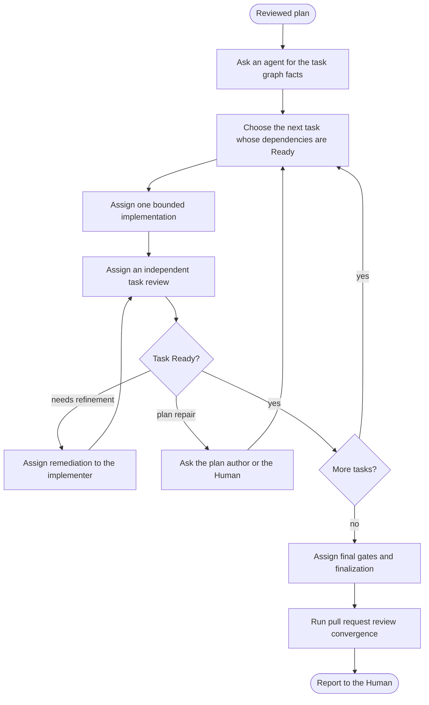

# SOP: Execute a reviewed plan

## Intent

Deliver a plan whose status is `review-plan-complete` by assigning its tasks to coding agents one bounded action at a time, accepting each task through independent review, and converging the final result.

## Inputs

- The reviewed plan path, from the confirmed Room Brief or the Human.
- Existing coding agents suited to the plan's tasks, reviews, and remediation.

## Participants and capabilities

| Participant | Role | Capabilities used |
| --- | --- | --- |
| Human | answers authority and plan-repair decisions and approves landing | Human-controlled actions |
| Orchestrator | chooses every assignment and its order | `SendMessage`, `InspectWork`, `WaitForChange`, `ReadAgent`, `ObservePermissionPrompt`, `ApprovePermissionOnce`, `AbandonIdleRequest`, `AcquireResource`, `ReleaseResource` |
| Implementer agents | implement one assigned task with the `execute-plan` skill's orchestrated branch | assignment scope and owner files |
| Task reviewer agents | review one completed task independently | assignment scope |

## Room Brief boundary

Execution delivers only the reviewed plan. Plan repair that changes a goal, owner, or dependency, and any landing decision, goes to the Human or the plan author as the reason requires.

## Workflow map

## Steps

1. Ask a coding agent to read the plan and report its task graph facts: task ids, owners, dependencies, and gates. You do not interpret technical detail yourself.
2. Choose the next task whose dependencies are Ready. Assign it with `SendMessage`, naming the exact task id, its owner boundary, its gate, and the evidence you expect. The implementer uses the `execute-plan` skill's orchestrated branch and performs only that bounded action; it does not start or follow the standalone progression driver. Deterministic helpers only verify the task, owner, hash, evidence, or operation you selected.
3. Run tasks in parallel only when their owners are disjoint. Never let two uncoordinated writers touch the same owner or resource; use leases for shared resources.
4. Match the implementer's model and effort to the task's complexity.
5. When a task reports completion, assign an independent task review to a different agent.
6. When the review asks for refinement, assign remediation to the original implementer with the review. When it requires plan repair, ask the plan author or the Human according to the stated reason.
7. When every task is Ready, assign the final gates and finalization to a coding agent: `just lint`, `just test`, and `just build` when the plan declares it.
8. Converge the final change with `reference/sop-review-pr`, then report to the Human, who decides landing.

## Success evidence

Every task has a Ready review, the declared final gates passed on the final tree, and pull request review converged.

## Settlement evidence

A settled Request proves only that the participant replied. Task reports, review verdicts, and gate results in the replies are the evidence you compare.

## Failure signals

- A task repeatedly fails review for the same root cause.
- Work appears outside a task's owner.
- A final gate fails after a repair.

## Adaptation and recovery authority

You may reorder ready tasks, move work to another existing agent, change effort, or add attempts and lessons to the SOP. Plan repair, new agents, and landing need the plan author or the Human.

## Resource leases

Lease scarce shared resources, such as a test database or a device, for the duration of one assignment.

## Attempt ledger

Record task attempts, review rounds, and lessons as advisory prose.

## Human tasks

Decide plan repairs that need developer authority, approve landing, and add or replace agents when asked.

## Stop and escalation

Stop when the change converges and is reported, or when a decision belongs to the Human.

## Revision history

| Revision | Change | Reason |
| --- | --- | --- |
| 1 | Built-in SOP | Standard orchestrated plan execution |
