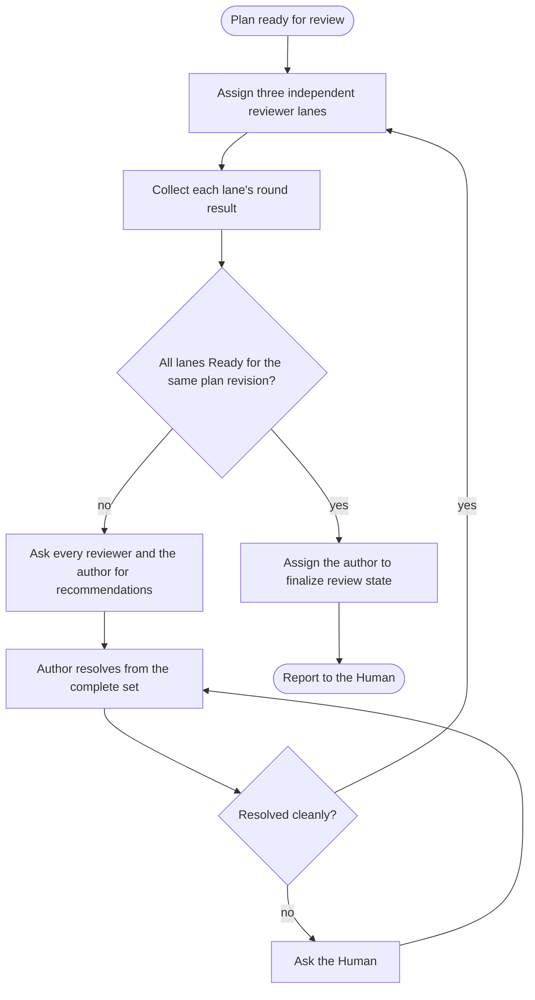

# SOP: Review a plan to convergence

## Intent

Bring one plan to the point where three independent reviewer lanes from different model families all return Ready for the same plan revision, with every finding resolved by a separate author, and then have that author record `review-plan-complete`.

## Inputs

- The plan path, from the confirmed Room Brief or the Human.
- Three existing coding agents from different model families for the reviewer lanes, and one separate existing coding agent as the author.

## Participants and capabilities

| Participant | Role | Capabilities used |
| --- | --- | --- |
| Human | resolves conflicts partners cannot resolve and answers authority questions | Human-controlled actions |
| Orchestrator | sequences lanes and rounds and compares evidence | `SendMessage`, `InspectWork`, `WaitForChange`, `ReadAgent` |
| Reviewer agents (three lanes) | review the plan read-only with the `review-plan` skill, each in its own named lane | assignment scope |
| Author agent | adjudicates and repairs findings with `address-review-comments`, then finalizes | assignment scope |

## Room Brief boundary

Review changes only the plan under review. Requests to change the plan's goal or scope go to the Human.

## Workflow map

## Steps

1. Assign each reviewer agent its lane with `SendMessage`: run `review-plan` on the plan with an explicit `--reviewer <lane>`, stay read-only, and do not read other lanes' artifacts. Give each assignment its own `work_id`.
2. Wait for each lane to settle and read its reported verdict, plan revision, and findings. Lanes are independent; do not forward one lane's findings to another reviewer while the round is open.
3. If any lane reports findings, share the findings with all three reviewers and the author and ask each for a recommendation. Give the author the complete set of four recommendations and ask the author to resolve every finding with `address-review-comments`, choosing the best resolution from the candidates.
4. If the author cannot resolve a finding cleanly, ask the Human with a Human-addressed `SendMessage` and return the decision to the author.
5. Start the next round for every lane on the repaired plan. Repeat until all three lanes return Ready.
6. All lanes Ready is a fact, not a state change. In a separate, explicit assignment, ask the author to run the plan-review finalization helper bound to the exact plan hash and each lane's Ready round. Reviewers never write plan state, and nothing advances automatically from a verdict.

## Success evidence

All three lanes report Ready for one plan hash, and the author's finalization receipt shows `review-plan-complete` for that hash.

## Settlement evidence

A settled reviewer Request proves only that the reviewer replied. The verdict and plan revision in the reply are the evidence you compare.

## Failure signals

- A lane keeps reporting the same root cause.
- Lanes report different plan revisions.
- The finalization helper fails closed.

## Adaptation and recovery authority

You may move a lane to another existing agent of a different family, change round pacing, or ask for narrower recommendations. Adding or replacing agents, or changing the plan's goal, needs the Human.

## Resource leases

Use a lease when two agents would otherwise edit the plan at the same time.

## Attempt ledger

Record rounds, lane results, and recurring root causes as advisory prose.

## Human tasks

Resolve conflicts the author cannot resolve cleanly, and answer scope questions.

## Stop and escalation

Stop when finalization succeeds, or when a decision belongs to the Human.

## Revision history

| Revision | Change | Reason |
| --- | --- | --- |
| 1 | Built-in SOP | Standard plan review convergence |
