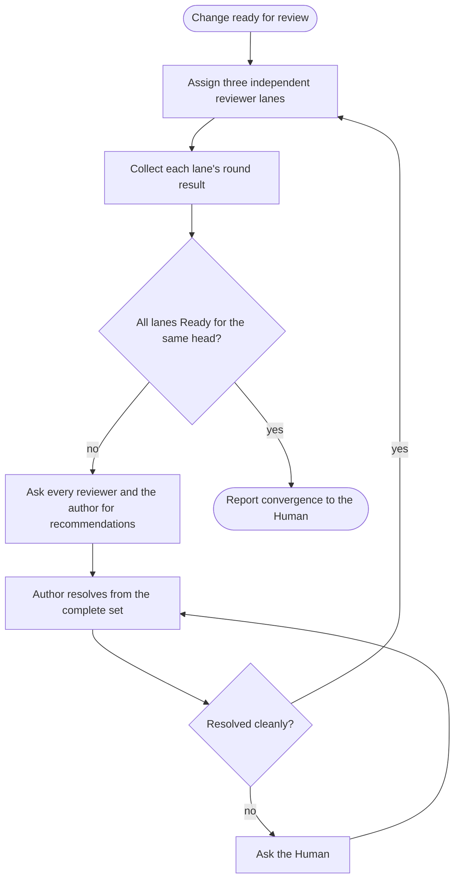

# SOP: Review a pull request to convergence

## Intent

Bring one branch or pull request to the point where three independent reviewer lanes from different model families all return Ready for the same head, with every finding resolved by a separate author.

## Inputs

- The branch, base, and optional plan, from the confirmed Room Brief or the Human.
- Three existing coding agents from different model families for the reviewer lanes, and one separate existing coding agent as the author.

## Participants and capabilities

| Participant | Role | Capabilities used |
| --- | --- | --- |
| Human | resolves conflicts partners cannot resolve, answers authority questions, and decides merging | Human-controlled actions |
| Orchestrator | sequences lanes and rounds and compares evidence | `SendMessage`, `InspectWork`, `WaitForChange`, `ReadAgent` |
| Reviewer agents (three lanes) | review the change with the `review-pr` skill, each in its own named lane | assignment scope |
| Author agent | adjudicates and repairs findings with `address-review-comments` | assignment scope |

## Room Brief boundary

Review covers the branch's goal. Findings outside that goal, and any merge or publication decision, go to the Human.

## Workflow map

## Steps

1. Assign each reviewer agent its lane with `SendMessage`: run `review-pr` against the stated base with an explicit `--reviewer <lane>`, and do not read other lanes' artifacts. Give each assignment its own `work_id`.
2. Wait for each lane to settle and read its reported verdict, head, and findings. Keep lanes independent while the round is open.
3. If any lane reports findings, share them with all three reviewers and the author and ask each for a recommendation. Give the author the complete set of four recommendations and ask the author to resolve every finding with `address-review-comments`, choosing the best resolution from the candidates.
4. If the author cannot resolve a finding cleanly, ask the Human with a Human-addressed `SendMessage` and return the decision to the author.
5. Start the next round for every lane on the new head. Repeat until all three lanes return Ready.
6. Report convergence to the Human with the head, each lane's result, and any remaining risk. All lanes Ready is a fact; merging is the Human's decision.

## Success evidence

All three lanes report Ready for one head.

## Settlement evidence

A settled reviewer Request proves only that the reviewer replied. The verdict and head in the reply are the evidence you compare.

## Failure signals

- A lane keeps reporting the same root cause.
- Lanes review different heads.
- The author reports a repair it cannot land.

## Adaptation and recovery authority

You may move a lane to another existing agent of a different family, change round pacing, or ask for narrower recommendations. Adding or replacing agents, or changing the branch goal, needs the Human.

## Resource leases

Use a lease when two agents would otherwise change the branch at the same time.

## Attempt ledger

Record rounds, lane results, and recurring root causes as advisory prose.

## Human tasks

Resolve conflicts the author cannot resolve cleanly, answer scope questions, and decide merging.

## Stop and escalation

Stop when all lanes are Ready, or when a decision belongs to the Human.

## Revision history

| Revision | Change | Reason |
| --- | --- | --- |
| 1 | Built-in SOP | Standard pull request review convergence |
