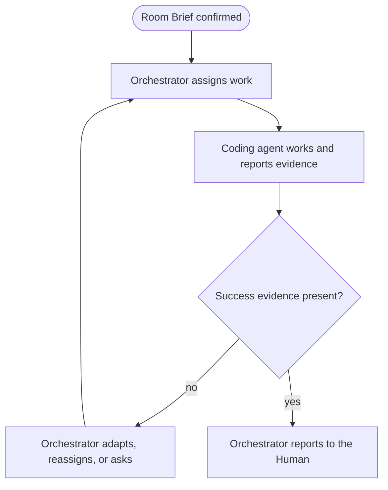

# Workflow: <name>

<!-- Copy this skeleton into a new SOP and replace every angle-bracket placeholder. Keep the Mermaid diagram and the prose aligned. The diagram is a visual map, not an executable graph. -->

## Intent

<The outcome this workflow produces and how it serves the confirmed Room Brief.>

## Inputs

<Facts, artifacts, and decisions the workflow starts from.>

## Participants and capabilities

| Participant | Role | Capabilities used |
| --- | --- | --- |
| Human | <role> | <Human-controlled actions> |
| Orchestrator | process owner | <closed query and operation names, such as `SendMessage` or `InspectWork`> |
| <coding agent> | <role> | <assignment scope and permissions> |

## Room Brief boundary

<How this workflow stays inside the confirmed Goal and Non-goals, and which requests would need a new room or a Human-controlled action.>

## Current SOP source

<A `ReadContent` reference name, or a `ReadWorkflowDraft` draft id and revision. Never a filesystem path.>

## Workflow map

## Steps

1. <Step, owner, and the evidence that ends it.>

## Success evidence

<Observable evidence that the workflow achieved its intent.>

## Settlement evidence

<Which Request, operation, and reply facts the Orchestrator inspects, and what each one does and does not prove.>

## Failure signals

<Facts that show a step is failing, stalled, or off track.>

## Adaptation and recovery authority

<What the Orchestrator may change within the Room Brief, and what needs a Human-controlled action.>

## Resource leases

<Shared resources, who holds them, and when they are released.>

## Attempt ledger

<Advisory record of attempts, outcomes, and lessons. Prose only.>

## Human tasks

<Advisory list of what the Human is asked to do or decide. Prose only.>

## Stop and escalation

<When the workflow stops, and when the Orchestrator asks the Human.>

## Revision history

| Revision | Change | Reason |
| --- | --- | --- |
| 1 | <initial version> | <reason> |
