# Workflow: auto-merge-pr

## Graph

```mermaid
flowchart TD
    begin(["Get PR merge-ready"]):::start --> usage

    usage[Orchestrator: check Claude and Codex allowance in bus state] --> low{"Claude or Codex allowance below 5%?"}
    low -- yes --> alert[Orchestrator: alert developer in MASTER]
    alert --> devdirection[Developer: give direction]:::developer
    devdirection --> proceed{Developer says proceed?}
    proceed -- yes --> cursorout
    proceed -- no --> blocked
    low -- no --> cursorout{Cursor out of allowance?}
    cursorout -- yes --> dropcursor[Orchestrator: leave cursor-review out of the reviewers]
    cursorout -- no --> askverify
    dropcursor --> askverify[Orchestrator: ask developer whether pre-merge verification is required, record the answer]
    askverify --> measure["Orchestrator: measure total changed lines (git diff --shortstat base...head)"]

    measure --> big{"Total changed lines >= 3000?"}
    big -- yes --> split["Author: run split-pr --publish (classify parts, write the plan)"]
    big -- no --> review
    split --> approveplan["Orchestrator: approve the split plan (split-pr CONFIRM)"]
    approveplan --> buildparts["Author: split-pr builds each part in its own worktree (worktree-new), then publishes the PRs"]
    buildparts --> splitok{split-pr succeeded?}
    splitok -- "no: preflight ERROR, redesign STOP, helper or coverage failure, failed publish wave" --> blocked
    splitok -- yes --> splitdone(["PR split"]):::failure

    subgraph round [Review round]
        review["Reviewers: run review-pr in parallel (Claude, Codex, optional Cursor)"]
        review --> allready{Every reviewer Ready?}
        allready -- no --> anyabandon{Any Abandon?}
        anyabandon -- Needs Refinement --> address[Author: run address-review-comments, push APPLY fixes]
        address --> outscope{"Any finding outside the PR goal and non-goals?"}
        outscope -- yes --> recordscope["Orchestrator: record it in temp/#lt;branch#gt;/deferred.md"]
        outscope -- no --> flag
        recordscope --> flag{Any FLAG?}
        flag -- yes --> poll[Orchestrator: poll author and every reviewer for a recommendation, forward all to author]
        poll --> bestof[Author: run best-of-n]
        bestof --> bonverdict{best-of-n verdict?}
        bonverdict -- universal --> applyfirst[Author: apply first place, push]
        bonverdict -- clear --> applyfirst
        bonverdict -- toss-up --> blocking{Blocking?}
        blocking -- no --> defer["Orchestrator: record it in temp/#lt;branch#gt;/deferred.md"]
        blocking -- yes --> recordblock["Orchestrator: record it in temp/#lt;branch#gt;/deferred.md"]
        flag -- no --> review
        applyfirst --> review
        defer --> review
        applydec[Author: apply developer's decision, push] --> review
    end

    anyabandon -- yes --> single{"Abandon reason is dimension 6 (multi-purpose)?"}
    single -- yes --> split
    single -- no --> nopreset[Developer: no preset strategy, decide]:::developer
    nopreset --> sendback{Developer sends it back to fix?}
    sendback -- yes --> applydec
    sendback -- no --> blocked

    recordblock --> informblocked["Orchestrator: inform developer in MASTER (link deferred.md)"]
    informblocked --> blocked
    allready -- yes --> verify{Developer verification required?}
    verify -- yes --> holdmerge["Author: run merge-pr --hold-before-merge"]
    holdmerge --> holding{merge-pr ready and holding?}
    holding -- no --> blocked
    holding -- yes --> manualtest[Developer: manual test and merge approval]:::developer
    manualtest --> approved{Approved?}
    approved -- yes --> merge
    approved -- no --> applydec
    verify -- no --> merge[Author: run merge-pr]
    merge --> mergeok{merge-pr merged the PR?}
    mergeok -- yes --> mainco{PR worktree is the main checkout?}
    mainco -- yes --> anydeferred{"Any deferred issues in temp/#lt;branch#gt;/deferred.md?"}
    mainco -- no --> removeagents[Orchestrator: remove the room agents working in the PR worktree]
    removeagents --> closewt[Orchestrator: run worktree-close on the PR worktree]
    closewt --> anydeferred
    anydeferred -- yes --> informmerged["Orchestrator: inform developer in MASTER (link deferred.md)"]
    anydeferred -- no --> merged(["PR merged"]):::success
    informmerged --> merged
    mergeok -- no --> blocked(["PR merge blocked"]):::failure

    classDef start fill:#dbeafe,stroke:#1d4ed8
    classDef success fill:#dcfce7,stroke:#15803d
    classDef failure fill:#fee2e2,stroke:#b91c1c
    classDef developer fill:#fde2e4,stroke:#c9184a
    classDef current stroke-width:3px,stroke:#2563eb
    class usage current
```

## After a split

"PR split" means this run merges nothing: the original PR is replaced by its
parts. The orchestrator follows split-pr's RETURN report (shape, parts, PRs):

- **train** (stacked): run this workflow once per part, one after another,
  bottom first. Merge strictly bottom up: only the bottom PR merges, into the
  base, never a PR into its parent branch. After a parent merges, assign an
  agent to run `split-pr restack --publish`, which rebases the children onto
  the base and retargets their PRs, before the next part starts.
- **parallel** (separate PRs): run this workflow per part at the same time,
  each with its own author and reviewers, in the part worktree split-pr already
  created; assign an agent to run `worktree-new` only for a part that has none.
- **mixed**: run the prerequisite parts first as a train, then the independent
  parts in parallel. A part with two or more parents under the default `wait`
  policy stays a local branch until restack leaves it a single base, and only
  then gets its run.
- **Original PR**: split-pr never deletes the source branch and keeps it until
  every part is verified and the developer authorizes cleanup. The orchestrator
  asks the developer in MASTER to close the original PR once all parts have
  PRs, linking the original `temp/<branch>/deferred.md`.
- **deferred.md**: each part's run keeps its own `temp/<part-branch>/deferred.md`
  and hands it off at that part's exit.

## Participants

| Agent | Provider | Role |
|---|---|---|
| orchestrator | any | Checks provider allowance, runs the size check and assigns split-pr, approves the split plan at split-pr CONFIRM and runs the parts as in "After a split", adds and removes agents, polls recommendations for flagged issues and forwards them, records deferred issues in `temp/<branch>/deferred.md` (what the issue is, the recommendations, why it is out of scope, nonblocking or blocking), asks and alerts the developer in MASTER, keeps the workflow file current. After the merge, when the PR worktree is not the main checkout, removes the room agents working in it and runs worktree-close on it from outside. Informs the developer in MASTER with a link to `temp/<branch>/deferred.md` when it has entries at "PR merged" and when a blocking deferred issue ends at "PR merge blocked". Never writes code. |
| developer | - | Answers allowance alerts; decides Abandon whose reason is not dimension 6 (multi-purpose); reads `temp/<branch>/deferred.md` after the workflow ends; optionally runs the manual test and merge approval while merge-pr holds before the merge. |
| author | claude | split-pr --publish, address-review-comments, best-of-n, applies decisions, push, merge-pr (which waits for and fixes CI), with `--hold-before-merge` first when developer verification is required |
| claude-review | claude | review-pr |
| codex-review | codex | review-pr |
| cursor-review (optional) | cursor | review-pr |

All agents share one worktree on the PR branch (any worktree, not necessarily
the main checkout); reviewers only read, the author is the only writer.

Reviewers must be on different models; at minimum both Claude and Codex
review. Cursor is optional: when it is out of allowance it is left out of the
reviewer set, without an alert.
