# Workflow: auto-merge-pr

## Graph

```mermaid
flowchart TD
    begin(["Get PR merge-ready"]):::start --> usage

    usage[Orchestrator: read Claude and Codex weekly usage in bus state] --> low{"Claude or Codex weekly used_percent above 95, or unknown?"}
    low -- yes --> alert[Orchestrator: alert developer in MASTER]
    alert --> devdirection[Developer: give direction]:::developer
    devdirection --> proceed{Developer says proceed?}
    proceed -- yes --> askverify
    proceed -- no --> informdev
    low -- no --> askverify["Orchestrator: ask developer to merge without asking, or hold for manual test and approval; record the answer"]
    askverify --> measure["Orchestrator: measure added + removed lines against the PR base branch, excluding plans/ (git diff --shortstat)"]

    measure --> big{"Total changed lines >= 3000?"}
    big -- yes --> split["Author: run split-pr --publish (classify parts, write the plan)"]
    big -- no --> lockgoal["Orchestrator: lock the PR goal and non-goals (ask the developer once if none is locked)"]
    lockgoal --> review
    split --> approveplan["Orchestrator: approve the split plan (split-pr CONFIRM)"]
    approveplan --> buildparts["Author: split-pr builds each part in its own worktree (worktree-new), then publishes the PRs"]
    buildparts --> splitok{split-pr succeeded?}
    splitok -- "no: preflight ERROR, redesign STOP, helper or coverage failure, failed publish wave" --> splitfailed(["Split failed (orchestrator recovers)"]):::failure
    splitok -- yes --> splitdone(["PR split (orchestrator recovers)"]):::failure

    subgraph round [Review round]
        review["Reviewers: run review-pr --reviewer #lt;agent-name#gt; in parallel (Claude, Codex, optional Cursor)"]
        review --> cursorlimit{cursor-review hit a usage limit?}
        cursorlimit -- yes --> dropcursor[Orchestrator: remove cursor-review from the reviewers, no alert]
        cursorlimit -- no --> allready
        dropcursor --> allready{Every reviewer Ready?}
        allready -- no --> anyabandon{Any Abandon?}
        anyabandon -- "no (Needs Refinement)" --> address[Author: run address-review-comments, push APPLY fixes]
        address --> outscope{"Any finding outside the PR goal and non-goals?"}
        outscope -- yes --> recordscope["Orchestrator: record out-of-scope finding in deferred.md"]
        outscope -- no --> flag
        recordscope --> flag{Any FLAG?}
        flag -- yes --> readflag[Orchestrator: read each flagged issue]
        readflag --> needsdev{"About unclear product requirements, an architectural decision, or expected behavior?"}
        needsdev -- no --> poll[Orchestrator: poll author and every reviewer for a recommendation, forward all to author]
        poll --> bestof[Author: run best-of-n]
        bestof --> bonverdict{best-of-n verdict?}
        bonverdict -- universal --> applyfirst[Author: apply first place, push]
        bonverdict -- clear --> applyfirst
        bonverdict -- toss-up --> recordtoss["Orchestrator: record toss-up in deferred.md"]
        recordtoss --> blocking{"Orchestrator: toss-up blocking?"}
        blocking -- no --> review
        flag -- no --> review
        applyfirst --> review
        applydec[Author: apply developer's decision, push] --> review
    end

    needsdev -- yes --> informdev
    bonverdict -- "handed back: non-technical" --> informdev
    blocking -- yes --> informdev

    anyabandon -- yes --> single{"Abandon reason is dimension 6 (multi-purpose)?"}
    single -- yes --> split
    single -- no --> nopreset[Developer: no preset strategy, decide]:::developer
    nopreset --> sendback{Developer sends it back to fix?}
    sendback -- yes --> applydec
    sendback -- no --> informdev

    allready -- yes --> verify{"Developer asked to hold before merge? (start answer = merge permission)"}
    verify -- "yes: hold for test and approval" --> holdmerge["Author: run merge-pr --hold-before-merge"]
    holdmerge --> holding{merge-pr ready and holding?}
    holding -- no --> informdev
    holding -- yes --> manualtest[Developer: manual test and merge approval]:::developer
    manualtest --> approved{Approved?}
    approved -- yes --> merge
    approved -- no --> applydec
    verify -- "no: merge without asking" --> merge[Author: run merge-pr]
    merge --> mergeok{merge-pr merged the PR?}
    mergeok -- no --> informdev
    mergeok -- yes --> removeagents[Orchestrator: remove the room agents]
    removeagents --> mainco{PR worktree is the main checkout?}
    mainco -- no --> closewt[Orchestrator: run worktree-close on the PR worktree]
    mainco -- yes --> anydeferred
    closewt --> anydeferred{"Any deferred issues in #lt;main checkout#gt;/temp/#lt;branch-slug#gt;/deferred.md?"}
    anydeferred -- yes --> informmerged["Orchestrator: inform developer in MASTER (link deferred.md)"]
    anydeferred -- no --> merged(["PR merged"]):::success
    informmerged --> merged

    informdev["Orchestrator: inform developer in MASTER (reason, link deferred.md)"] --> blocked(["PR merge blocked (developer recovers)"]):::failure

    classDef start fill:#dbeafe,stroke:#1d4ed8
    classDef success fill:#dcfce7,stroke:#15803d
    classDef failure fill:#fee2e2,stroke:#b91c1c
    classDef developer fill:#fde2e4,stroke:#c9184a
```

## Failure recovery

- **PR split (orchestrator recovers):** starts from split-pr's RETURN report
  (shape, parts, PRs) and follows "After a split".
- **Split failed (orchestrator recovers):** starts from split-pr's ERROR or STOP
  output and its plan under `temp/split-pr/`; has an agent fix the plan or the
  branch and rerun split-pr, or asks the developer when a part needs a redesign.
- **PR merge blocked (developer recovers):** starts from the reason the
  orchestrator posted in MASTER, `deferred.md`, and the PR state (branch, open
  PR, latest review round, the merge-pr report if it ran).

## After a split

"PR split" means this run merges nothing: the original PR is replaced by its
parts. The orchestrator follows split-pr's RETURN report (shape, parts, PRs):

- **train** (stacked): run this workflow once per part, one after another,
  bottom first. Merge strictly bottom up: only the bottom PR merges, into the
  base, never a PR into its parent branch. After a parent merges, assign an
  agent to run `split-pr restack --publish`, which rebases the children onto
  the base and retargets their PRs, before the next part starts.
- **parallel** (separate PRs): run this workflow per part at the same time,
  each with its own author and reviewers, in the part worktree split-pr already
  created; assign an agent to run `worktree-new` only for a part that has none.
- **mixed**: run the prerequisite parts first as a train, then the independent
  parts in parallel. A part with two or more parents under the default `wait`
  policy stays a local branch until restack leaves it a single base, and only
  then gets its run.
- **Original PR**: split-pr never deletes the source branch and keeps it until
  every part is verified and the developer authorizes cleanup. The orchestrator
  asks the developer in MASTER to close the original PR once all parts have
  PRs, linking the original branch's `deferred.md`.
- **deferred.md**: each part's run keeps its own
  `<main checkout>/temp/<part-branch-slug>/deferred.md` and hands it off at
  that part's exit.

## Participants

| Agent | Provider | Role |
|---|---|---|
| orchestrator | any | Reads Claude and Codex weekly usage in bus state. Asks the developer at the start whether to merge without asking or hold for a manual test and approval; that answer is the merge permission, and it records it. Locks the PR goal and non-goals before the first review. Runs the size check, assigns split-pr, approves the split plan at CONFIRM, and recovers from both split exits. Adds and removes agents, including dropping cursor-review without an alert when it hits a usage limit, and briefs each reviewer to run review-pr with `--reviewer <agent-name>`. Reads each flagged issue, polls recommendations and forwards them to the author, and on the developer's behalf authorizes the author to apply a universal or clear best-of-n first place. Decides whether a toss-up is blocking. Records deferred issues in `<main checkout>/temp/<branch-slug>/deferred.md` (slashes in the branch name become dashes; worktree-close never removes the main checkout's `temp/`), stating what the issue is, the recommendations, why it is out of scope, nonblocking or blocking. Informs the developer in MASTER with the reason and the `deferred.md` link before "PR merge blocked", and with the link at "PR merged" when it has entries. After the merge, removes the room agents and, when the PR worktree is not the main checkout, runs worktree-close on it. Writing `deferred.md` and running worktree-close are its only exceptions to delegating everything; it never writes code. |
| developer | - | Gives direction on allowance alerts; answers the merge-permission question at the start; supplies the PR goal and non-goals when none is locked; decides an Abandon whose reason is not dimension 6 (multi-purpose); optionally runs the manual test and merge approval while merge-pr holds before the merge; recovers from "PR merge blocked". |
| author | claude | split-pr --publish, address-review-comments, best-of-n, applies decisions, push, merge-pr (which waits for and fixes CI), with `--hold-before-merge` first when the developer asked to hold |
| claude-review | claude | review-pr `--reviewer claude-review` |
| codex-review | codex | review-pr `--reviewer codex-review` |
| cursor-review (optional) | cursor | review-pr `--reviewer cursor-review` |

All agents share one worktree on the PR branch (any worktree, not necessarily
the main checkout); reviewers only read, the author is the only writer.

Reviewers must be on different models; at minimum both Claude and Codex
review. Cursor is optional: bus state does not collect Cursor usage, so
cursor-review is removed from the reviewers, without an alert, when it hits a
usage limit.
