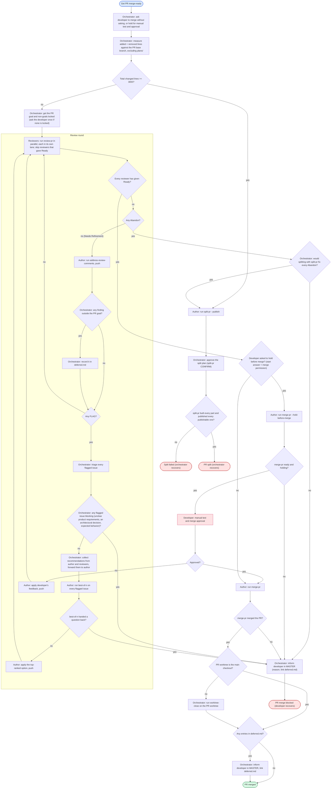

# Workflow: auto-merge-pr

This workflow is a skill for the orchestrator: it shows how the developer wants
one PR steered to "PR merged". Follow its steps and decisions, and use your own
judgment for everything it leaves open: agent names, staffing, and how to
recover.

## Graph

`deferred.md` is `<main checkout>/temp/<branch-slug>/deferred.md`, where every
character of the branch name outside `A-Za-z0-9_-` becomes `-`. It holds only
findings outside the PR goal, each with what it is and why it is out of scope.
worktree-close never removes the main checkout's `temp/`, so the link survives.

best-of-n is there to keep the developer out of failure resolution: whatever
its verdict (universal, clear or toss-up), the author applies the top-ranked
option. best-of-n keeps the ranking in its own ledger
(`temp/best-of-n/<branch-slug>/ledger.json`, rendered as `decisions.md`).
Only blocking flagged issues and questions best-of-n hands back reach the
developer.

## Failure recovery

- **PR merge blocked (developer recovers):** the developer starts from the
  reason you posted in MASTER, `deferred.md`, and the PR state (branch, open
  PR, latest review round, the merge-pr report if it ran).

## Orchestrator failure recovery

You handle these yourself:

- **PR split:** this run merges nothing; the parts replace the original PR.
  Run this workflow once per part and carry over the start answer instead of
  asking again. Start a part once all its parents have merged; parts with no
  open parent can run in parallel, each with its own author and reviewers.
  A part with two or more parents stays a local branch under split-pr's
  default `wait` policy until restack leaves it one base; that is expected.
  A train merges strictly bottom up, never into a parent branch; after a
  parent merges, have an agent run `split-pr restack <plan> --publish` with
  the plan path (`temp/split-pr/<source-slug>/plan.json` in the worktree where
  split-pr ran, so keep that worktree until every part is done). split-pr
  keeps the source branch until the developer authorizes cleanup; once every
  part has its PR, ask the developer in MASTER to close the original PR.
- **Split failed:** rerunning split-pr STOPs while its plan exists
  (PREFLIGHT). Have an agent fix the plan or the branch and rerun the helper
  step that failed; for a failed publish wave, restack mode with the plan path
  publishes the parts that are now publishable. A part that only a redesign
  could make independent is the developer's call.
- **Usage limit mid-run:** judge by the provider's reset time. Swap another
  model into that lane, keeping the reviewers on different models, or wait for
  the reset.

## Participants

| Role | Model | Does |
|---|---|---|
| Orchestrator | any | Steers the run to "PR merged" and recovers from the cases above. Names and staffs the agents and changes the team as the run needs. Asks the merge-permission question once; that answer is the permission to merge. Gets the PR goal and non-goals locked, approves the split plan, decides whether splitting fixes an Abandon, records out-of-scope findings in `deferred.md`, triages flagged issues, and on the developer's behalf has the author apply best-of-n's top-ranked option. Informs the developer in MASTER at "PR merge blocked", and at "PR merged" when `deferred.md` has entries. Writing `deferred.md` and running worktree-close are its only hands-on actions; it delegates everything else. |
| Developer | - | Answers the merge-permission question; supplies the PR goal and non-goals when none is locked; optionally runs the manual test and merge approval while merge-pr holds; recovers from "PR merge blocked". |
| Author | any | split-pr, address-review-comments (which commits the reviewers' tests), best-of-n, fixes, merge-pr (which handles CI and new GitHub review comments, pushing its own fixes). Before split-pr or merge-pr, commits any reviewer tests still left in the worktree. |
| Reviewers | different models: at least Claude and Codex, Cursor optional | review-pr, each with `--reviewer` set to its own agent name. |

All agents for one PR share its worktree (any worktree, not necessarily the
main checkout); the author is the only one who commits.
