# Workflow: auto-merge-pr

## Graph

```mermaid
flowchart TD
    begin(["Get PR merge-ready"]):::start --> usage

    usage[Orchestrator: check Claude and Codex allowance in bus state] --> low{"Claude or Codex allowance below 5%?"}
    low -- yes --> alert[Orchestrator: alert developer in MASTER]
    alert --> devdirection[Developer: give direction]:::developer
    devdirection --> proceed{Developer says proceed?}
    proceed -- yes --> cursorout
    proceed -- no --> blocked
    low -- no --> cursorout{Cursor out of allowance?}
    cursorout -- yes --> dropcursor[Orchestrator: leave cursor-review out of the reviewers]
    cursorout -- no --> askverify
    dropcursor --> askverify[Orchestrator: ask developer whether pre-merge verification is required, record the answer]
    askverify --> measure["Orchestrator: measure total changed lines (git diff --shortstat base...head)"]

    measure --> big{"Total changed lines >= 3000?"}
    big -- yes --> split[Author: run split-pr]
    big -- no --> review
    split --> shape{split-pr shape?}
    shape -- train --> train[Orchestrator: review the parts one after another, in stack order]
    shape -- parallel --> par[Orchestrator: review the parts in parallel, each with its own copy of this loop]
    shape -- mixed --> mixed[Orchestrator: review the prerequisite parts first, then the rest in parallel]
    train -- each part --> review
    par -- each part --> review
    mixed -- each part --> review

    subgraph round [Review round]
        review["Reviewers: run review-pr in parallel (Claude, Codex, optional Cursor)"]
        review --> allready{Every reviewer Ready?}
        allready -- no --> anyabandon{Any Abandon?}
        anyabandon -- Needs Refinement --> address[Author: run address-review-comments, push APPLY fixes]
        address --> outscope{"Any finding outside the PR goal and non-goals?"}
        outscope -- yes --> recordscope["Orchestrator: record it in temp/#lt;branch#gt;/deferred.md"]
        outscope -- no --> flag
        recordscope --> flag{Any FLAG?}
        flag -- yes --> poll[Orchestrator: poll author and every reviewer for a recommendation, forward all to author]
        poll --> bestof[Author: run best-of-n]
        bestof --> bonverdict{best-of-n verdict?}
        bonverdict -- universal --> applyfirst[Author: apply first place, push]
        bonverdict -- clear --> applyfirst
        bonverdict -- toss-up --> blocking{Blocking?}
        blocking -- no --> defer["Orchestrator: record it in temp/#lt;branch#gt;/deferred.md"]
        blocking -- yes --> recordblock["Orchestrator: record it in temp/#lt;branch#gt;/deferred.md"]
        flag -- no --> ci
        applyfirst --> ci
        defer --> ci
        applydec[Author: apply developer's decision, push] --> ci
        ci{CI green?}
        ci -- no --> cifix[Author: fix CI, push]
        cifix --> ci
        ci -- yes --> review
    end

    anyabandon -- yes --> single{Abandon reason is single purpose?}
    single -- yes --> split
    single -- no --> nopreset[Developer: no preset strategy, decide]:::developer
    nopreset --> sendback{Developer sends it back to fix?}
    sendback -- yes --> applydec
    sendback -- no --> blocked

    recordblock --> blocked
    allready -- yes --> verify{Developer verification required?}
    verify -- yes --> regress[Developer: regression test and merge approval]:::developer
    regress --> approved{Passed and approved?}
    approved -- yes --> merge
    approved -- no --> applydec
    verify -- no --> merge[Author: run merge-pr]
    merge --> mergeok{merge-pr merged the PR?}
    mergeok -- yes --> mainco{PR worktree is the main checkout?}
    mainco -- yes --> merged(["PR merged (deferred issues in temp/#lt;branch#gt;/deferred.md)"]):::success
    mainco -- no --> removeagents[Orchestrator: remove the room agents working in the PR worktree]
    removeagents --> closewt[Orchestrator: run worktree-close on the PR worktree]
    closewt --> merged
    mergeok -- no --> blocked(["PR merge blocked"]):::failure

    classDef start fill:#dbeafe,stroke:#1d4ed8
    classDef success fill:#dcfce7,stroke:#15803d
    classDef failure fill:#fee2e2,stroke:#b91c1c
    classDef developer fill:#fde2e4,stroke:#c9184a
    classDef current stroke-width:3px,stroke:#2563eb
    class usage current
```

## Participants

| Agent | Provider | Role |
|---|---|---|
| orchestrator | any | Checks provider allowance, runs the size check and assigns split-pr, adds and removes agents, polls recommendations for flagged issues and forwards them, records deferred issues in `temp/<branch>/deferred.md` (what the issue is, the recommendations, why it is out of scope, nonblocking or blocking), asks and alerts the developer in MASTER, keeps the workflow file current. After the merge, when the PR worktree is not the main checkout, removes the room agents working in it and runs worktree-close on it from outside. Never writes code. |
| developer | - | Answers allowance alerts; decides Abandon that is not single purpose; reads `temp/<branch>/deferred.md` after the workflow ends; optionally runs the pre-merge regression test and approval. |
| author | claude | split-pr, address-review-comments, best-of-n, applies decisions and CI fixes, push, merge-pr |
| claude-review | claude | review-pr |
| codex-review | codex | review-pr |
| cursor-review (optional) | cursor | review-pr |

All agents share one worktree on the PR branch (any worktree, not necessarily
the main checkout); reviewers only read, the author is the only writer.

Reviewers must be on different models; at minimum both Claude and Codex
review. Cursor is optional: when it is out of allowance it is left out of the
reviewer set, without an alert.
