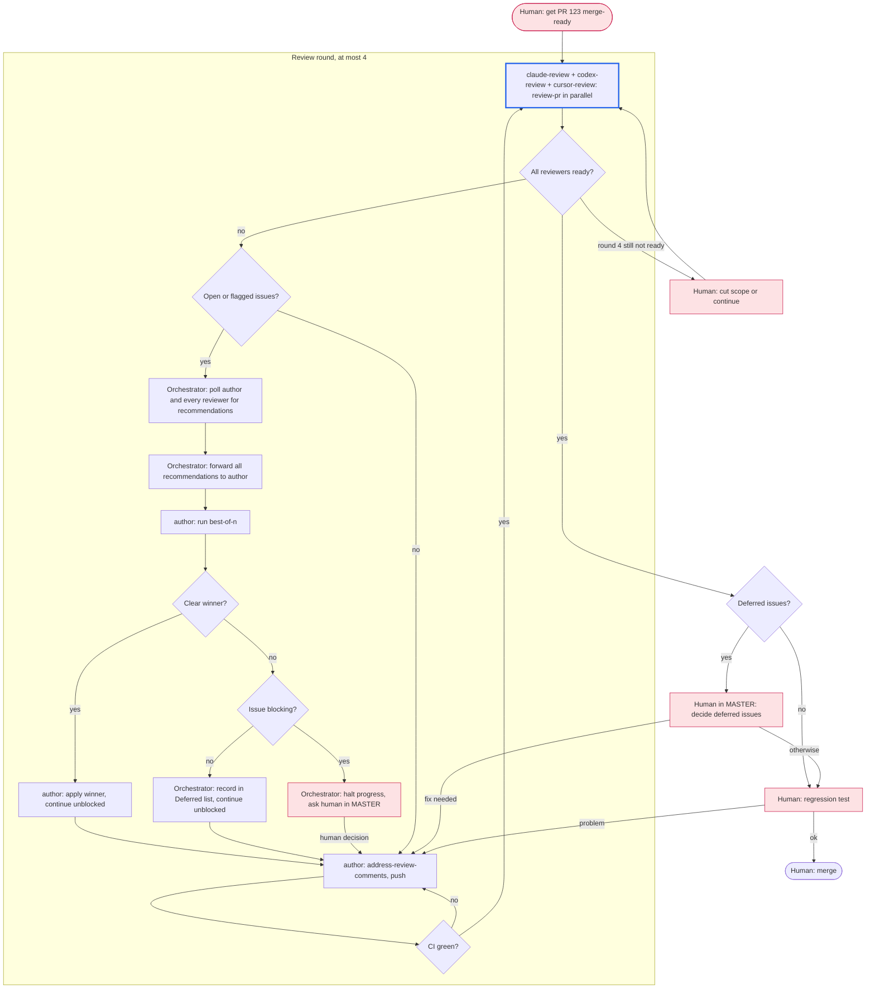

# Workflow: pr-123 review loop

<!-- Example. A PR is written; reviewers on different models review it until
all of them say ready, then the human regression-tests it before merge. -->

## Goal

PR #123 is ready to merge: every reviewer says ready, CI is green, and the
human's regression test passes.

## Non-goals

- New features beyond the PR's scope. Reviewers file them as follow-ups.

## Graph

## Participants

| Agent | Provider | Role | Worktree / branch |
|---|---|---|---|
| author | claude | best-of-n, address-review-comments, push | main worktree, PR branch |
| claude-review | claude | review-pr | main worktree, read-only |
| codex-review | codex | review-pr | main worktree, read-only |
| cursor-review | cursor | review-pr | main worktree, read-only |

## Gates

- CI green on the pushed head before each review round.
- Every reviewer answers ready on the same head commit.

## Coordination

- Reviewers only read; the author is the only writer on the branch.
- Each round reviews the delta since the previous round (`review-pr` round 2+).

## Decision rules

- For each open or flagged issue in a review round, the orchestrator polls the
  author and every reviewer for a recommendation and forwards all
  recommendations to the author, who runs the `best-of-n` skill.
- A clear winner (`universal` or `clear`) is applied by the author; the round
  continues unblocked.
- With no clear winner, a nonblocking issue goes in the workflow's Deferred
  list, with its recommendations and why it does not block. The round continues
  unblocked; the orchestrator asks the human in MASTER at the next human
  checkpoint, before regression testing.
- With no clear winner on a blocking issue, the orchestrator halts progress and
  asks the human in MASTER. Resume only after the human decides.
- Cap: 4 rounds. After that, ask the human to cut scope or allow more rounds.
- The human merges; the orchestrator never does.

## Deferred

- None.

## Log

- 2026-10-09: Routed open or flagged issues through author-run best-of-n; only blocking issues without a clear winner halt the round for the human.
- 2026-10-06: Drafted with the human.
